# Enterprise Technical Architecture & System Design

## Table of Contents

1. Executive Architecture Summary
2. System Architecture Overview
3. Database Architecture & Design
4. API Architecture & Design Patterns
5. Real-Time Fleet Tracking System
6. Map Integration Architecture
7. Caching & Performance Strategy
8. Message Queue & Event Architecture
9. Authentication & Security
10. Scalability Architecture
11. VPS Deployment Strategy
12. Monitoring & Observability
13. CI/CD Pipeline Design
14. Disaster Recovery & Backup
15. Technical Stack Justification
16. Missing Features Analysis
17. Performance Benchmarks

---

## 1. Executive Architecture Summary

### Architecture Philosophy

**Principles:**

- **Microservices-Ready Monolith**: Start monolithic, design for future service extraction
- **Event-Driven**: Async communication for non-critical paths
- **API-First**: All functionality exposed through APIs
- **Real-Time First**: WebSocket for live updates
- **Cache-Heavy**: Redis at multiple layers
- **Observable**: Metrics, logs, traces everywhere
- **Resilient**: Circuit breakers, retries, fallbacks
- **Scalable**: Horizontal scaling capability

### Architecture Maturity Path

```
Phase 1 (Months 0-6): Modular Monolith on VPS
├─ Single server deployment
├─ PostgreSQL + Redis on same machine
├─ Load balancer ready architecture
└─ Monitoring and metrics

Phase 2 (Months 7-12): Distributed Monolith
├─ Multiple application servers
├─ Separate database server
├─ Redis cluster
├─ CDN integration
└─ Queue workers separated

Phase 3 (Months 13-18): Service Extraction
├─ Booking service separated
├─ Notification service separated
├─ Fleet tracking service separated
├─ Payment service separated
└─ API Gateway introduced

Phase 4 (Months 19-24): Full Microservices
├─ 8-10 independent services
├─ Service mesh (optional)
├─ Distributed tracing
├─ Multi-region deployment
└─ Event-driven architecture
```

---

## 2. System Architecture Overview

### 2.1 High-Level Architecture

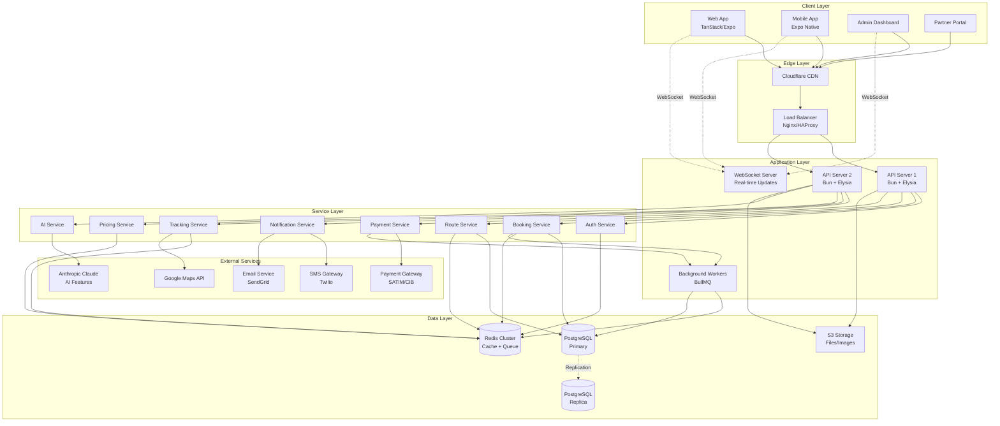

### 2.2 Detailed Component Architecture

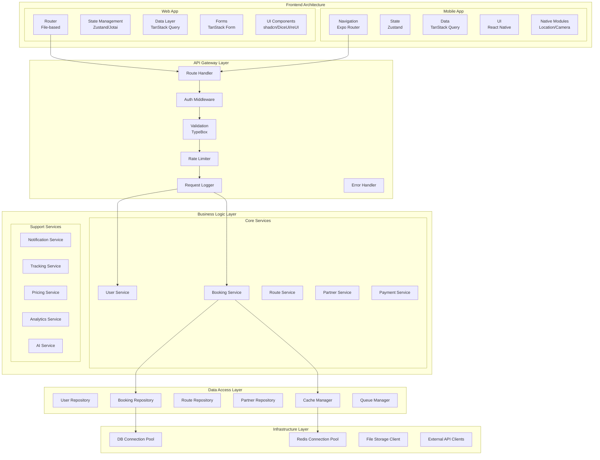

### 2.3 Request Flow Architecture

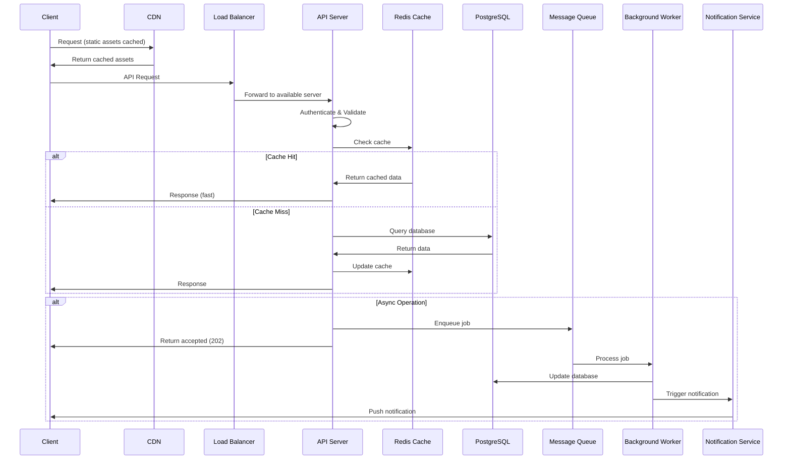

---

## 3. Database Architecture & Design

### 3.1 Database Strategy

**PostgreSQL Choice Rationale:**

- ACID compliance for financial transactions
- Complex queries with JOINs
- JSON support for flexible data (preferences, metadata)
- Excellent indexing capabilities
- Mature replication and backup tools
- Strong ecosystem and community

**Scaling Strategy:**

- **Vertical (Phase 1)**: 8-16GB RAM, 4-8 vCPUs
- **Replication (Phase 2)**: Primary-replica for read scaling
- **Partitioning (Phase 3)**: Partition bookings by date
- **Sharding (Phase 4)**: Shard by region if multi-region

### 3.2 Database Schema Design

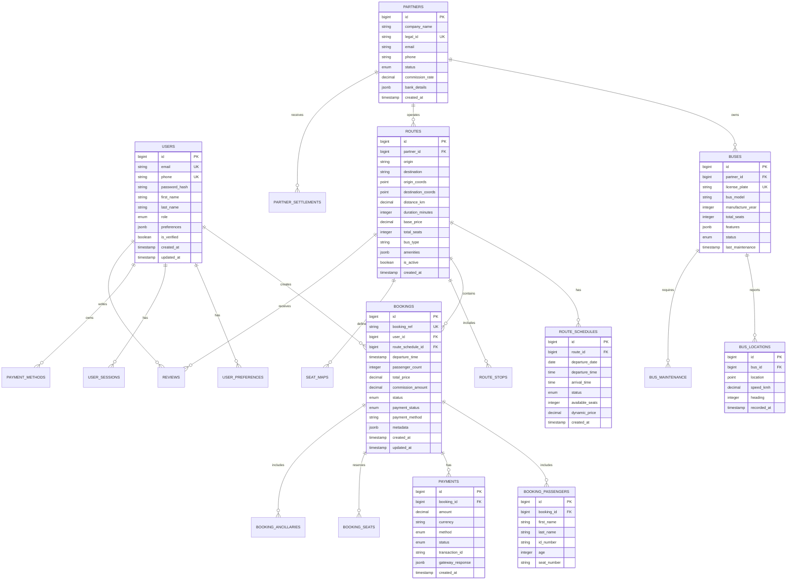

### 3.3 Indexing Strategy

**Critical Indexes:**

```
Performance-Critical Indexes:

1. bookings
   - (user_id, created_at DESC) - User booking history
   - (booking_ref) UNIQUE - Lookup by reference
   - (route_schedule_id, status) - Route occupancy
   - (status, payment_status) - Admin filtering
   - (departure_time) WHERE status='confirmed' - Future bookings

2. routes
   - (origin, destination, is_active) - Route search
   - GiST (origin_coords) - Geospatial search
   - GiST (destination_coords) - Geospatial search
   - (partner_id, is_active) - Partner routes

3. route_schedules
   - (route_id, departure_date, departure_time) - Schedule lookup
   - (departure_date, status) WHERE is_active - Daily schedules
   - (available_seats) WHERE available_seats > 0 - Availability

4. users
   - (email) UNIQUE - Login
   - (phone) UNIQUE - SMS login
   - (created_at DESC) - Recent signups

5. bus_locations
   - (bus_id, recorded_at DESC) - Latest location
   - GiST (location) - Geospatial queries
   - Partial index WHERE recorded_at > NOW() - '1 day' - Recent only

6. payments
   - (booking_id) - Payment lookup
   - (transaction_id) UNIQUE - Deduplication
   - (status, created_at DESC) - Failed payment retry

Composite Indexes:
- Multi-column indexes where query patterns show consistent column combinations
- Include columns used in WHERE, JOIN, ORDER BY clauses

Index Maintenance:
- REINDEX monthly for high-write tables
- Monitor index bloat
- Analyze query plans regularly
- Drop unused indexes (monitor pg_stat_user_indexes)
```

### 3.4 Partitioning Strategy

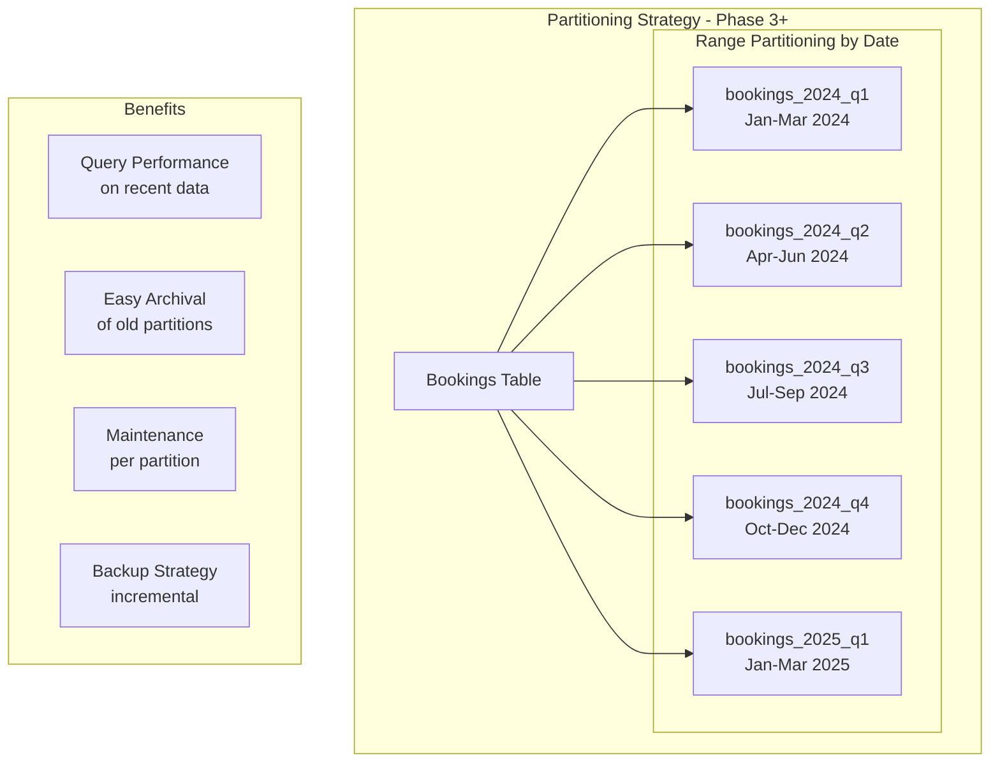

**Partition Configuration:**

```
Table: bookings
Strategy: Range partitioning by departure_time
Partition Size: Quarterly

Rationale:
- 80% of queries target last 3 months
- Easy archival of >1 year old data
- Quarterly aligns with business cycles
- Manageable partition count (~12 active)

Auto-creation:
- Create next quarter partition 1 month in advance
- Automated via cron job

Archival:
- Move partitions >1 year to cold storage
- Keep metadata/aggregates in main database
```

### 3.5 Database Replication Architecture

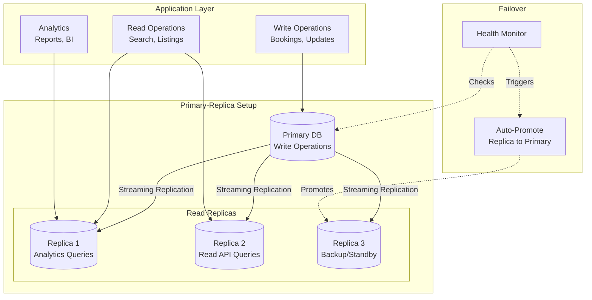

**Replication Configuration:**

```
Primary Database:
- All writes (INSERT, UPDATE, DELETE)
- Critical reads requiring freshest data
- Transaction coordinator

Read Replica 1:
- API read queries (search, route listings)
- User profile queries
- General application reads
- Lag tolerance: <1 second

Read Replica 2:
- Load distribution for reads
- Geographic failover ready
- Lag tolerance: <1 second

Read Replica 3 (Analytics):
- Heavy analytical queries
- Reporting and BI
- Data exports
- Lag tolerance: <30 seconds

Connection Pooling:
- Primary: PgBouncer (transaction mode)
- Replicas: PgBouncer (session mode)
- Max connections per pool: 100
- Statement timeout: 30s
```

---

## 4. API Architecture & Design Patterns

### 4.1 API Design Philosophy

**RESTful API + WebSocket Hybrid:**

```
REST API:
- Standard CRUD operations
- Stateless requests
- HTTP methods semantic (GET, POST, PUT, PATCH, DELETE)
- JSON response format
- Versioned (/api/v1/)

WebSocket:
- Real-time updates (bus location, booking status)
- Bi-directional communication
- Persistent connection
- Event-based messaging
```

### 4.2 API Gateway Pattern

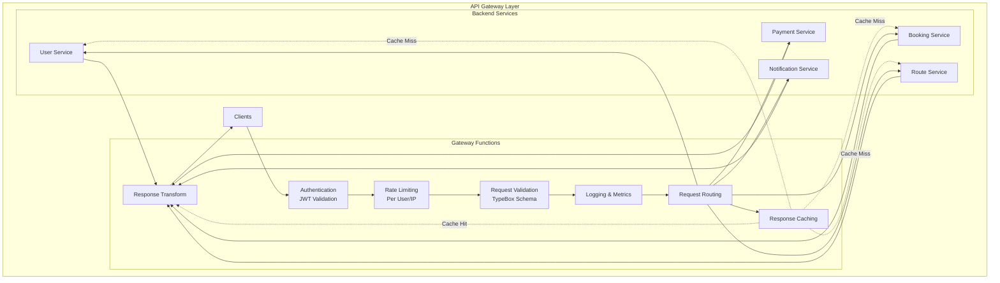

### 4.3 API Endpoint Structure

**Resource-Based URL Design:**

```
Base URL: https://api.yourplatform.dz/v1

Authentication & Users:
POST   /auth/register              - Register new user
POST   /auth/login                 - Login (email/phone)
POST   /auth/verify-otp            - Verify OTP
POST   /auth/refresh               - Refresh token
POST   /auth/logout                - Logout
GET    /users/me                   - Current user profile
PATCH  /users/me                   - Update profile
GET    /users/me/bookings          - User's bookings

Routes:
GET    /routes                     - Search routes
GET    /routes/:id                 - Route details
GET    /routes/:id/schedules       - Route schedules
GET    /routes/popular             - Popular routes
GET    /routes/suggestions         - AI suggestions

Bookings:
POST   /bookings                   - Create booking
GET    /bookings                   - List user bookings
GET    /bookings/:id               - Booking details
PATCH  /bookings/:id/cancel        - Cancel booking
GET    /bookings/:id/ticket        - Download ticket PDF
POST   /bookings/:id/modify        - Modify booking

Payments:
POST   /payments/initiate          - Start payment
POST   /payments/confirm           - Confirm payment
GET    /payments/:id/status        - Payment status
POST   /payments/refund            - Request refund

Real-time:
WS     /ws/tracking/:busId         - Bus location stream
WS     /ws/booking/:bookingId      - Booking status updates
WS     /ws/notifications           - User notifications

Admin (separate subdomain: admin-api):
GET    /admin/analytics/dashboard  - Dashboard metrics
GET    /admin/bookings             - All bookings
GET    /admin/partners             - Partner management
GET    /admin/routes               - Route management
```

### 4.4 Request/Response Patterns

**Standard Response Format:**

```
Success Response Structure:
{
  "success": true,
  "data": { ... },
  "meta": {
    "timestamp": "2025-01-15T10:30:00Z",
    "requestId": "req_abc123"
  }
}

Paginated Response:
{
  "success": true,
  "data": [ ... ],
  "pagination": {
    "page": 1,
    "limit": 20,
    "total": 150,
    "totalPages": 8,
    "hasNext": true,
    "hasPrevious": false
  },
  "meta": { ... }
}

Error Response:
{
  "success": false,
  "error": {
    "code": "BOOKING_NOT_FOUND",
    "message": "Booking with ID 12345 not found",
    "details": { ... },
    "field": "bookingId" // for validation errors
  },
  "meta": { ... }
}

HTTP Status Codes:
200 - Success
201 - Created
202 - Accepted (async processing)
400 - Bad Request (validation error)
401 - Unauthorized
403 - Forbidden
404 - Not Found
409 - Conflict
422 - Unprocessable Entity
429 - Too Many Requests
500 - Internal Server Error
503 - Service Unavailable
```

### 4.5 API Versioning Strategy

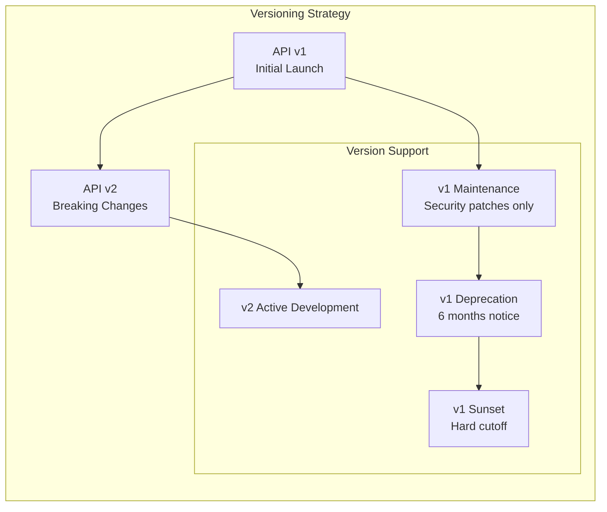

**Versioning Rules:**

```
Version Strategy: URL-based (/api/v1, /api/v2)

Breaking Changes Trigger New Version:
- Changed response structure
- Removed fields
- Changed field types
- Changed authentication method
- Changed business logic significantly

Non-Breaking Changes (Same Version):
- Added optional fields
- Added new endpoints
- Added optional parameters
- Performance improvements
- Bug fixes

Version Lifecycle:
- v1: Launch → 12 months (active) → 6 months (maintenance) → deprecate
- Minimum 6 months notice before sunset
- Client SDK updates provided 3 months before deprecation
- Migration guides published

Version Headers:
Request: X-API-Version: 1
Response: X-API-Version: 1, X-API-Deprecated: true, X-API-Sunset-Date: 2026-01-01
```

---

## 5. Real-Time Fleet Tracking System

### 5.1 Fleet Tracking Architecture

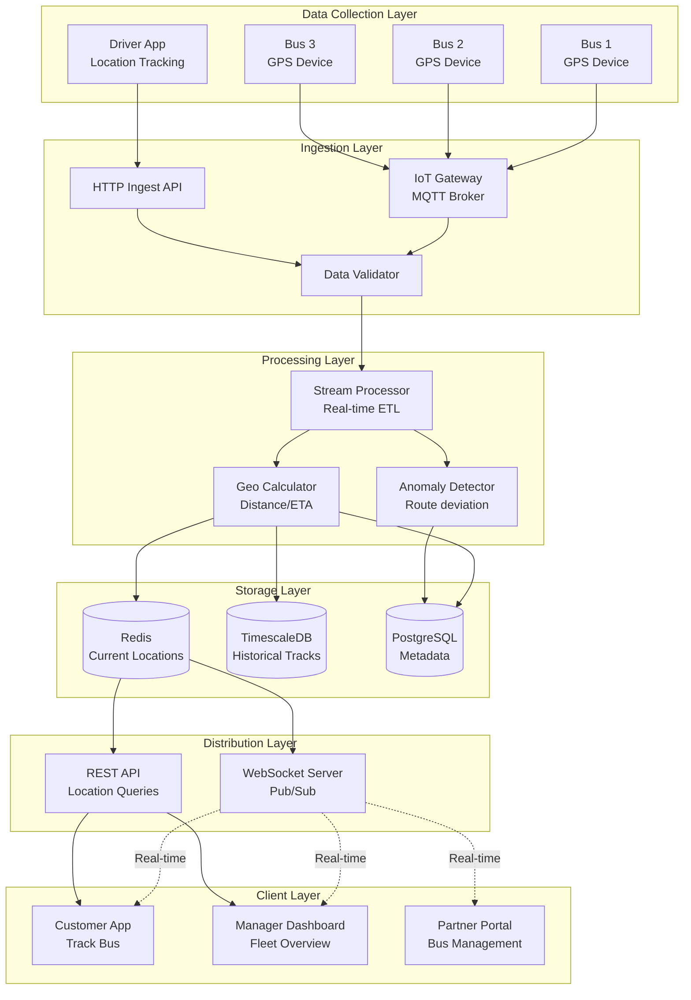

### 5.2 Location Data Model

**Data Structure:**

```
Location Update Payload (from bus/driver):
{
  "busId": "bus_12345",
  "timestamp": 1705320600000, // Unix timestamp ms
  "location": {
    "latitude": 36.7538,
    "longitude": 3.0588,
    "accuracy": 5 // meters
  },
  "motion": {
    "speed": 85.5, // km/h
    "heading": 45, // degrees (0-360)
    "altitude": 120 // meters
  },
  "status": {
    "ignition": true,
    "doorOpen": false,
    "passengers": 32, // if available
    "fuel": 65 // percentage
  },
  "deviceId": "device_abc123",
  "signature": "hmac_signature" // for security
}

Processed Location Data (stored in Redis):
Key: bus:location:{busId}
Value: {
  "busId": "bus_12345",
  "routeId": "route_456",
  "scheduleId": "schedule_789",
  "location": {
    "lat": 36.7538,
    "lng": 3.0588,
    "accuracy": 5
  },
  "motion": {
    "speed": 85.5,
    "heading": 45,
    "altitude": 120
  },
  "calculated": {
    "distanceTraveled": 145.2, // km from origin
    "distanceRemaining": 287.8, // km to destination
    "estimatedArrival": 1705327800000,
    "onSchedule": true,
    "delayMinutes": 0
  },
  "lastUpdate": 1705320600000,
  "nextStopId": "stop_xyz",
  "nextStopETA": 1705321200000
}
TTL: 1 hour (auto-expire if bus stops reporting)

Historical Location Data (TimescaleDB):
Table: bus_location_history
- Hypertable partitioned by time
- Retention: 90 days detailed, 1 year aggregated
- Compression after 7 days
```

### 5.3 Real-Time Update Flow

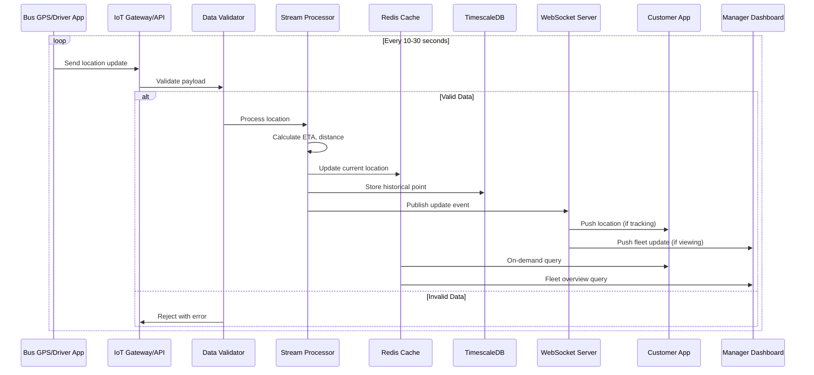

### 5.4 Geospatial Queries & Calculations

**Query Patterns:**

```
1. Get Current Bus Location:
   Redis: GET bus:location:{busId}
   Fallback to PostgreSQL if Redis miss

2. Get All Active Buses in Region:
   Redis: GEOSEARCH bus:locations FROMLONLAT 3.0588 36.7538 BYRADIUS 50 KM
   Returns all buses within 50km radius

3. Track Bus on Route:
   Redis: Multiple keys
   - bus:location:{busId} - current position
   - route:geofence:{routeId} - route polygon
   - Check if bus within route corridor

4. Calculate ETA:
   - Current location
   - Destination coordinates
   - Average speed from last 5 minutes
   - Traffic factor (if available from Google Maps)
   - Formula: ETA = (distance_remaining / avg_speed) * traffic_factor

5. Detect Route Deviation:
   - Calculate distance from bus to route polyline
   - If distance > threshold (e.g., 2km):
     - Alert manager
     - Notify customer
     - Log incident

Geofencing:
- Define route corridor (buffer around polyline)
- Alert if bus leaves corridor
- Notify if approaching stops
- Trigger arrival notifications

Performance Optimizations:
- Pre-calculate route polylines
- Cache route geometries in Redis
- Use GiST indexes on PostGIS columns
- Batch location updates (max 1000/sec)
```

### 5.5 Map Integration Architecture

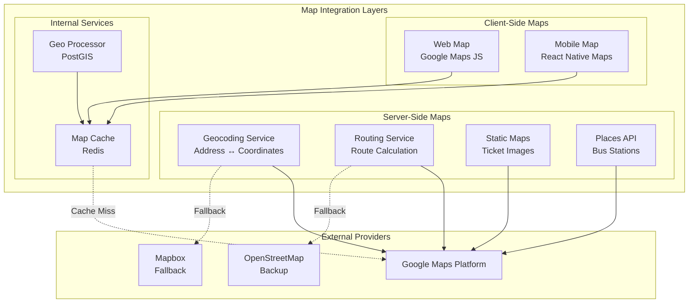

**Map Integration Features:**

```
Customer App Features:
1. Route Visualization:
   - Display route polyline on map
   - Show origin and destination markers
   - Display intermediate stops
   - Highlight major cities along route

2. Live Bus Tracking:
   - Real-time bus marker (moving)
   - ETA countdown
   - Distance to destination
   - Next stop information
   - Traffic conditions overlay

3. Station Locator:
   - Find nearby bus stations
   - Get directions to station
   - Show station amenities
   - Display departure times

4. Trip Sharing:
   - Share live location with family
   - Emergency SOS with location
   - Trip progress timeline

Manager Dashboard Features:
1. Fleet Overview Map:
   - All active buses displayed
   - Color-coded by status (on-time, delayed, idle)
   - Cluster markers for dense areas
   - Filter by route, partner, status

2. Route Management:
   - Visualize all routes on map
   - Edit route polylines
   - Add/remove stops
   - Define service areas

3. Heatmap Analytics:
   - Popular routes
   - High-demand areas
   - Traffic patterns
   - Service coverage gaps

4. Geofencing:
   - Define operational zones
   - Restricted areas
   - Speed limit zones
   - Border checkpoints

Technical Implementation:
- Google Maps JavaScript API (web)
- React Native Maps (mobile)
- Google Maps Directions API (routing)
- Google Maps Geocoding API (address lookup)
- Google Maps Static API (ticket images)

Cost Optimization:
- Cache geocoding results (30 days)
- Cache static maps (indefinite)
- Cache direction polylines (7 days)
- Use map data locally where possible
- Batch geocoding requests
- Use session tokens

Fallback Strategy:
- Primary: Google Maps
- Secondary: Mapbox
- Tertiary: OpenStreetMap (offline maps)
```

---

## 6. Caching & Performance Strategy

### 6.1 Multi-Layer Caching Architecture

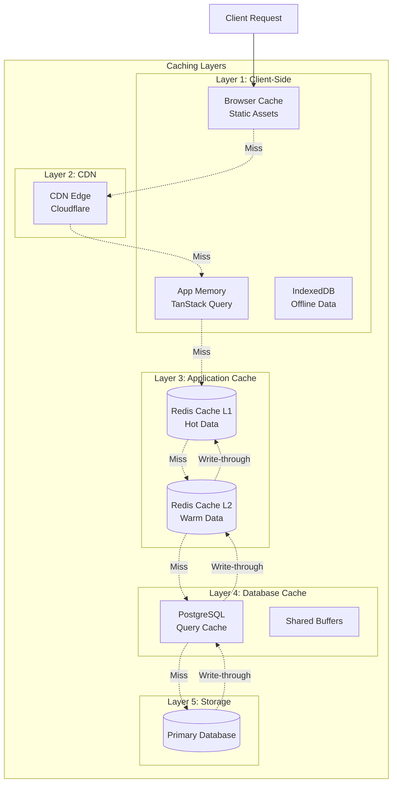

### 6.2 Redis Caching Strategy

**Cache Key Patterns:**

```
Key Naming Convention:
{service}:{resource}:{identifier}:{attribute}

Examples:
user:profile:12345 - User profile
route:details:456 - Route information
route:search:ALG-ORA-2025-01-15 - Search results
booking:availability:route456:2025-01-15 - Seat availability
pricing:dynamic:route456:2025-01-15 - Dynamic pricing
session:jwt:user12345 - JWT token (refresh)
ratelimit:api:user12345 - Rate limit counter
location:bus:bus789 - Current bus location
analytics:dashboard:daily:2025-01-15 - Dashboard metrics

Key Strategies by Data Type:

1. User Sessions (TTL: 30 days):
   Key: session:{userId}
   Value: JWT payload, user preferences
   Strategy: Sliding expiration on access

2. Route Information (TTL: 6 hours):
   Key: route:details:{routeId}
   Value: Full route object with schedules
   Strategy: Write-through, invalidate on update

3. Search Results (TTL: 5 minutes):
   Key: search:{origin}:{dest}:{date}:{hash}
   Value: Array of matching routes
   Strategy: Short TTL, high hit rate

4. Seat Availability (TTL: 30 seconds):
   Key: avail:{scheduleId}
   Value: Available seat count
   Strategy: Very short TTL, updated on booking

5. Dynamic Pricing (TTL: 5 minutes):
   Key: price:{scheduleId}:{passengers}
   Value: Calculated price
   Strategy: Recalculated frequently

6. Bus Locations (TTL: 1 hour):
   Key: location:bus:{busId}
   Value: Latest location + metadata
   Strategy: Auto-expire if no updates

7. Popular Routes (TTL: 24 hours):
   Key: popular:routes:{region}
   Value: Sorted set of popular routes
   Strategy: Daily recalculation

Cache Invalidation Patterns:

1. Time-based (TTL):
   - Static data: 6-24 hours
   - Dynamic data: 1-5 minutes
   - Real-time data: 10-60 seconds

2. Event-based:
   - Booking created → invalidate availability
   - Route updated → invalidate route cache
   - Price changed → invalidate pricing cache

3. Manual:
   - Admin actions
   - System maintenance
   - Cache warming after deployment

Cache Warming Strategy:
- Pre-populate popular routes on startup
- Pre-calculate next 7 days availability
- Load frequently accessed user profiles
- Background job runs hourly
```

### 6.3 Query Performance Optimization

**Query Optimization Techniques:**

```
1. N+1 Query Prevention:
   Problem: Loading bookings with route details
   Bad: Load bookings, then load route for each booking (N queries)
   Good: Single query with JOIN or eager loading

2. Pagination:
   Always use LIMIT/OFFSET or cursor-based pagination
   Max page size: 100 items
   Default: 20 items

3. Selective Column Loading:
   Don't SELECT * - specify needed columns
   Reduces data transfer and parsing time

4. Query Result Caching:
   Cache expensive aggregations
   Cache complex JOINs
   Cache computed values

5. Materialized Views:
   For complex analytics queries
   Refresh strategy: Incremental or full
   Example: Daily booking statistics

6. Connection Pooling:
   PgBouncer in transaction mode
   Pool size: 2x CPU cores
   Max client connections: 1000
   Server connections: 100

7. Prepared Statements:
   Reuse query plans
   Reduce parsing overhead
   Better performance for repeated queries

8. Explain Analyze:
   Monitor slow queries (>500ms)
   Analyze query plans
   Optimize based on actual execution

9. Partial Indexes:
   Index only relevant subset
   Example: WHERE is_active = true
   Smaller index size, faster lookups

10. JSONB Indexing:
    GIN index on JSONB columns
    Index specific keys if possible
    Example: preferences->'language'
```

### 6.4 Response Time Targets

```
Performance Benchmarks:

API Response Times (95th percentile):
- Simple GET (cached): <50ms
- Simple GET (uncached): <200ms
- Complex Query: <500ms
- Search with filters: <800ms
- Create booking: <1000ms
- Payment processing: <3000ms

Page Load Times (95th percentile):
- Homepage (first load): <2s
- Homepage (cached): <500ms
- Search results: <1.5s
- Booking flow (per step): <1s
- Dashboard: <2s

Real-time Updates:
- Location update latency: <200ms
- WebSocket message delivery: <100ms
- Notification delivery: <500ms

Database Query Times (95th percentile):
- Simple SELECT: <10ms
- JOIN query: <50ms
- Aggregation: <100ms
- Full-text search: <200ms

Monitoring Thresholds:
- Alert if p95 > 2x target
- Page if p95 > 5x target
- Critical if p50 > target
```
