# Enterprise Technical Architecture & System Design

## Table of Contents

1. Executive Architecture Summary
2. System Architecture Overview
3. Database Architecture & Design
4. API Architecture & Design Patterns
5. Real-Time Fleet Tracking System
6. Map Integration Architecture
7. Caching & Performance Strategy
8. Message Queue & Event Architecture
9. Authentication & Security
10. Scalability Architecture
11. VPS Deployment Strategy
12. Monitoring & Observability
13. CI/CD Pipeline Design
14. Disaster Recovery & Backup
15. Technical Stack Justification
16. Missing Features Analysis
17. Performance Benchmarks

---

## 1. Executive Architecture Summary

### Architecture Philosophy

**Principles:**
- **Microservices-Ready Monolith**: Start monolithic, design for future service extraction
- **Event-Driven**: Async communication for non-critical paths
- **API-First**: All functionality exposed through APIs
- **Real-Time First**: WebSocket for live updates
- **Cache-Heavy**: Redis at multiple layers
- **Observable**: Metrics, logs, traces everywhere
- **Resilient**: Circuit breakers, retries, fallbacks
- **Scalable**: Horizontal scaling capability

### Architecture Maturity Path

```
Phase 1 (Months 0-6): Modular Monolith on VPS
├─ Single server deployment
├─ PostgreSQL + Redis on same machine
├─ Load balancer ready architecture
└─ Monitoring and metrics

Phase 2 (Months 7-12): Distributed Monolith
├─ Multiple application servers
├─ Separate database server
├─ Redis cluster
├─ CDN integration
└─ Queue workers separated

Phase 3 (Months 13-18): Service Extraction
├─ Booking service separated
├─ Notification service separated
├─ Fleet tracking service separated
├─ Payment service separated
└─ API Gateway introduced

Phase 4 (Months 19-24): Full Microservices
├─ 8-10 independent services
├─ Service mesh (optional)
├─ Distributed tracing
├─ Multi-region deployment
└─ Event-driven architecture
```

---

## 2. System Architecture Overview

### 2.1 High-Level Architecture

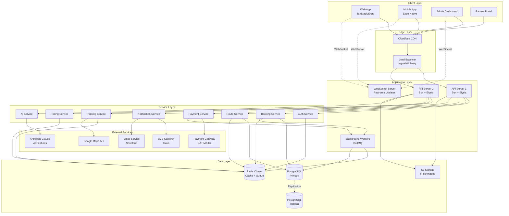
```mermaid
graph TB
    subgraph "Client Layer"
        WEB[Web App<br/>TanStack/Expo]
        MOBILE[Mobile App<br/>Expo Native]
        ADMIN[Admin Dashboard]
        PARTNER[Partner Portal]
    end

    subgraph "Edge Layer"
        CDN[Cloudflare CDN]
        LB[Load Balancer<br/>Nginx/HAProxy]
    end

    subgraph "Application Layer"
        API1[API Server 1<br/>Bun + Elysia]
        API2[API Server 2<br/>Bun + Elysia]
        WS[WebSocket Server<br/>Real-time Updates]
        WORKER[Background Workers<br/>BullMQ]
    end

    subgraph "Service Layer"
        AUTH[Auth Service]
        BOOKING[Booking Service]
        ROUTE[Route Service]
        PAYMENT[Payment Service]
        NOTIF[Notification Service]
        TRACKING[Tracking Service]
        PRICING[Pricing Service]
        AI[AI Service]
    end

    subgraph "Data Layer"
        PGSQL[(PostgreSQL<br/>Primary)]
        PGREP[(PostgreSQL<br/>Replica)]
        REDIS[(Redis Cluster<br/>Cache + Queue)]
        S3[S3 Storage<br/>Files/Images]
    end

    subgraph "External Services"
        MAPS[Google Maps API]
        SMS[SMS Gateway<br/>Twilio]
        EMAIL[Email Service<br/>SendGrid]
        PAY[Payment Gateway<br/>SATIM/CIB]
        CLAUDE[Anthropic Claude<br/>AI Features]
    end

    WEB --> CDN
    MOBILE --> CDN
    ADMIN --> CDN
    PARTNER --> CDN
    CDN --> LB
    LB --> API1
    LB --> API2
    API1 --> AUTH
    API1 --> BOOKING
    API1 --> ROUTE
    API1 --> PAYMENT
    API2 --> NOTIF
    API2 --> TRACKING
    API2 --> PRICING
    API2 --> AI
    
    WEB -.WebSocket.-> WS
    MOBILE -.WebSocket.-> WS
    ADMIN -.WebSocket.-> WS
    
    AUTH --> REDIS
    BOOKING --> PGSQL
    BOOKING --> REDIS
    ROUTE --> PGSQL
    ROUTE --> REDIS
    PAYMENT --> PAY
    NOTIF --> SMS
    NOTIF --> EMAIL
    TRACKING --> REDIS
    TRACKING --> MAPS
    PRICING --> REDIS
    AI --> CLAUDE
    
    BOOKING --> WORKER
    PAYMENT --> WORKER
    WORKER --> REDIS
    WORKER --> PGSQL
    
    PGSQL -.Replication.-> PGREP
    
    API1 --> S3
    API2 --> S3
```

### 2.2 Detailed Component Architecture

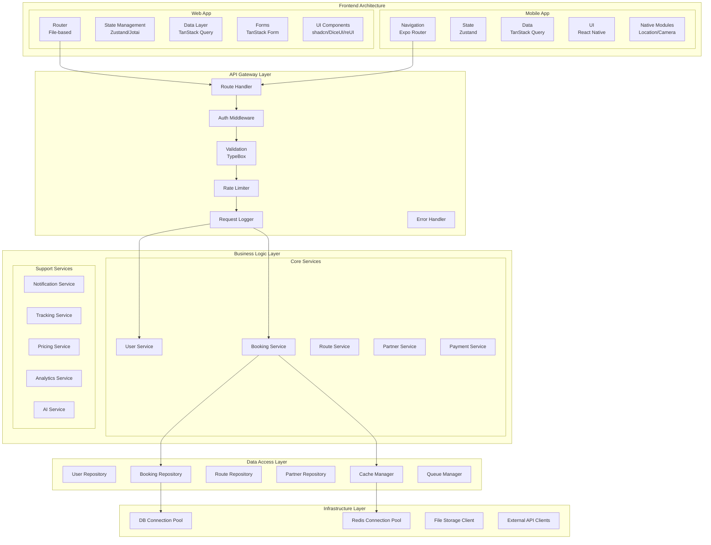
```mermaid
graph TB
    subgraph "Frontend Architecture"
        subgraph "Web App"
            WA_ROUTER[Router<br/>File-based]
            WA_STATE[State Management<br/>Zustand/Jotai]
            WA_QUERY[Data Layer<br/>TanStack Query]
            WA_FORM[Forms<br/>TanStack Form]
            WA_UI[UI Components<br/>shadcn/DiceUI/reUI]
        end
        
        subgraph "Mobile App"
            MA_NAV[Navigation<br/>Expo Router]
            MA_STATE[State<br/>Zustand]
            MA_QUERY[Data<br/>TanStack Query]
            MA_UI[UI<br/>React Native]
            MA_NATIVE[Native Modules<br/>Location/Camera]
        end
    end

    subgraph "API Gateway Layer"
        GW_ROUTE[Route Handler]
        GW_AUTH[Auth Middleware]
        GW_VALID[Validation<br/>TypeBox]
        GW_RATE[Rate Limiter]
        GW_LOG[Request Logger]
        GW_ERROR[Error Handler]
    end

    subgraph "Business Logic Layer"
        subgraph "Core Services"
            SVC_USER[User Service]
            SVC_BOOK[Booking Service]
            SVC_ROUTE[Route Service]
            SVC_PART[Partner Service]
            SVC_PAY[Payment Service]
        end
        
        subgraph "Support Services"
            SVC_NOTIF[Notification Service]
            SVC_TRACK[Tracking Service]
            SVC_PRICE[Pricing Service]
            SVC_ANAL[Analytics Service]
            SVC_AI[AI Service]
        end
    end

    subgraph "Data Access Layer"
        REPO_USER[User Repository]
        REPO_BOOK[Booking Repository]
        REPO_ROUTE[Route Repository]
        REPO_PART[Partner Repository]
        CACHE[Cache Manager]
        QUEUE[Queue Manager]
    end

    subgraph "Infrastructure Layer"
        DB_POOL[DB Connection Pool]
        REDIS_POOL[Redis Connection Pool]
        FILE_STORE[File Storage Client]
        EXT_API[External API Clients]
    end

    WA_ROUTER --> GW_ROUTE
    MA_NAV --> GW_ROUTE
    GW_ROUTE --> GW_AUTH
    GW_AUTH --> GW_VALID
    GW_VALID --> GW_RATE
    GW_RATE --> GW_LOG
    GW_LOG --> SVC_USER
    GW_LOG --> SVC_BOOK
    
    SVC_BOOK --> REPO_BOOK
    SVC_BOOK --> CACHE
    REPO_BOOK --> DB_POOL
    CACHE --> REDIS_POOL
```

### 2.3 Request Flow Architecture

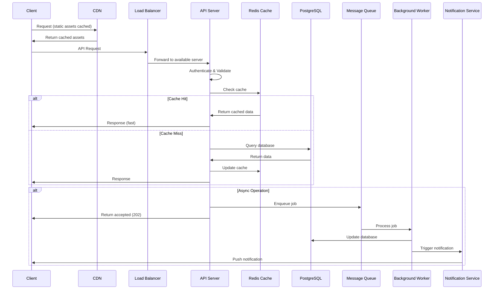
```mermaid
sequenceDiagram
    participant Client
    participant CDN
    participant LB as Load Balancer
    participant API as API Server
    participant Cache as Redis Cache
    participant DB as PostgreSQL
    participant Queue as Message Queue
    participant Worker as Background Worker
    participant Notify as Notification Service

    Client->>CDN: Request (static assets cached)
    CDN->>Client: Return cached assets
    
    Client->>LB: API Request
    LB->>API: Forward to available server
    
    API->>API: Authenticate & Validate
    API->>Cache: Check cache
    
    alt Cache Hit
        Cache->>API: Return cached data
        API->>Client: Response (fast)
    else Cache Miss
        API->>DB: Query database
        DB->>API: Return data
        API->>Cache: Update cache
        API->>Client: Response
    end
    
    alt Async Operation
        API->>Queue: Enqueue job
        API->>Client: Return accepted (202)
        Queue->>Worker: Process job
        Worker->>DB: Update database
        Worker->>Notify: Trigger notification
        Notify->>Client: Push notification
    end
```

---

## 3. Database Architecture & Design

### 3.1 Database Strategy

**PostgreSQL Choice Rationale:**
- ACID compliance for financial transactions
- Complex queries with JOINs
- JSON support for flexible data (preferences, metadata)
- Excellent indexing capabilities
- Mature replication and backup tools
- Strong ecosystem and community

**Scaling Strategy:**
- **Vertical (Phase 1)**: 8-16GB RAM, 4-8 vCPUs
- **Replication (Phase 2)**: Primary-replica for read scaling
- **Partitioning (Phase 3)**: Partition bookings by date
- **Sharding (Phase 4)**: Shard by region if multi-region

### 3.2 Database Schema Design

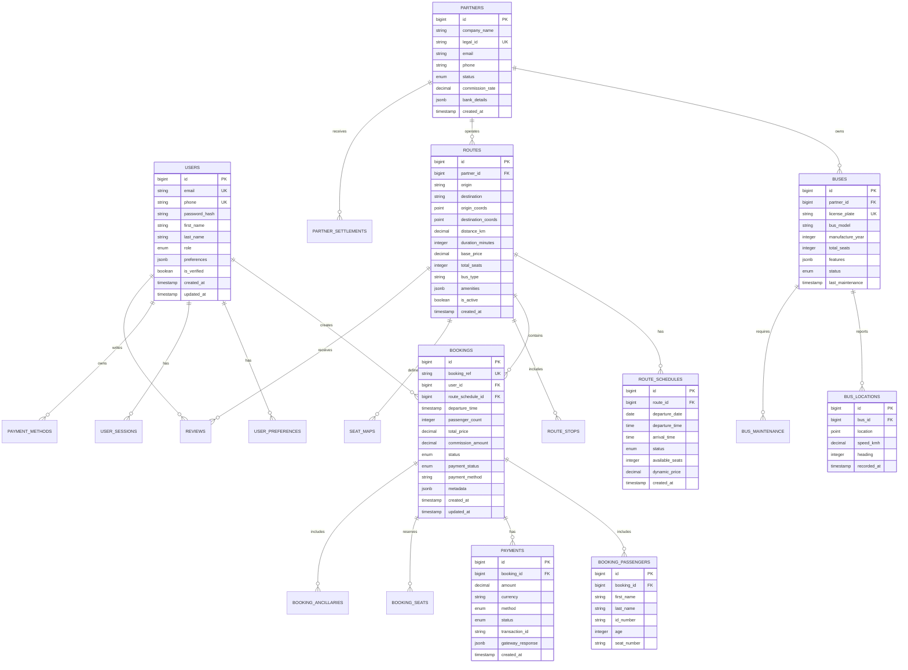
```mermaid
erDiagram
    USERS ||--o{ BOOKINGS : creates
    USERS ||--o{ USER_PREFERENCES : has
    USERS ||--o{ USER_SESSIONS : has
    USERS ||--o{ PAYMENT_METHODS : owns
    
    PARTNERS ||--o{ BUSES : owns
    PARTNERS ||--o{ ROUTES : operates
    PARTNERS ||--o{ PARTNER_SETTLEMENTS : receives
    
    ROUTES ||--o{ ROUTE_SCHEDULES : has
    ROUTES ||--o{ BOOKINGS : contains
    ROUTES ||--o{ ROUTE_STOPS : includes
    ROUTES ||--o{ SEAT_MAPS : defines
    
    BOOKINGS ||--o{ BOOKING_PASSENGERS : includes
    BOOKINGS ||--o{ PAYMENTS : has
    BOOKINGS ||--o{ BOOKING_SEATS : reserves
    BOOKINGS ||--o{ BOOKING_ANCILLARIES : includes
    
    BUSES ||--o{ BUS_LOCATIONS : reports
    BUSES ||--o{ BUS_MAINTENANCE : requires
    
    ROUTES ||--o{ REVIEWS : receives
    USERS ||--o{ REVIEWS : writes
    
    USERS {
        bigint id PK
        string email UK
        string phone UK
        string password_hash
        string first_name
        string last_name
        enum role
        jsonb preferences
        boolean is_verified
        timestamp created_at
        timestamp updated_at
    }
    
    PARTNERS {
        bigint id PK
        string company_name
        string legal_id UK
        string email
        string phone
        enum status
        decimal commission_rate
        jsonb bank_details
        timestamp created_at
    }
    
    ROUTES {
        bigint id PK
        bigint partner_id FK
        string origin
        string destination
        point origin_coords
        point destination_coords
        decimal distance_km
        integer duration_minutes
        decimal base_price
        integer total_seats
        string bus_type
        jsonb amenities
        boolean is_active
        timestamp created_at
    }
    
    ROUTE_SCHEDULES {
        bigint id PK
        bigint route_id FK
        date departure_date
        time departure_time
        time arrival_time
        enum status
        integer available_seats
        decimal dynamic_price
        timestamp created_at
    }
    
    BOOKINGS {
        bigint id PK
        string booking_ref UK
        bigint user_id FK
        bigint route_schedule_id FK
        timestamp departure_time
        integer passenger_count
        decimal total_price
        decimal commission_amount
        enum status
        enum payment_status
        string payment_method
        jsonb metadata
        timestamp created_at
        timestamp updated_at
    }
    
    BOOKING_PASSENGERS {
        bigint id PK
        bigint booking_id FK
        string first_name
        string last_name
        string id_number
        integer age
        string seat_number
    }
    
    BUSES {
        bigint id PK
        bigint partner_id FK
        string license_plate UK
        string bus_model
        integer manufacture_year
        integer total_seats
        jsonb features
        enum status
        timestamp last_maintenance
    }
    
    BUS_LOCATIONS {
        bigint id PK
        bigint bus_id FK
        point location
        decimal speed_kmh
        integer heading
        timestamp recorded_at
    }
    
    PAYMENTS {
        bigint id PK
        bigint booking_id FK
        decimal amount
        string currency
        enum method
        enum status
        string transaction_id
        jsonb gateway_response
        timestamp created_at
    }
```

### 3.3 Indexing Strategy

**Critical Indexes:**

```
Performance-Critical Indexes:

1. bookings
   - (user_id, created_at DESC) - User booking history
   - (booking_ref) UNIQUE - Lookup by reference
   - (route_schedule_id, status) - Route occupancy
   - (status, payment_status) - Admin filtering
   - (departure_time) WHERE status='confirmed' - Future bookings

2. routes
   - (origin, destination, is_active) - Route search
   - GiST (origin_coords) - Geospatial search
   - GiST (destination_coords) - Geospatial search
   - (partner_id, is_active) - Partner routes

3. route_schedules
   - (route_id, departure_date, departure_time) - Schedule lookup
   - (departure_date, status) WHERE is_active - Daily schedules
   - (available_seats) WHERE available_seats > 0 - Availability

4. users
   - (email) UNIQUE - Login
   - (phone) UNIQUE - SMS login
   - (created_at DESC) - Recent signups

5. bus_locations
   - (bus_id, recorded_at DESC) - Latest location
   - GiST (location) - Geospatial queries
   - Partial index WHERE recorded_at > NOW() - '1 day' - Recent only

6. payments
   - (booking_id) - Payment lookup
   - (transaction_id) UNIQUE - Deduplication
   - (status, created_at DESC) - Failed payment retry

Composite Indexes:
- Multi-column indexes where query patterns show consistent column combinations
- Include columns used in WHERE, JOIN, ORDER BY clauses

Index Maintenance:
- REINDEX monthly for high-write tables
- Monitor index bloat
- Analyze query plans regularly
- Drop unused indexes (monitor pg_stat_user_indexes)
```

### 3.4 Partitioning Strategy

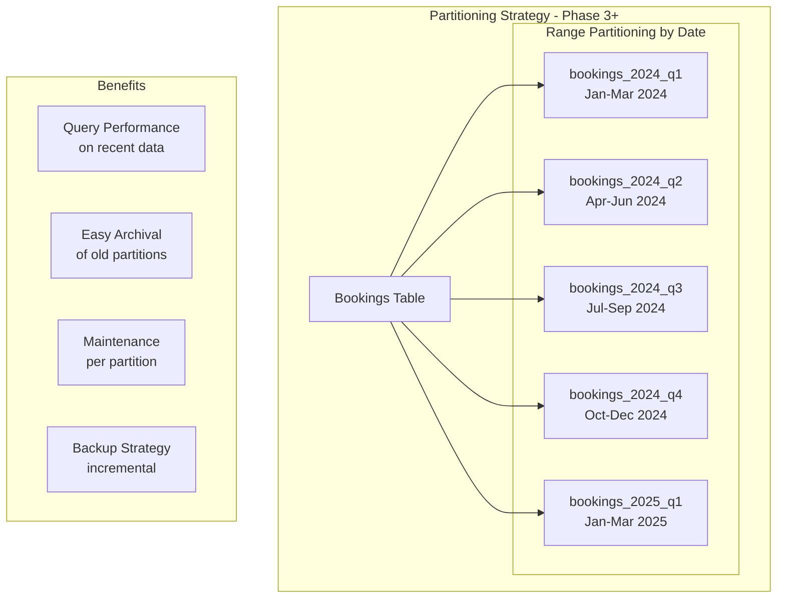
```mermaid
graph TB
    subgraph "Partitioning Strategy - Phase 3+"
        BOOKINGS[Bookings Table]
        
        subgraph "Range Partitioning by Date"
            P2024Q1[bookings_2024_q1<br/>Jan-Mar 2024]
            P2024Q2[bookings_2024_q2<br/>Apr-Jun 2024]
            P2024Q3[bookings_2024_q3<br/>Jul-Sep 2024]
            P2024Q4[bookings_2024_q4<br/>Oct-Dec 2024]
            P2025Q1[bookings_2025_q1<br/>Jan-Mar 2025]
        end
        
        BOOKINGS --> P2024Q1
        BOOKINGS --> P2024Q2
        BOOKINGS --> P2024Q3
        BOOKINGS --> P2024Q4
        BOOKINGS --> P2025Q1
    end
    
    subgraph "Benefits"
        B1[Query Performance<br/>on recent data]
        B2[Easy Archival<br/>of old partitions]
        B3[Maintenance<br/>per partition]
        B4[Backup Strategy<br/>incremental]
    end
```

**Partition Configuration:**

```
Table: bookings
Strategy: Range partitioning by departure_time
Partition Size: Quarterly

Rationale:
- 80% of queries target last 3 months
- Easy archival of >1 year old data
- Quarterly aligns with business cycles
- Manageable partition count (~12 active)

Auto-creation: 
- Create next quarter partition 1 month in advance
- Automated via cron job

Archival:
- Move partitions >1 year to cold storage
- Keep metadata/aggregates in main database
```

### 3.5 Database Replication Architecture

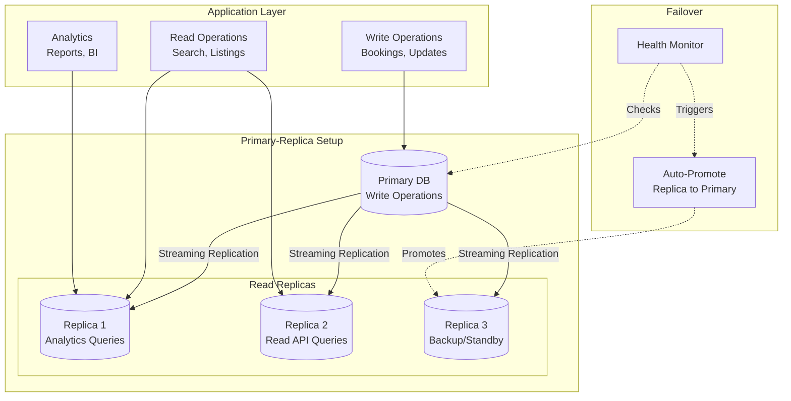
```mermaid
graph TB
    subgraph "Primary-Replica Setup"
        PRIMARY[(Primary DB<br/>Write Operations)]
        
        subgraph "Read Replicas"
            REPLICA1[(Replica 1<br/>Analytics Queries)]
            REPLICA2[(Replica 2<br/>Read API Queries)]
            REPLICA3[(Replica 3<br/>Backup/Standby)]
        end
        
        PRIMARY -->|Streaming Replication| REPLICA1
        PRIMARY -->|Streaming Replication| REPLICA2
        PRIMARY -->|Streaming Replication| REPLICA3
    end
    
    subgraph "Application Layer"
        APP_WRITE[Write Operations<br/>Bookings, Updates]
        APP_READ[Read Operations<br/>Search, Listings]
        APP_ANALYTICS[Analytics<br/>Reports, BI]
    end
    
    APP_WRITE --> PRIMARY
    APP_READ --> REPLICA1
    APP_READ --> REPLICA2
    APP_ANALYTICS --> REPLICA1
    
    subgraph "Failover"
        MONITOR[Health Monitor]
        PROMOTE[Auto-Promote<br/>Replica to Primary]
    end
    
    MONITOR -.Checks.-> PRIMARY
    MONITOR -.Triggers.-> PROMOTE
    PROMOTE -.Promotes.-> REPLICA3
```

**Replication Configuration:**

```
Primary Database:
- All writes (INSERT, UPDATE, DELETE)
- Critical reads requiring freshest data
- Transaction coordinator

Read Replica 1:
- API read queries (search, route listings)
- User profile queries
- General application reads
- Lag tolerance: <1 second

Read Replica 2:
- Load distribution for reads
- Geographic failover ready
- Lag tolerance: <1 second

Read Replica 3 (Analytics):
- Heavy analytical queries
- Reporting and BI
- Data exports
- Lag tolerance: <30 seconds

Connection Pooling:
- Primary: PgBouncer (transaction mode)
- Replicas: PgBouncer (session mode)
- Max connections per pool: 100
- Statement timeout: 30s
```

---

## 4. API Architecture & Design Patterns

### 4.1 API Design Philosophy

**RESTful API + WebSocket Hybrid:**

```
REST API:
- Standard CRUD operations
- Stateless requests
- HTTP methods semantic (GET, POST, PUT, PATCH, DELETE)
- JSON response format
- Versioned (/api/v1/)

WebSocket:
- Real-time updates (bus location, booking status)
- Bi-directional communication
- Persistent connection
- Event-based messaging
```

### 4.2 API Gateway Pattern

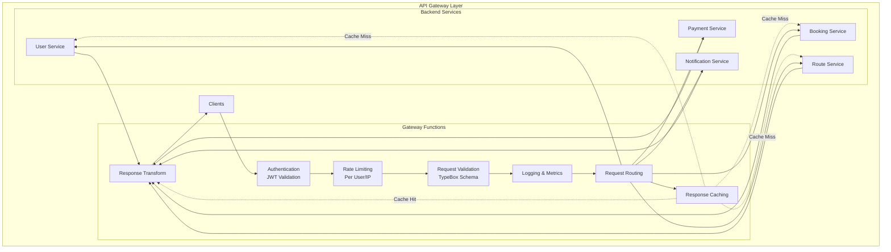
```mermaid
graph TB
    subgraph "API Gateway Layer"
        CLIENT[Clients]
        
        subgraph "Gateway Functions"
            AUTH[Authentication<br/>JWT Validation]
            RATE[Rate Limiting<br/>Per User/IP]
            VALID[Request Validation<br/>TypeBox Schema]
            LOG[Logging & Metrics]
            ROUTE[Request Routing]
            TRANSFORM[Response Transform]
            CACHE[Response Caching]
        end
        
        subgraph "Backend Services"
            SVC1[User Service]
            SVC2[Booking Service]
            SVC3[Route Service]
            SVC4[Payment Service]
            SVC5[Notification Service]
        end
    end
    
    CLIENT --> AUTH
    AUTH --> RATE
    RATE --> VALID
    VALID --> LOG
    LOG --> ROUTE
    ROUTE --> CACHE
    
    CACHE -.Cache Hit.-> TRANSFORM
    CACHE -.Cache Miss.-> SVC1
    CACHE -.Cache Miss.-> SVC2
    CACHE -.Cache Miss.-> SVC3
    
    ROUTE --> SVC1
    ROUTE --> SVC2
    ROUTE --> SVC3
    ROUTE --> SVC4
    ROUTE --> SVC5
    
    SVC1 --> TRANSFORM
    SVC2 --> TRANSFORM
    SVC3 --> TRANSFORM
    SVC4 --> TRANSFORM
    SVC5 --> TRANSFORM
    
    TRANSFORM --> CLIENT
```

### 4.3 API Endpoint Structure

**Resource-Based URL Design:**

```
Base URL: https://api.yourplatform.dz/v1

Authentication & Users:
POST   /auth/register              - Register new user
POST   /auth/login                 - Login (email/phone)
POST   /auth/verify-otp            - Verify OTP
POST   /auth/refresh               - Refresh token
POST   /auth/logout                - Logout
GET    /users/me                   - Current user profile
PATCH  /users/me                   - Update profile
GET    /users/me/bookings          - User's bookings

Routes:
GET    /routes                     - Search routes
GET    /routes/:id                 - Route details
GET    /routes/:id/schedules       - Route schedules
GET    /routes/popular             - Popular routes
GET    /routes/suggestions         - AI suggestions

Bookings:
POST   /bookings                   - Create booking
GET    /bookings                   - List user bookings
GET    /bookings/:id               - Booking details
PATCH  /bookings/:id/cancel        - Cancel booking
GET    /bookings/:id/ticket        - Download ticket PDF
POST   /bookings/:id/modify        - Modify booking

Payments:
POST   /payments/initiate          - Start payment
POST   /payments/confirm           - Confirm payment
GET    /payments/:id/status        - Payment status
POST   /payments/refund            - Request refund

Real-time:
WS     /ws/tracking/:busId         - Bus location stream
WS     /ws/booking/:bookingId      - Booking status updates
WS     /ws/notifications           - User notifications

Admin (separate subdomain: admin-api):
GET    /admin/analytics/dashboard  - Dashboard metrics
GET    /admin/bookings             - All bookings
GET    /admin/partners             - Partner management
GET    /admin/routes               - Route management
```

### 4.4 Request/Response Patterns

**Standard Response Format:**

```
Success Response Structure:
{
  "success": true,
  "data": { ... },
  "meta": {
    "timestamp": "2025-01-15T10:30:00Z",
    "requestId": "req_abc123"
  }
}

Paginated Response:
{
  "success": true,
  "data": [ ... ],
  "pagination": {
    "page": 1,
    "limit": 20,
    "total": 150,
    "totalPages": 8,
    "hasNext": true,
    "hasPrevious": false
  },
  "meta": { ... }
}

Error Response:
{
  "success": false,
  "error": {
    "code": "BOOKING_NOT_FOUND",
    "message": "Booking with ID 12345 not found",
    "details": { ... },
    "field": "bookingId" // for validation errors
  },
  "meta": { ... }
}

HTTP Status Codes:
200 - Success
201 - Created
202 - Accepted (async processing)
400 - Bad Request (validation error)
401 - Unauthorized
403 - Forbidden
404 - Not Found
409 - Conflict
422 - Unprocessable Entity
429 - Too Many Requests
500 - Internal Server Error
503 - Service Unavailable
```

### 4.5 API Versioning Strategy

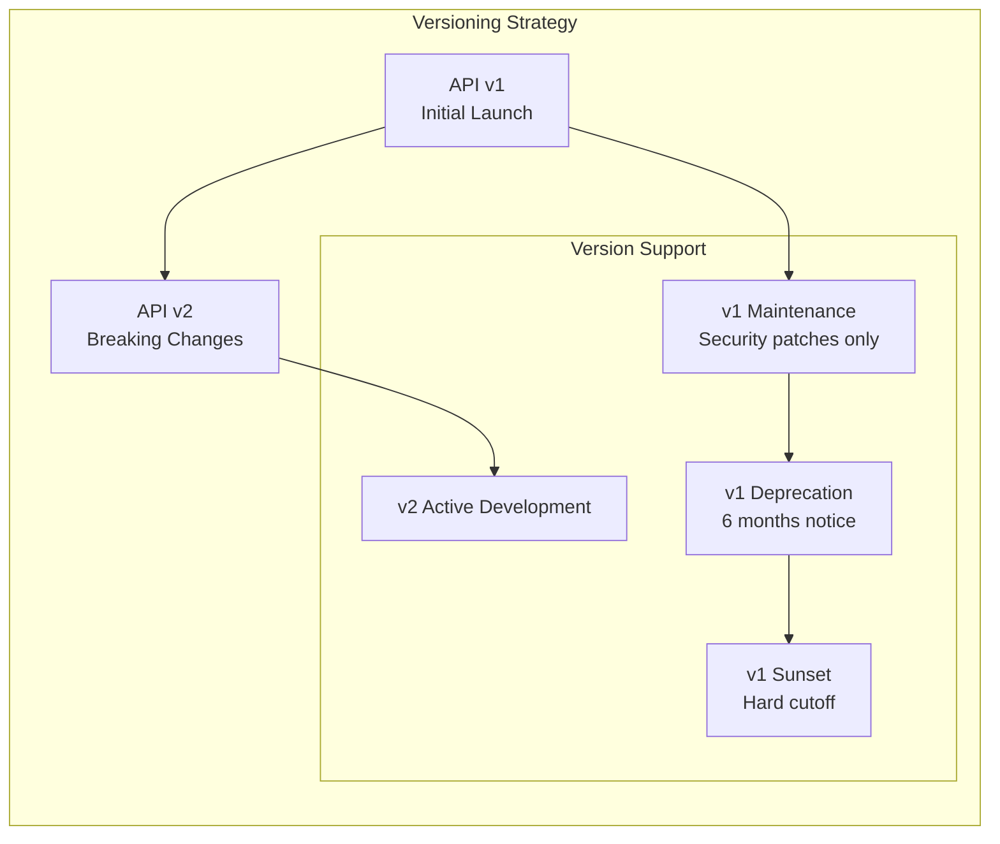
```mermaid
graph LR
    subgraph "Versioning Strategy"
        V1[API v1<br/>Initial Launch]
        V2[API v2<br/>Breaking Changes]
        
        subgraph "Version Support"
            V1_MAINT[v1 Maintenance<br/>Security patches only]
            V2_ACTIVE[v2 Active Development]
            V1_DEPRECATE[v1 Deprecation<br/>6 months notice]
            V1_SUNSET[v1 Sunset<br/>Hard cutoff]
        end
    end
    
    V1 --> V2
    V2 --> V2_ACTIVE
    V1 --> V1_MAINT
    V1_MAINT --> V1_DEPRECATE
    V1_DEPRECATE --> V1_SUNSET
```

**Versioning Rules:**

```
Version Strategy: URL-based (/api/v1, /api/v2)

Breaking Changes Trigger New Version:
- Changed response structure
- Removed fields
- Changed field types
- Changed authentication method
- Changed business logic significantly

Non-Breaking Changes (Same Version):
- Added optional fields
- Added new endpoints
- Added optional parameters
- Performance improvements
- Bug fixes

Version Lifecycle:
- v1: Launch → 12 months (active) → 6 months (maintenance) → deprecate
- Minimum 6 months notice before sunset
- Client SDK updates provided 3 months before deprecation
- Migration guides published

Version Headers:
Request: X-API-Version: 1
Response: X-API-Version: 1, X-API-Deprecated: true, X-API-Sunset-Date: 2026-01-01
```

---

## 5. Real-Time Fleet Tracking System

### 5.1 Fleet Tracking Architecture

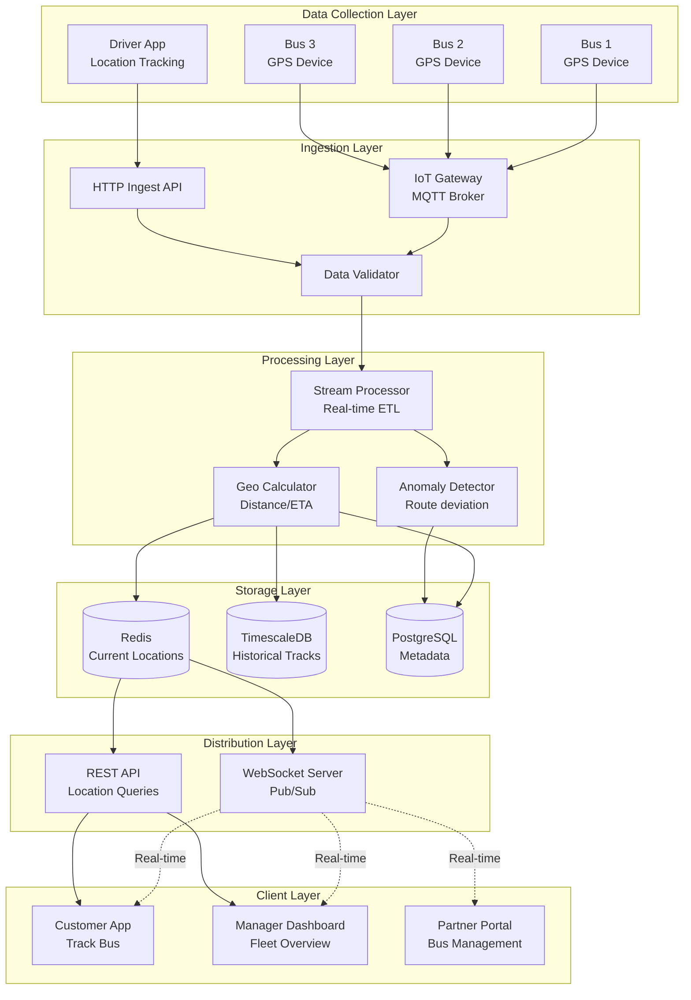
```mermaid
graph TB
    subgraph "Data Collection Layer"
        BUS1[Bus 1<br/>GPS Device]
        BUS2[Bus 2<br/>GPS Device]
        BUS3[Bus 3<br/>GPS Device]
        DRIVER_APP[Driver App<br/>Location Tracking]
    end
    
    subgraph "Ingestion Layer"
        IOT_GATEWAY[IoT Gateway<br/>MQTT Broker]
        API_INGEST[HTTP Ingest API]
        VALIDATOR[Data Validator]
    end
    
    subgraph "Processing Layer"
        STREAM[Stream Processor<br/>Real-time ETL]
        GEO_CALC[Geo Calculator<br/>Distance/ETA]
        ANOMALY[Anomaly Detector<br/>Route deviation]
    end
    
    subgraph "Storage Layer"
        REDIS_LOC[(Redis<br/>Current Locations)]
        TIMESERIES[(TimescaleDB<br/>Historical Tracks)]
        PGSQL[(PostgreSQL<br/>Metadata)]
    end
    
    subgraph "Distribution Layer"
        WS_SERVER[WebSocket Server<br/>Pub/Sub]
        REST_API[REST API<br/>Location Queries]
    end
    
    subgraph "Client Layer"
        CUSTOMER[Customer App<br/>Track Bus]
        MANAGER[Manager Dashboard<br/>Fleet Overview]
        PARTNER[Partner Portal<br/>Bus Management]
    end
    
    BUS1 --> IOT_GATEWAY
    BUS2 --> IOT_GATEWAY
    BUS3 --> IOT_GATEWAY
    DRIVER_APP --> API_INGEST
    
    IOT_GATEWAY --> VALIDATOR
    API_INGEST --> VALIDATOR
    
    VALIDATOR --> STREAM
    STREAM --> GEO_CALC
    STREAM --> ANOMALY
    
    GEO_CALC --> REDIS_LOC
    GEO_CALC --> TIMESERIES
    GEO_CALC --> PGSQL
    ANOMALY --> PGSQL
    
    REDIS_LOC --> WS_SERVER
    REDIS_LOC --> REST_API
    
    WS_SERVER -.Real-time.-> CUSTOMER
    WS_SERVER -.Real-time.-> MANAGER
    WS_SERVER -.Real-time.-> PARTNER
    REST_API --> CUSTOMER
    REST_API --> MANAGER
```

### 5.2 Location Data Model

**Data Structure:**

```
Location Update Payload (from bus/driver):
{
  "busId": "bus_12345",
  "timestamp": 1705320600000, // Unix timestamp ms
  "location": {
    "latitude": 36.7538,
    "longitude": 3.0588,
    "accuracy": 5 // meters
  },
  "motion": {
    "speed": 85.5, // km/h
    "heading": 45, // degrees (0-360)
    "altitude": 120 // meters
  },
  "status": {
    "ignition": true,
    "doorOpen": false,
    "passengers": 32, // if available
    "fuel": 65 // percentage
  },
  "deviceId": "device_abc123",
  "signature": "hmac_signature" // for security
}

Processed Location Data (stored in Redis):
Key: bus:location:{busId}
Value: {
  "busId": "bus_12345",
  "routeId": "route_456",
  "scheduleId": "schedule_789",
  "location": {
    "lat": 36.7538,
    "lng": 3.0588,
    "accuracy": 5
  },
  "motion": {
    "speed": 85.5,
    "heading": 45,
    "altitude": 120
  },
  "calculated": {
    "distanceTraveled": 145.2, // km from origin
    "distanceRemaining": 287.8, // km to destination
    "estimatedArrival": 1705327800000,
    "onSchedule": true,
    "delayMinutes": 0
  },
  "lastUpdate": 1705320600000,
  "nextStopId": "stop_xyz",
  "nextStopETA": 1705321200000
}
TTL: 1 hour (auto-expire if bus stops reporting)

Historical Location Data (TimescaleDB):
Table: bus_location_history
- Hypertable partitioned by time
- Retention: 90 days detailed, 1 year aggregated
- Compression after 7 days
```

### 5.3 Real-Time Update Flow

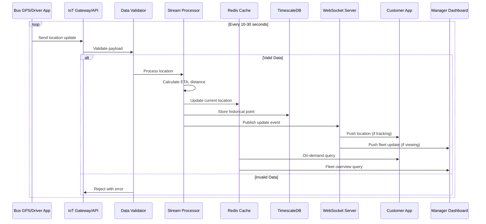
```mermaid
sequenceDiagram
    participant Bus as Bus GPS/Driver App
    participant Gateway as IoT Gateway/API
    participant Validator as Data Validator
    participant Processor as Stream Processor
    participant Redis as Redis Cache
    participant DB as TimescaleDB
    participant WS as WebSocket Server
    participant Customer as Customer App
    participant Manager as Manager Dashboard

    loop Every 10-30 seconds
        Bus->>Gateway: Send location update
        Gateway->>Validator: Validate payload
        
        alt Valid Data
            Validator->>Processor: Process location
            Processor->>Processor: Calculate ETA, distance
            Processor->>Redis: Update current location
            Processor->>DB: Store historical point
            Processor->>WS: Publish update event
            
            WS->>Customer: Push location (if tracking)
            WS->>Manager: Push fleet update (if viewing)
            
            Redis->>Customer: On-demand query
            Redis->>Manager: Fleet overview query
        else Invalid Data
            Validator->>Gateway: Reject with error
        end
    end
```

### 5.4 Geospatial Queries & Calculations

**Query Patterns:**

```
1. Get Current Bus Location:
   Redis: GET bus:location:{busId}
   Fallback to PostgreSQL if Redis miss
   
2. Get All Active Buses in Region:
   Redis: GEOSEARCH bus:locations FROMLONLAT 3.0588 36.7538 BYRADIUS 50 KM
   Returns all buses within 50km radius
   
3. Track Bus on Route:
   Redis: Multiple keys
   - bus:location:{busId} - current position
   - route:geofence:{routeId} - route polygon
   - Check if bus within route corridor
   
4. Calculate ETA:
   - Current location
   - Destination coordinates
   - Average speed from last 5 minutes
   - Traffic factor (if available from Google Maps)
   - Formula: ETA = (distance_remaining / avg_speed) * traffic_factor
   
5. Detect Route Deviation:
   - Calculate distance from bus to route polyline
   - If distance > threshold (e.g., 2km):
     - Alert manager
     - Notify customer
     - Log incident

Geofencing:
- Define route corridor (buffer around polyline)
- Alert if bus leaves corridor
- Notify if approaching stops
- Trigger arrival notifications

Performance Optimizations:
- Pre-calculate route polylines
- Cache route geometries in Redis
- Use GiST indexes on PostGIS columns
- Batch location updates (max 1000/sec)
```

### 5.5 Map Integration Architecture

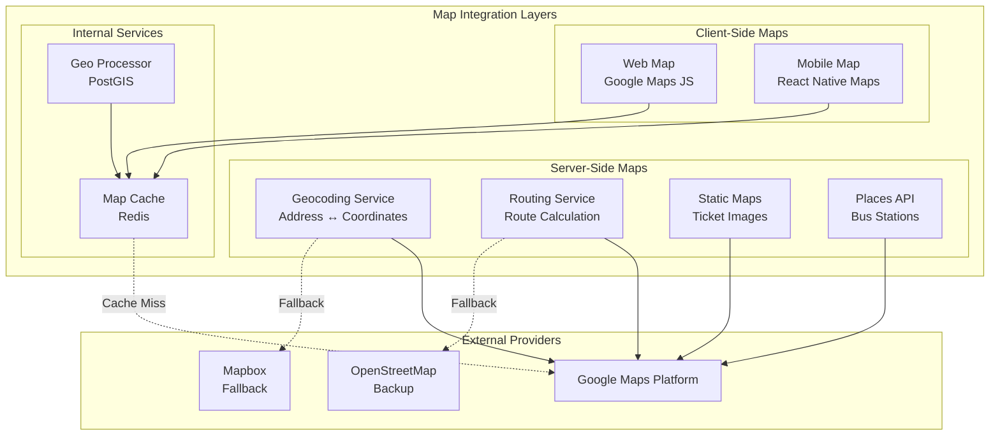
```mermaid
graph TB
    subgraph "Map Integration Layers"
        subgraph "Client-Side Maps"
            WEB_MAP[Web Map<br/>Google Maps JS]
            MOBILE_MAP[Mobile Map<br/>React Native Maps]
        end
        
        subgraph "Server-Side Maps"
            GEOCODE[Geocoding Service<br/>Address ↔ Coordinates]
            ROUTING[Routing Service<br/>Route Calculation]
            STATIC[Static Maps<br/>Ticket Images]
            PLACES[Places API<br/>Bus Stations]
        end
        
        subgraph "Internal Services"
            CACHE_MAP[Map Cache<br/>Redis]
            GEO_PROC[Geo Processor<br/>PostGIS]
        end
    end
    
    subgraph "External Providers"
        GOOGLE[Google Maps Platform]
        MAPBOX[Mapbox<br/>Fallback]
        OSM[OpenStreetMap<br/>Backup]
    end
    
    WEB_MAP --> CACHE_MAP
    MOBILE_MAP --> CACHE_MAP
    CACHE_MAP -.Cache Miss.-> GOOGLE
    GEOCODE --> GOOGLE
    ROUTING --> GOOGLE
    STATIC --> GOOGLE
    PLACES --> GOOGLE
    
    GEOCODE -.Fallback.-> MAPBOX
    ROUTING -.Fallback.-> OSM
    
    GEO_PROC --> CACHE_MAP
```

**Map Integration Features:**

```
Customer App Features:
1. Route Visualization:
   - Display route polyline on map
   - Show origin and destination markers
   - Display intermediate stops
   - Highlight major cities along route
   
2. Live Bus Tracking:
   - Real-time bus marker (moving)
   - ETA countdown
   - Distance to destination
   - Next stop information
   - Traffic conditions overlay
   
3. Station Locator:
   - Find nearby bus stations
   - Get directions to station
   - Show station amenities
   - Display departure times
   
4. Trip Sharing:
   - Share live location with family
   - Emergency SOS with location
   - Trip progress timeline

Manager Dashboard Features:
1. Fleet Overview Map:
   - All active buses displayed
   - Color-coded by status (on-time, delayed, idle)
   - Cluster markers for dense areas
   - Filter by route, partner, status
   
2. Route Management:
   - Visualize all routes on map
   - Edit route polylines
   - Add/remove stops
   - Define service areas
   
3. Heatmap Analytics:
   - Popular routes
   - High-demand areas
   - Traffic patterns
   - Service coverage gaps
   
4. Geofencing:
   - Define operational zones
   - Restricted areas
   - Speed limit zones
   - Border checkpoints

Technical Implementation:
- Google Maps JavaScript API (web)
- React Native Maps (mobile)
- Google Maps Directions API (routing)
- Google Maps Geocoding API (address lookup)
- Google Maps Static API (ticket images)

Cost Optimization:
- Cache geocoding results (30 days)
- Cache static maps (indefinite)
- Cache direction polylines (7 days)
- Use map data locally where possible
- Batch geocoding requests
- Use session tokens

Fallback Strategy:
- Primary: Google Maps
- Secondary: Mapbox
- Tertiary: OpenStreetMap (offline maps)
```

---

## 6. Caching & Performance Strategy

### 6.1 Multi-Layer Caching Architecture

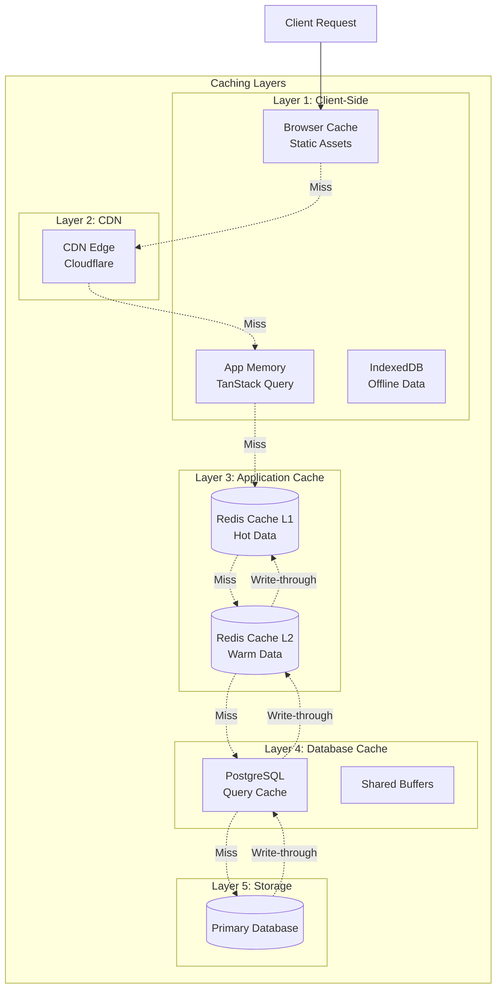
```mermaid
graph TB
    subgraph "Caching Layers"
        subgraph "Layer 1: Client-Side"
            BROWSER[Browser Cache<br/>Static Assets]
            APP_MEM[App Memory<br/>TanStack Query]
            LOCAL_DB[IndexedDB<br/>Offline Data]
        end
        
        subgraph "Layer 2: CDN"
            CDN_EDGE[CDN Edge<br/>Cloudflare]
        end
        
        subgraph "Layer 3: Application Cache"
            REDIS_L1[(Redis Cache L1<br/>Hot Data)]
            REDIS_L2[(Redis Cache L2<br/>Warm Data)]
        end
        
        subgraph "Layer 4: Database Cache"
            PG_CACHE[PostgreSQL<br/>Query Cache]
            PG_BUFFER[Shared Buffers]
        end
        
        subgraph "Layer 5: Storage"
            DATABASE[(Primary Database)]
        end
    end
    
    CLIENT[Client Request]
    
    CLIENT --> BROWSER
    BROWSER -.Miss.-> CDN_EDGE
    CDN_EDGE -.Miss.-> APP_MEM
    APP_MEM -.Miss.-> REDIS_L1
    REDIS_L1 -.Miss.-> REDIS_L2
    REDIS_L2 -.Miss.-> PG_CACHE
    PG_CACHE -.Miss.-> DATABASE
    
    DATABASE -.Write-through.-> PG_CACHE
    PG_CACHE -.Write-through.-> REDIS_L2
    REDIS_L2 -.Write-through.-> REDIS_L1
```

### 6.2 Redis Caching Strategy

**Cache Key Patterns:**

```
Key Naming Convention:
{service}:{resource}:{identifier}:{attribute}

Examples:
user:profile:12345 - User profile
route:details:456 - Route information
route:search:ALG-ORA-2025-01-15 - Search results
booking:availability:route456:2025-01-15 - Seat availability
pricing:dynamic:route456:2025-01-15 - Dynamic pricing
session:jwt:user12345 - JWT token (refresh)
ratelimit:api:user12345 - Rate limit counter
location:bus:bus789 - Current bus location
analytics:dashboard:daily:2025-01-15 - Dashboard metrics

Key Strategies by Data Type:

1. User Sessions (TTL: 30 days):
   Key: session:{userId}
   Value: JWT payload, user preferences
   Strategy: Sliding expiration on access
   
2. Route Information (TTL: 6 hours):
   Key: route:details:{routeId}
   Value: Full route object with schedules
   Strategy: Write-through, invalidate on update
   
3. Search Results (TTL: 5 minutes):
   Key: search:{origin}:{dest}:{date}:{hash}
   Value: Array of matching routes
   Strategy: Short TTL, high hit rate
   
4. Seat Availability (TTL: 30 seconds):
   Key: avail:{scheduleId}
   Value: Available seat count
   Strategy: Very short TTL, updated on booking
   
5. Dynamic Pricing (TTL: 5 minutes):
   Key: price:{scheduleId}:{passengers}
   Value: Calculated price
   Strategy: Recalculated frequently
   
6. Bus Locations (TTL: 1 hour):
   Key: location:bus:{busId}
   Value: Latest location + metadata
   Strategy: Auto-expire if no updates
   
7. Popular Routes (TTL: 24 hours):
   Key: popular:routes:{region}
   Value: Sorted set of popular routes
   Strategy: Daily recalculation

Cache Invalidation Patterns:

1. Time-based (TTL):
   - Static data: 6-24 hours
   - Dynamic data: 1-5 minutes
   - Real-time data: 10-60 seconds
   
2. Event-based:
   - Booking created → invalidate availability
   - Route updated → invalidate route cache
   - Price changed → invalidate pricing cache
   
3. Manual:
   - Admin actions
   - System maintenance
   - Cache warming after deployment

Cache Warming Strategy:
- Pre-populate popular routes on startup
- Pre-calculate next 7 days availability
- Load frequently accessed user profiles
- Background job runs hourly
```

### 6.3 Query Performance Optimization

**Query Optimization Techniques:**

```
1. N+1 Query Prevention:
   Problem: Loading bookings with route details
   Bad: Load bookings, then load route for each booking (N queries)
   Good: Single query with JOIN or eager loading
   
2. Pagination:
   Always use LIMIT/OFFSET or cursor-based pagination
   Max page size: 100 items
   Default: 20 items
   
3. Selective Column Loading:
   Don't SELECT * - specify needed columns
   Reduces data transfer and parsing time
   
4. Query Result Caching:
   Cache expensive aggregations
   Cache complex JOINs
   Cache computed values
   
5. Materialized Views:
   For complex analytics queries
   Refresh strategy: Incremental or full
   Example: Daily booking statistics
   
6. Connection Pooling:
   PgBouncer in transaction mode
   Pool size: 2x CPU cores
   Max client connections: 1000
   Server connections: 100
   
7. Prepared Statements:
   Reuse query plans
   Reduce parsing overhead
   Better performance for repeated queries
   
8. Explain Analyze:
   Monitor slow queries (>500ms)
   Analyze query plans
   Optimize based on actual execution
   
9. Partial Indexes:
   Index only relevant subset
   Example: WHERE is_active = true
   Smaller index size, faster lookups
   
10. JSONB Indexing:
    GIN index on JSONB columns
    Index specific keys if possible
    Example: preferences->'language'
```

### 6.4 Response Time Targets

```
Performance Benchmarks:

API Response Times (95th percentile):
- Simple GET (cached): <50ms
- Simple GET (uncached): <200ms
- Complex Query: <500ms
- Search with filters: <800ms
- Create booking: <1000ms
- Payment processing: <3000ms

Page Load Times (95th percentile):
- Homepage (first load): <2s
- Homepage (cached): <500ms
- Search results: <1.5s
- Booking flow (per step): <1s
- Dashboard: <2s

Real-time Updates:
- Location update latency: <200ms
- WebSocket message delivery: <100ms
- Notification delivery: <500ms

Database Query Times (95th percentile):
- Simple SELECT: <10ms
- JOIN query: <50ms
- Aggregation: <100ms
- Full-text search: <200ms

Monitoring Thresholds:
- Alert if p95 > 2x target
- Page if p95 > 5x target
- Critical if p50 > target
```

---

## 7. Message Queue & Event Architecture

### 7.1 Message Queue Architecture

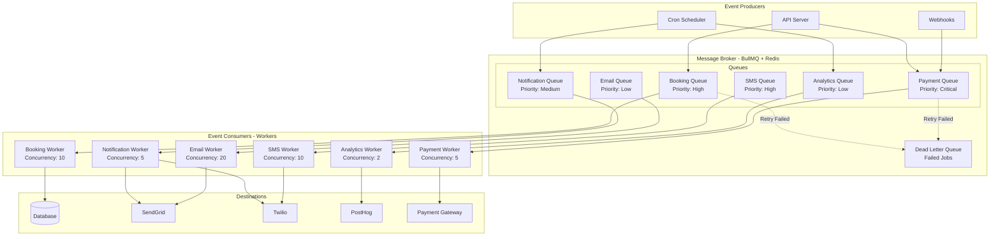
```mermaid
graph TB
    subgraph "Event Producers"
        API[API Server]
        WEBHOOK[Webhooks]
        SCHEDULER[Cron Scheduler]
    end
    
    subgraph "Message Broker - BullMQ + Redis"
        subgraph "Queues"
            Q_BOOKING[Booking Queue<br/>Priority: High]
            Q_NOTIF[Notification Queue<br/>Priority: Medium]
            Q_EMAIL[Email Queue<br/>Priority: Low]
            Q_SMS[SMS Queue<br/>Priority: High]
            Q_ANALYTICS[Analytics Queue<br/>Priority: Low]
            Q_PAYMENT[Payment Queue<br/>Priority: Critical]
        end
        
        DLQ[Dead Letter Queue<br/>Failed Jobs]
    end
    
    subgraph "Event Consumers - Workers"
        W_BOOKING[Booking Worker<br/>Concurrency: 10]
        W_NOTIF[Notification Worker<br/>Concurrency: 5]
        W_EMAIL[Email Worker<br/>Concurrency: 20]
        W_SMS[SMS Worker<br/>Concurrency: 10]
        W_ANALYTICS[Analytics Worker<br/>Concurrency: 2]
        W_PAYMENT[Payment Worker<br/>Concurrency: 5]
    end
    
    subgraph "Destinations"
        DB[(Database)]
        EMAIL_SVC[SendGrid]
        SMS_SVC[Twilio]
        ANALYTICS_SVC[PostHog]
        PAYMENT_GW[Payment Gateway]
    end
    
    API --> Q_BOOKING
    API --> Q_PAYMENT
    WEBHOOK --> Q_PAYMENT
    SCHEDULER --> Q_ANALYTICS
    SCHEDULER --> Q_NOTIF
    
    Q_BOOKING --> W_BOOKING
    Q_NOTIF --> W_NOTIF
    Q_EMAIL --> W_EMAIL
    Q_SMS --> W_SMS
    Q_ANALYTICS --> W_ANALYTICS
    Q_PAYMENT --> W_PAYMENT
    
    Q_BOOKING -.Retry Failed.-> DLQ
    Q_PAYMENT -.Retry Failed.-> DLQ
    
    W_BOOKING --> DB
    W_NOTIF --> SMS_SVC
    W_NOTIF --> EMAIL_SVC
    W_EMAIL --> EMAIL_SVC
    W_SMS --> SMS_SVC
    W_ANALYTICS --> ANALYTICS_SVC
    W_PAYMENT --> PAYMENT_GW
```

### 7.2 Queue Configuration

**Queue Priorities & Settings:**

```
Queue: booking_confirmation
Priority: High
Concurrency: 10 workers
Retry Strategy: Exponential backoff (3 attempts)
Timeout: 30 seconds
Rate Limit: None
Use Case: Confirm booking, generate ticket, send notifications

Jobs:
- confirm_booking
- generate_ticket_pdf
- send_booking_confirmation
- update_seat_inventory
- trigger_partner_notification

Queue: payment_processing
Priority: Critical
Concurrency: 5 workers
Retry Strategy: 5 attempts with 1min, 5min, 15min, 1hr, 4hr delays
Timeout: 60 seconds
Rate Limit: None
Use Case: Process payments, handle callbacks

Jobs:
- initiate_payment
- process_payment_callback
- handle_payment_success
- handle_payment_failure
- process_refund

Queue: notifications
Priority: Medium
Concurrency: 5 workers
Retry Strategy: 3 attempts
Timeout: 10 seconds
Rate Limit: 100 per minute (per provider)
Use Case: Send emails, SMS, push notifications

Jobs:
- send_sms
- send_email
- send_push_notification
- send_whatsapp_message

Queue: analytics_events
Priority: Low
Concurrency: 2 workers
Retry Strategy: Infinite retries
Timeout: 5 seconds
Rate Limit: None
Use Case: Track analytics events, update metrics

Jobs:
- track_booking_event
- update_daily_metrics
- calculate_revenue
- generate_reports

Queue: scheduled_tasks
Priority: Low
Concurrency: 1 worker
Retry Strategy: 3 attempts
Timeout: 300 seconds (5 min)
Use Case: Cron-like scheduled jobs

Jobs:
- send_departure_reminders (T-24hrs)
- send_departure_alerts (T-2hrs)
- expire_pending_bookings (T+15min)
- generate_daily_reports
- cleanup_old_data
- refresh_cache
- update_popular_routes
```

### 7.3 Event-Driven Architecture

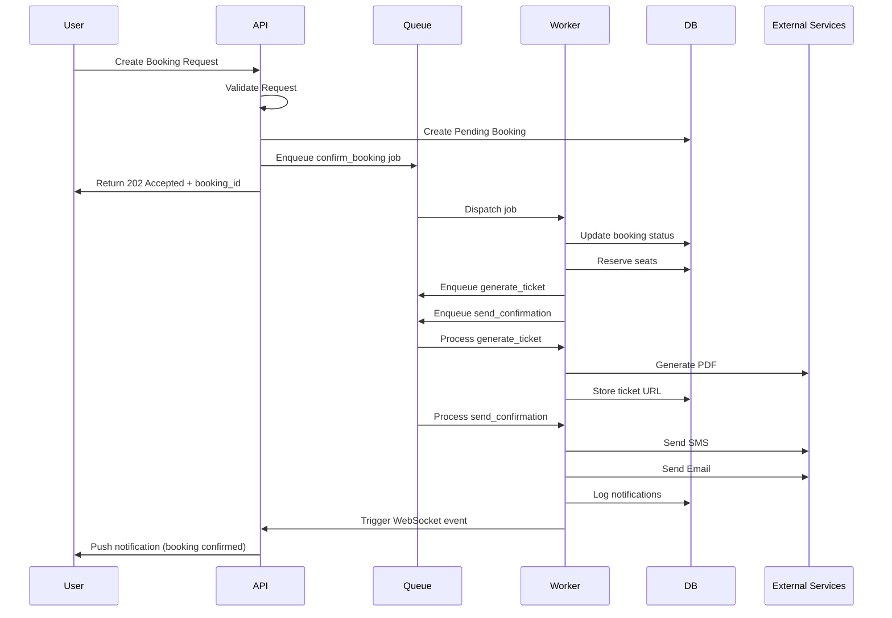
```mermaid
sequenceDiagram
    participant User
    participant API
    participant Queue
    participant Worker
    participant DB
    participant External as External Services

    User->>API: Create Booking Request
    API->>API: Validate Request
    API->>DB: Create Pending Booking
    API->>Queue: Enqueue confirm_booking job
    API->>User: Return 202 Accepted + booking_id
    
    Queue->>Worker: Dispatch job
    Worker->>DB: Update booking status
    Worker->>DB: Reserve seats
    Worker->>Queue: Enqueue generate_ticket
    Worker->>Queue: Enqueue send_confirmation
    
    Queue->>Worker: Process generate_ticket
    Worker->>External: Generate PDF
    Worker->>DB: Store ticket URL
    
    Queue->>Worker: Process send_confirmation
    Worker->>External: Send SMS
    Worker->>External: Send Email
    Worker->>DB: Log notifications
    
    Worker->>API: Trigger WebSocket event
    API->>User: Push notification (booking confirmed)
```

### 7.4 Job Patterns & Best Practices

**Idempotency:**

```
Idempotency Key Pattern:
- Every job has unique idempotency key
- Check if job already processed before execution
- Store result in Redis with key = idempotency_key
- TTL: 24 hours

Example:
Job: send_booking_confirmation
Idempotency Key: booking:{bookingId}:confirmation:sent
Before sending:
  - Check Redis key exists
  - If exists, skip (already sent)
  - If not exists, send and set key

Benefits:
- Prevents duplicate notifications
- Safe retries
- Exactly-once processing guarantee
```

**Job Chaining:**

```
Parent Job → Child Jobs

Example: Booking Confirmation Flow
1. confirm_booking (parent)
   ├─> 2a. generate_ticket (child)
   ├─> 2b. send_sms_confirmation (child)
   ├─> 2c. send_email_confirmation (child)
   ├─> 2d. update_analytics (child)
   └─> 2e. notify_partner (child)

Implementation:
- Parent job creates child jobs
- Parent waits for all children (optional)
- Children can create grandchildren
- Track job tree in Redis

Benefits:
- Parallel execution
- Independent retry logic
- Better observability
- Failure isolation
```

**Delayed Jobs:**

```
Use Case: Scheduled Reminders

Departure Reminder Flow:
1. Booking confirmed at 10:00 AM
2. Schedule job for 24 hours before departure
3. Job sits in delayed queue until trigger time
4. Execute: Send SMS + Email reminder

Implementation:
- BullMQ delayed jobs (built-in)
- Store: delay = departure_time - 24_hours - now
- Redis sorted set by execution time
- Worker polls for ready jobs

Use Cases:
- Departure reminders (T-24h, T-2h)
- Payment expiry (T+15min)
- Review requests (T+24h after trip)
- Abandoned booking recovery (T+1h)
- Partner settlement (weekly)
```

---

## 8. Authentication & Security

### 8.1 Authentication Architecture

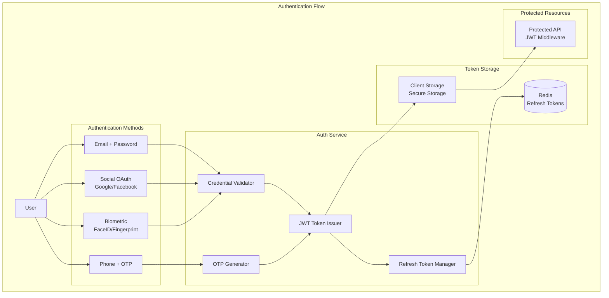
```mermaid
graph TB
    subgraph "Authentication Flow"
        USER[User]
        
        subgraph "Authentication Methods"
            EMAIL_PASS[Email + Password]
            PHONE_OTP[Phone + OTP]
            SOCIAL[Social OAuth<br/>Google/Facebook]
            BIOMETRIC[Biometric<br/>FaceID/Fingerprint]
        end
        
        subgraph "Auth Service"
            VALIDATOR[Credential Validator]
            OTP_GEN[OTP Generator]
            JWT_ISSUER[JWT Token Issuer]
            REFRESH[Refresh Token Manager]
        end
        
        subgraph "Token Storage"
            REDIS_TOKEN[(Redis<br/>Refresh Tokens)]
            CLIENT_STORE[Client Storage<br/>Secure Storage]
        end
        
        subgraph "Protected Resources"
            API[Protected API<br/>JWT Middleware]
        end
    end
    
    USER --> EMAIL_PASS
    USER --> PHONE_OTP
    USER --> SOCIAL
    USER --> BIOMETRIC
    
    EMAIL_PASS --> VALIDATOR
    PHONE_OTP --> OTP_GEN
    SOCIAL --> VALIDATOR
    BIOMETRIC --> VALIDATOR
    
    VALIDATOR --> JWT_ISSUER
    OTP_GEN --> JWT_ISSUER
    
    JWT_ISSUER --> REFRESH
    JWT_ISSUER --> CLIENT_STORE
    REFRESH --> REDIS_TOKEN
    
    CLIENT_STORE --> API
```

### 8.2 JWT Token Strategy

**Token Architecture:**

```
Access Token (Short-lived):
- Lifetime: 15 minutes
- Stored: Client memory (not localStorage for web)
- Claims:
  {
    "sub": "user_12345",
    "email": "user@example.com",
    "role": "customer",
    "iat": 1705320600,
    "exp": 1705321500,
    "jti": "token_unique_id"
  }
- Use: Bearer token in Authorization header
- Security: Cannot be revoked (short lifetime mitigates risk)

Refresh Token (Long-lived):
- Lifetime: 30 days
- Stored: 
  - Web: Secure, HttpOnly cookie
  - Mobile: Encrypted secure storage (Keychain/Keystore)
  - Redis: For validation and revocation
- Claims:
  {
    "sub": "user_12345",
    "type": "refresh",
    "device_id": "device_abc123",
    "iat": 1705320600,
    "exp": 1707912600,
    "jti": "refresh_unique_id"
  }
- Use: Refresh endpoint to get new access token
- Security: Can be revoked, device-bound

Token Refresh Flow:
1. Access token expires
2. Client sends refresh token to /auth/refresh
3. Server validates refresh token from Redis
4. Issue new access token + rotate refresh token
5. Store new refresh token in Redis
6. Return new tokens to client

Token Revocation:
- Logout: Delete refresh token from Redis
- Suspicious activity: Revoke all user tokens
- Password change: Revoke all user tokens
- Admin action: Revoke specific user tokens

Session Management:
- Redis key: session:{userId}:{deviceId}
- Store: Refresh token, device info, IP, last active
- TTL: 30 days (sliding on activity)
- Max sessions per user: 5 devices
- Oldest session evicted if limit exceeded
```

### 8.3 OTP Authentication

**OTP Flow:**

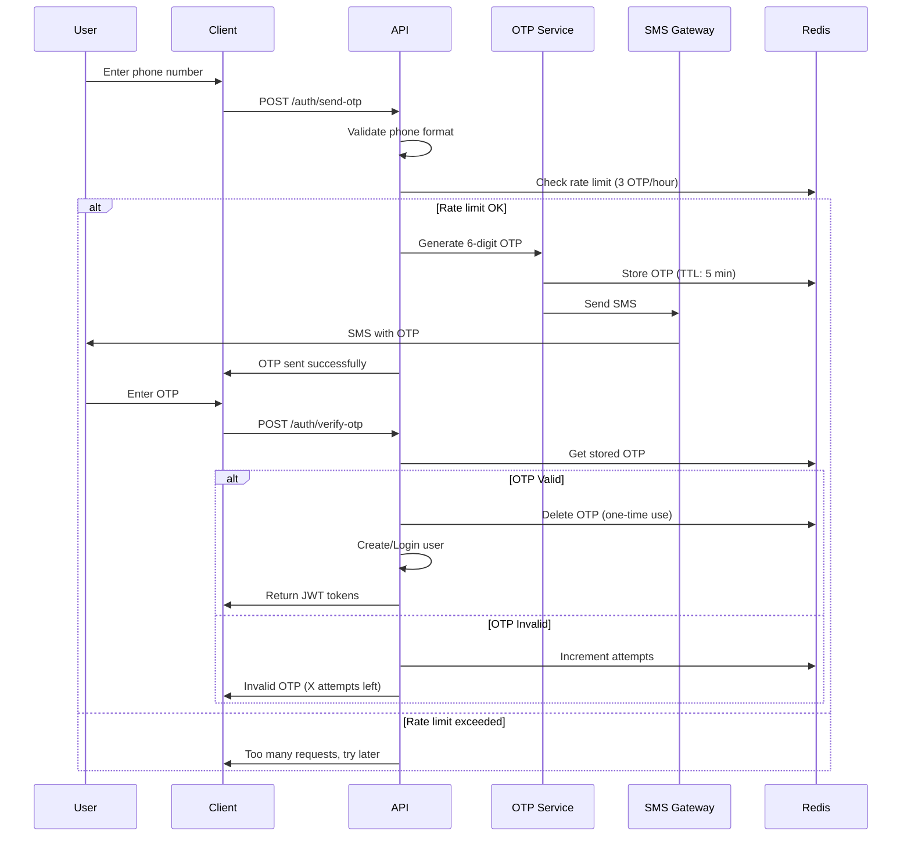
```mermaid
sequenceDiagram
    participant User
    participant Client
    participant API
    participant OTP Service
    participant SMS Gateway
    participant Redis

    User->>Client: Enter phone number
    Client->>API: POST /auth/send-otp
    API->>API: Validate phone format
    API->>Redis: Check rate limit (3 OTP/hour)
    
    alt Rate limit OK
        API->>OTP Service: Generate 6-digit OTP
        OTP Service->>Redis: Store OTP (TTL: 5 min)
        OTP Service->>SMS Gateway: Send SMS
        SMS Gateway->>User: SMS with OTP
        API->>Client: OTP sent successfully
        
        User->>Client: Enter OTP
        Client->>API: POST /auth/verify-otp
        API->>Redis: Get stored OTP
        
        alt OTP Valid
            API->>Redis: Delete OTP (one-time use)
            API->>API: Create/Login user
            API->>Client: Return JWT tokens
        else OTP Invalid
            API->>Redis: Increment attempts
            API->>Client: Invalid OTP (X attempts left)
        end
    else Rate limit exceeded
        API->>Client: Too many requests, try later
    end
```

**OTP Security Measures:**

```
OTP Generation:
- Length: 6 digits
- Randomness: Cryptographically secure random
- Expiry: 5 minutes
- One-time use: Deleted after verification
- Rate limit: 3 OTP requests per phone per hour

OTP Storage (Redis):
Key: otp:{phone}
Value: {
  "code": "123456",
  "attempts": 0,
  "createdAt": 1705320600,
  "expiresAt": 1705320900
}
TTL: 5 minutes

Verification:
- Max attempts: 3 per OTP
- After 3 failed attempts: OTP invalidated
- Require new OTP request
- Log failed attempts for fraud detection

Anti-Abuse:
- Rate limit by IP: 10 OTP requests per hour
- Rate limit by device: 5 OTP requests per hour
- Rate limit by phone: 3 OTP requests per hour
- Block phone after 10 failed verifications in 24h
- CAPTCHA after 3 failed attempts
- Delay increases per failed attempt (1s, 2s, 5s)
```

### 8.4 Security Best Practices

**API Security:**

```
1. Input Validation:
   - TypeBox schema validation on all inputs
   - Sanitize all user inputs
   - Reject unexpected fields
   - Validate data types strictly
   - Max payload size: 10MB
   
2. Rate Limiting:
   - Per user: 1000 requests/hour
   - Per IP: 100 requests/minute
   - Per endpoint: Custom limits
   - Auth endpoints: 10 requests/minute
   - Booking: 5 requests/minute
   - Search: 30 requests/minute
   
3. SQL Injection Prevention:
   - Use parameterized queries (Drizzle ORM)
   - Never concatenate SQL strings
   - Validate all inputs
   - Principle of least privilege (DB user permissions)
   
4. XSS Prevention:
   - Content-Security-Policy headers
   - Escape all user-generated content
   - Sanitize HTML inputs
   - Use httpOnly cookies
   
5. CSRF Prevention:
   - CSRF tokens for state-changing operations
   - SameSite cookie attribute
   - Verify Origin header
   - Double-submit cookie pattern
   
6. CORS Configuration:
   - Whitelist specific domains
   - No wildcard (*) in production
   - Credentials: true only for trusted domains
   - Preflight request caching
```

**Data Security:**

```
Encryption at Rest:
- Database: PostgreSQL encryption (pgcrypto)
- Sensitive fields: AES-256 encryption
  - Payment card details
  - ID numbers
  - Bank account details
- File storage: S3 server-side encryption

Encryption in Transit:
- TLS 1.3 only
- HTTPS everywhere (forced redirect)
- HTTP Strict Transport Security (HSTS)
- Certificate pinning (mobile apps)

Secrets Management:
- Environment variables for secrets
- Never commit secrets to git
- Use secret management service (Vault, AWS Secrets Manager)
- Rotate secrets quarterly
- Different secrets per environment

PII (Personally Identifiable Information):
- Minimal collection principle
- Pseudonymization where possible
- Right to deletion (GDPR-style)
- Audit logs for PII access
- Retention policy: 2 years after last activity

Data Masking:
- Mask phone: +213*****1234
- Mask email: u***r@example.com
- Mask card: **** **** **** 1234
- Full data only for authorized users
```

### 8.5 Authorization & RBAC

**Role-Based Access Control:**


```mermaid
graph TB
    subgraph "User Roles"
        CUSTOMER[Customer<br/>Basic User]
        PARTNER[Partner<br/>Bus Operator]
        ADMIN[Admin<br/>Internal Staff]
        SUPER[Super Admin<br/>Full Access]
    end
    
    subgraph "Permissions"
        subgraph "Customer Permissions"
            C1[View Routes]
            C2[Create Booking]
            C3[Cancel Own Booking]
            C4[View Own Bookings]
            C5[Update Profile]
        end
        
        subgraph "Partner Permissions"
            P1[View Own Routes]
            P2[Update Bus Info]
            P3[View Own Bookings]
            P4[View Revenue]
            P5[Manage Drivers]
        end
        
        subgraph "Admin Permissions"
            A1[View All Bookings]
            A2[Manage Partners]
            A3[Manage Routes]
            A4[View Analytics]
            A5[Handle Support]
        end
        
        subgraph "Super Admin Permissions"
            S1[All Admin Permissions]
            S2[System Configuration]
            S3[User Management]
            S4[Access Logs]
        end
    end
    
    CUSTOMER --> C1
    CUSTOMER --> C2
    CUSTOMER --> C3
    CUSTOMER --> C4
    CUSTOMER --> C5
    
    PARTNER --> P1
    PARTNER --> P2
    PARTNER --> P3
    PARTNER --> P4
    PARTNER --> P5
    PARTNER --> C1
    
    ADMIN --> A1
    ADMIN --> A2
    ADMIN --> A3
    ADMIN --> A4
    ADMIN --> A5
    
    SUPER --> S1
    SUPER --> S2
    SUPER --> S3
    SUPER --> S4
```

**Permission Enforcement:**

```
Middleware Chain:
Request → Authenticate → Authorize → Handler

Authentication:
- Extract JWT from header
- Validate signature
- Check expiry
- Load user from Redis/DB

Authorization:
- Check user role
- Check required permission
- Check resource ownership (for user-specific resources)
- Allow or deny

Resource Ownership:
- Booking: User can only access own bookings
- Profile: User can only update own profile
- Partner: Partner can only see own data

Permission Matrix:
|  Resource  |  Customer  |  Partner  |  Admin  | Super Admin |
|------------|-----------|-----------|---------|-------------|
| Routes     | Read      | Read Own  | CRUD    | CRUD        |
| Bookings   | CRUD Own  | Read Own  | CRUD    | CRUD        |
| Users      | Update Own| -         | Read    | CRUD        |
| Partners   | -         | Update Own| CRUD    | CRUD        |
| Analytics  | -         | Own Data  | Read    | CRUD        |
| Settings   | -         | -         | Update  | CRUD        |

Special Permissions:
- cancel_any_booking: Admin can cancel any booking
- refund_booking: Admin can process refunds
- modify_pricing: Admin can override dynamic pricing
- view_pii: Admin can see full PII (audited)
- impersonate_user: Super Admin only (audited)
```

---

## 9. Scalability Architecture

### 9.1 Horizontal Scaling Strategy

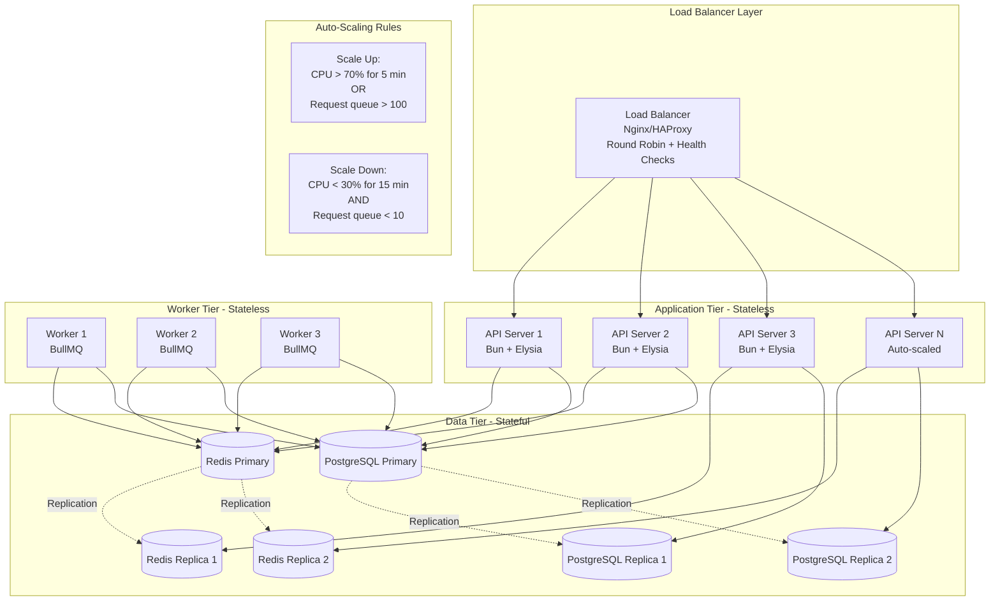
```mermaid
graph TB
    subgraph "Load Balancer Layer"
        LB[Load Balancer<br/>Nginx/HAProxy<br/>Round Robin + Health Checks]
    end
    
    subgraph "Application Tier - Stateless"
        API1[API Server 1<br/>Bun + Elysia]
        API2[API Server 2<br/>Bun + Elysia]
        API3[API Server 3<br/>Bun + Elysia]
        API_N[API Server N<br/>Auto-scaled]
    end
    
    subgraph "Worker Tier - Stateless"
        W1[Worker 1<br/>BullMQ]
        W2[Worker 2<br/>BullMQ]
        W3[Worker 3<br/>BullMQ]
    end
    
    subgraph "Data Tier - Stateful"
        REDIS_PRIMARY[(Redis Primary)]
        REDIS_REPLICA1[(Redis Replica 1)]
        REDIS_REPLICA2[(Redis Replica 2)]
        
        DB_PRIMARY[(PostgreSQL Primary)]
        DB_REPLICA1[(PostgreSQL Replica 1)]
        DB_REPLICA2[(PostgreSQL Replica 2)]
    end
    
    subgraph "Auto-Scaling Rules"
        SCALE_UP[Scale Up:<br/>CPU > 70% for 5 min<br/>OR<br/>Request queue > 100]
        SCALE_DOWN[Scale Down:<br/>CPU < 30% for 15 min<br/>AND<br/>Request queue < 10]
    end
    
    LB --> API1
    LB --> API2
    LB --> API3
    LB --> API_N
    
    API1 --> REDIS_PRIMARY
    API2 --> REDIS_PRIMARY
    API3 --> REDIS_REPLICA1
    API_N --> REDIS_REPLICA2
    
    API1 --> DB_PRIMARY
    API2 --> DB_PRIMARY
    API3 --> DB_REPLICA1
    API_N --> DB_REPLICA2
    
    W1 --> REDIS_PRIMARY
    W2 --> REDIS_PRIMARY
    W3 --> REDIS_PRIMARY
    
    W1 --> DB_PRIMARY
    W2 --> DB_PRIMARY
    W3 --> DB_PRIMARY
    
    REDIS_PRIMARY -.Replication.-> REDIS_REPLICA1
    REDIS_PRIMARY -.Replication.-> REDIS_REPLICA2
    
    DB_PRIMARY -.Replication.-> DB_REPLICA1
    DB_PRIMARY -.Replication.-> DB_REPLICA2
```

### 9.2 Auto-Scaling Configuration

**VPS Auto-Scaling Strategy:**

```
Initial Setup (Month 1-3):
- 1x API Server (4 vCPU, 8GB RAM)
- 1x Database Server (4 vCPU, 16GB RAM)
- 1x Redis Server (2 vCPU, 4GB RAM)
- Total Cost: ~$100-150/month

Growth Phase (Month 4-12):
- 3x API Servers (load balanced)
- 1x Database Primary + 1x Replica
- 1x Redis Primary + 1x Replica
- 2x Background Workers
- Total Cost: ~$400-600/month

Scaling Triggers:

Scale Out (Add API Server):
- Average CPU > 70% for 5 minutes
- Average response time > 1 second for 5 minutes
- Request queue depth > 100
- Concurrent connections > 5000
- Action: Add 1 API server
- Max instances: 10

Scale In (Remove API Server):
- Average CPU < 30% for 15 minutes
- Request queue depth < 10
- Concurrent connections < 1000
- Action: Remove 1 API server
- Min instances: 2

Database Scaling:
Vertical First:
- Phase 1: 4 vCPU, 16GB RAM
- Phase 2: 8 vCPU, 32GB RAM
- Phase 3: 16 vCPU, 64GB RAM

Horizontal (Read Replicas):
- Add when read queries > 1000 qps
- Max 3 replicas
- Round-robin read distribution

Redis Scaling:
- Vertical until 32GB RAM
- Then Redis Cluster (6 nodes minimum)
- Consistent hashing for key distribution
```

### 9.3 Database Sharding Strategy (Future)

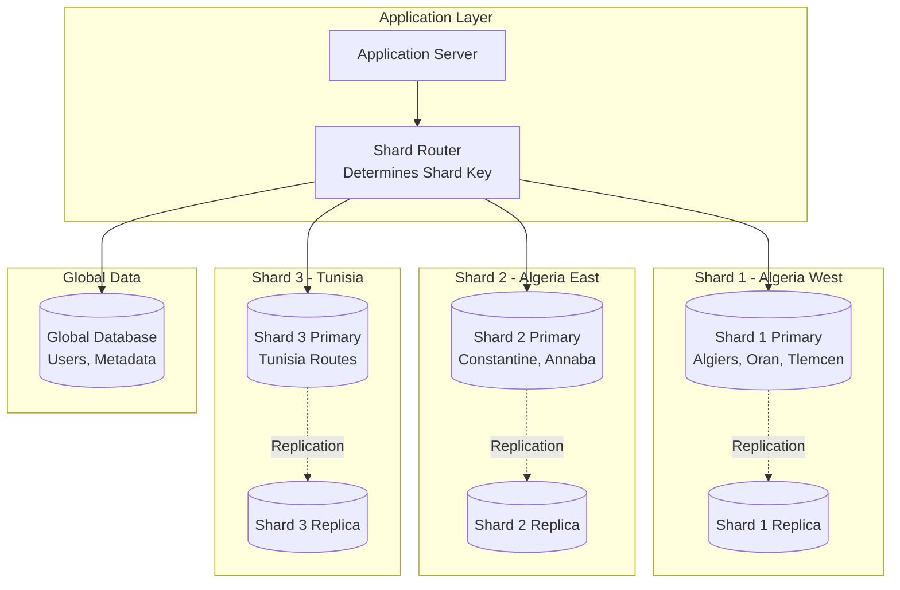
```mermaid
graph TB
    subgraph "Application Layer"
        APP[Application Server]
        SHARD_ROUTER[Shard Router<br/>Determines Shard Key]
    end
    
    subgraph "Shard 1 - Algeria West"
        SHARD1_PRIMARY[(Shard 1 Primary<br/>Algiers, Oran, Tlemcen)]
        SHARD1_REPLICA[(Shard 1 Replica)]
    end
    
    subgraph "Shard 2 - Algeria East"
        SHARD2_PRIMARY[(Shard 2 Primary<br/>Constantine, Annaba)]
        SHARD2_REPLICA[(Shard 2 Replica)]
    end
    
    subgraph "Shard 3 - Tunisia"
        SHARD3_PRIMARY[(Shard 3 Primary<br/>Tunisia Routes)]
        SHARD3_REPLICA[(Shard 3 Replica)]
    end
    
    subgraph "Global Data"
        GLOBAL_DB[(Global Database<br/>Users, Metadata)]
    end
    
    APP --> SHARD_ROUTER
    SHARD_ROUTER --> SHARD1_PRIMARY
    SHARD_ROUTER --> SHARD2_PRIMARY
    SHARD_ROUTER --> SHARD3_PRIMARY
    SHARD_ROUTER --> GLOBAL_DB
    
    SHARD1_PRIMARY -.Replication.-> SHARD1_REPLICA
    SHARD2_PRIMARY -.Replication.-> SHARD2_REPLICA
    SHARD3_PRIMARY -.Replication.-> SHARD3_REPLICA
```

**Sharding Strategy:**

```
Sharding Approach: Geographic Sharding by Region

Shard Key: Route Origin Region

Shard Distribution:
- Shard 1: Algeria West (Algiers, Oran, Blida, Tlemcen)
- Shard 2: Algeria East (Constantine, Annaba, Batna, Sétif)
- Shard 3: Algeria South (Biskra, Ghardaïa, Béchar)
- Shard 4: Tunisia (when launched)
- Shard 5: Morocco (when launched)

Sharded Tables:
- routes (by origin region)
- route_schedules (follows route)
- bookings (follows route)
- payments (follows booking)
- reviews (follows route)

Global Tables (Replicated):
- users
- partners
- system_config
- analytics_aggregates

Cross-Shard Queries:
- Search across regions: Fan-out to all shards, merge results
- Multi-region bookings: Distributed transaction (2PC)
- Analytics: MapReduce across shards

Implementation Timeline:
- Not needed until 1M+ bookings/month
- Implement after Month 18-24
- Requires significant engineering effort
- Alternative: Multi-region database (Citus, CockroachDB)
```

### 9.4 CDN & Edge Caching

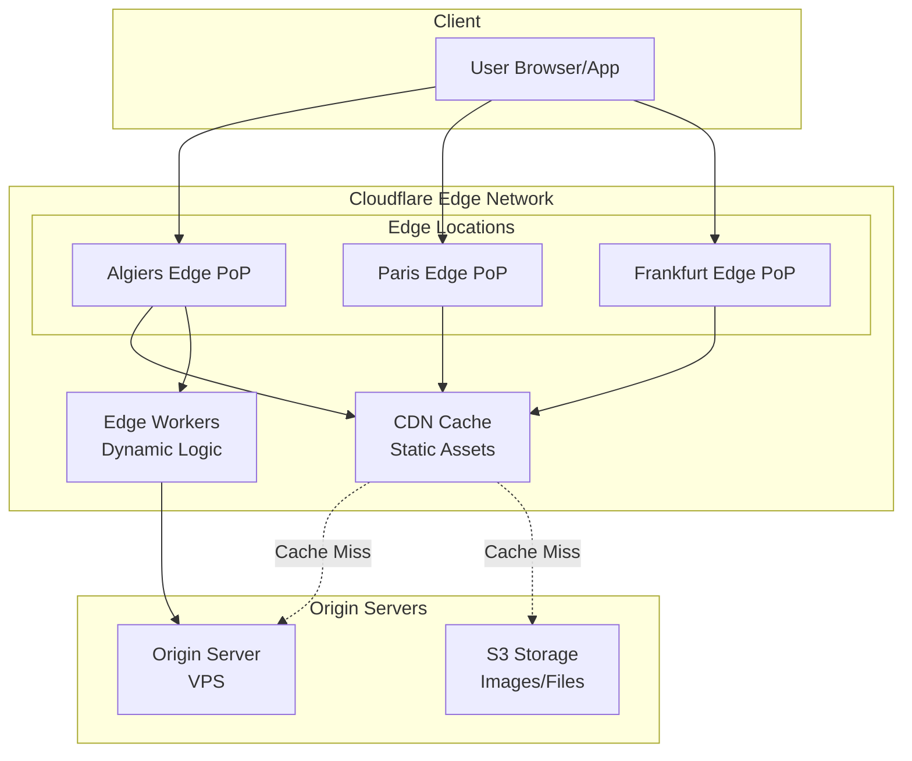
```mermaid
graph TB
    subgraph "Client"
        USER[User Browser/App]
    end
    
    subgraph "Cloudflare Edge Network"
        subgraph "Edge Locations"
            EDGE1[Algiers Edge PoP]
            EDGE2[Paris Edge PoP]
            EDGE3[Frankfurt Edge PoP]
        end
        
        CDN_CACHE[CDN Cache<br/>Static Assets]
        EDGE_WORKERS[Edge Workers<br/>Dynamic Logic]
    end
    
    subgraph "Origin Servers"
        ORIGIN[Origin Server<br/>VPS]
        S3[S3 Storage<br/>Images/Files]
    end
    
    USER --> EDGE1
    USER --> EDGE2
    USER --> EDGE3
    
    EDGE1 --> CDN_CACHE
    EDGE2 --> CDN_CACHE
    EDGE3 --> CDN_CACHE
    
    CDN_CACHE -.Cache Miss.-> ORIGIN
    CDN_CACHE -.Cache Miss.-> S3
    
    EDGE1 --> EDGE_WORKERS
    EDGE_WORKERS --> ORIGIN
```

**CDN Configuration:**

```
Cached Resources:
1. Static Assets (Cache: 1 year):
   - JavaScript bundles
   - CSS stylesheets
   - Images, icons, logos
   - Fonts
   
2. Semi-Static Content (Cache: 1 hour):
   - Route listings
   - Popular routes
   - Station information
   - Help/FAQ pages
   
3. Dynamic Content (Cache: 1 minute):
   - Search results
   - Seat availability (with revalidation)
   
4. Never Cache:
   - User-specific data
   - Booking process
   - Payment pages
   - Admin dashboard
   - Real-time tracking

Cache-Control Headers:
Static Assets:
  Cache-Control: public, max-age=31536000, immutable
  
Semi-Static:
  Cache-Control: public, max-age=3600, must-revalidate
  
Dynamic:
  Cache-Control: public, max-age=60, stale-while-revalidate=300
  
Personal:
  Cache-Control: private, no-store

Cloudflare Features:
- Page Rules: Custom caching per path
- Tiered Caching: Reduce origin requests
- Argo Smart Routing: Faster paths
- Polish: Image optimization
- Mirage: Lazy loading
- HTTP/3 (QUIC): Faster protocol
- Brotli Compression: Better compression

Edge Workers Use Cases:
- A/B testing (edge-side)
- Geo-routing (region detection)
- Bot detection
- Rate limiting (edge-side)
- Request/response modification
```

---

## 10. VPS Deployment Strategy

### 10.1 VPS Infrastructure Architecture

```mermaid
graph TB
    subgraph "Internet"
        USER[Users]
        CLOUDFLARE[Cloudflare<br/>CDN + DDoS Protection]
    end
    
    subgraph "VPS Provider - Hetzner/DigitalOcean"
        subgraph "Load Balancer VPS"
            LB[Nginx<br/>Load Balancer<br/>2 vCPU, 4GB RAM]
        end
        
        subgraph "Application Servers"
            APP1[API Server 1<br/>4 vCPU, 8GB RAM<br/>Bun + Elysia]
            APP2[API Server 2<br/>4 vCPU, 8GB RAM<br/>Bun + Elysia]
        end
        
        subgraph "Database Server"
            DBVM[PostgreSQL Primary<br/>8 vCPU, 32GB RAM<br/>500GB NVMe SSD]
        end
        
        subgraph "Cache Server"
            REDISVM[Redis<br/>4 vCPU, 16GB RAM]
        end
        
        subgraph "Worker Server"
            WORKERVM[Background Workers<br/>4 vCPU, 8GB RAM<br/>BullMQ Workers]
        end
        
        subgraph "Monitoring"
            MONITOR[Monitoring Server<br/>2 vCPU, 4GB RAM<br/>Grafana + Prometheus]
        end
    end
    
    subgraph "External Services"
        S3_BACKUP[S3-Compatible Storage<br/>Backups + Files]
    end
    
    USER --> CLOUDFLARE
    CLOUDFLARE --> LB
    
    LB --> APP1
    LB --> APP2
    
    APP1 --> DBVM
    APP1 --> REDISVM
    APP2 --> DBVM
    APP2 --> REDISVM
    
    WORKERVM --> DBVM
    WORKERVM --> REDISVM
    
    APP1 --> MONITOR
    APP2 --> MONITOR
    DBVM --> MONITOR
    REDISVM --> MONITOR
    WORKERVM --> MONITOR
    
    DBVM -.Backup.-> S3_BACKUP
```

### 10.2 Server Specifications

**Phase 1: Launch (Months 1-3) - Single Region**

```
Total Monthly Cost: ~$200-250

1. Load Balancer VPS:
   Provider: Hetzner Cloud
   Type: CX21
   Specs: 2 vCPU, 4GB RAM, 40GB SSD
   OS: Ubuntu 22.04 LTS
   Cost: €5.83/month (~$6.30)
   Purpose: Nginx reverse proxy + SSL termination

2. Application Server 1:
   Provider: Hetzner Cloud
   Type: CX31
   Specs: 4 vCPU (AMD), 8GB RAM, 80GB SSD
   OS: Ubuntu 22.04 LTS
   Cost: €11.66/month (~$12.60)
   Purpose: Primary API server (Bun + Elysia)

3. Database Server:
   Provider: Hetzner Cloud  
   Type: CX41
   Specs: 8 vCPU (AMD), 32GB RAM, 160GB SSD
   Additional: 500GB Volume (NVMe)
   OS: Ubuntu 22.04 LTS
   Cost: €23.33 + €20 volume (~$47/month)
   Purpose: PostgreSQL 16
   Config: Optimized for read-heavy workload

4. Redis Server:
   Provider: Hetzner Cloud
   Type: CX21
   Specs: 2 vCPU, 4GB RAM, 40GB SSD
   OS: Ubuntu 22.04 LTS
   Cost: €5.83/month (~$6.30)
   Purpose: Redis 7 (cache + queue)

5. Worker Server:
   Provider: Hetzner Cloud
   Type: CX21
   Specs: 2 vCPU, 4GB RAM, 40GB SSD
   OS: Ubuntu 22.04 LTS
   Cost: €5.83/month (~$6.30)
   Purpose: Background workers (BullMQ)

6. Monitoring:
   Provider: Hetzner Cloud
   Type: CX11
   Specs: 1 vCPU, 2GB RAM, 20GB SSD
   OS: Ubuntu 22.04 LTS
   Cost: €3.79/month (~$4.10)
   Purpose: Prometheus + Grafana + Loki

Total Compute: ~$82.60/month

Additional Costs:
- S3 Storage (Backspace/Wasabi): $30-50/month
- Bandwidth: Included (20TB free on Hetzner)
- Snapshots/Backups: $30-50/month
- Domain + SSL: $20/month
- External Services: $30-50/month
```

**Phase 2: Growth (Months 4-12) - Scaling**

```
Total Monthly Cost: ~$500-700

Scale Out:
1. Add Application Server 2 (CX31): $12.60/month
2. Add Application Server 3 (CX31): $12.60/month
3. Upgrade Database to CX51 (16 vCPU, 64GB RAM): $70/month
4. Add Database Replica (CX41): $47/month
5. Upgrade Redis to CX31: $12.60/month
6. Add Redis Replica (CX21): $6.30/month
7. Add Worker Server 2 (CX21): $6.30/month

New Total Compute: ~$250/month
Plus existing costs: ~$150/month
Additional services scale: ~$300/month
```

### 10.3 Network Architecture

```mermaid
graph TB
    subgraph "Public Internet"
        INTERNET[Internet]
    end
    
    subgraph "Cloudflare"
        CF_DNS[DNS]
        CF_CDN[CDN]
        CF_WAF[WAF]
        CF_DDOS[DDoS Protection]
    end
    
    subgraph "VPS Private Network 10.0.0.0/16"
        subgraph "DMZ Subnet 10.0.1.0/24"
            LB[Load Balancer<br/>10.0.1.10<br/>Public: X.X.X.X]
        end
        
        subgraph "Application Subnet 10.0.2.0/24"
            APP1[API Server 1<br/>10.0.2.10]
            APP2[API Server 2<br/>10.0.2.11]
            WORKER[Worker Server<br/>10.0.2.20]
        end
        
        subgraph "Data Subnet 10.0.3.0/24"
            DB[Database<br/>10.0.3.10]
            REDIS[Redis<br/>10.0.3.20]
        end
        
        subgraph "Monitoring Subnet 10.0.4.0/24"
            MONITOR[Monitoring<br/>10.0.4.10]
        end
    end
    
    INTERNET --> CF_DNS
    CF_DNS --> CF_CDN
    CF_CDN --> CF_WAF
    CF_WAF --> CF_DDOS
    CF_DDOS --> LB
    
    LB --> APP1
    LB --> APP2
    
    APP1 --> DB
    APP1 --> REDIS
    APP2 --> DB
    APP2 --> REDIS
    
    WORKER --> DB
    WORKER --> REDIS
    
    APP1 --> MONITOR
    APP2 --> MONITOR
    DB --> MONITOR
    REDIS --> MONITOR
    WORKER --> MONITOR
```

**Firewall Rules:**

```
Load Balancer (Public):
Inbound:
- Port 80 (HTTP): Allow from Cloudflare IPs only
- Port 443 (HTTPS): Allow from Cloudflare IPs only
- Port 22 (SSH): Allow from office IP only
Outbound: Allow all

Application Servers (Private):
Inbound:
- Port 3000 (API): Allow from Load Balancer only
- Port 22 (SSH): Allow from Load Balancer only
Outbound: Allow all

Database Server (Private):
Inbound:
- Port 5432 (PostgreSQL): Allow from Application & Worker subnets only
- Port 22 (SSH): Allow from Load Balancer only
Outbound: Deny all except monitoring

Redis Server (Private):
Inbound:
- Port 6379 (Redis): Allow from Application & Worker subnets only
- Port 22 (SSH): Allow from Load Balancer only
Outbound: Deny all except monitoring

Worker Server (Private):
Inbound:
- Port 22 (SSH): Allow from Load Balancer only
Outbound: Allow all (needs external API access)

Monitoring Server (Private):
Inbound:
- Port 3000 (Grafana): Allow from office IP only
- Port 9090 (Prometheus): Internal only
- Port 22 (SSH): Allow from Load Balancer only
Outbound: Allow all

Network Segmentation Benefits:
- Defense in depth
- Blast radius containment
- Compliance (PCI-DSS if needed)
- Performance (private network faster)
- Security (database never exposed)
```

### 10.4 Deployment Automation

```mermaid
graph LR
    subgraph "CI/CD Pipeline"
        GIT[Git Push<br/>GitHub/GitLab]
        CI[CI Server<br/>GitHub Actions]
        BUILD[Build & Test]
        DOCKER[Build Docker Image]
        REGISTRY[Container Registry]
        DEPLOY[Deploy Script]
        
        subgraph "Deployment Strategy"
            BLUE[Blue Environment<br/>Current]
            GREEN[Green Environment<br/>New]
            SWITCH[Traffic Switch]
        end
        
        HEALTH[Health Check]
        ROLLBACK[Rollback if Fail]
    end
    
    GIT --> CI
    CI --> BUILD
    BUILD --> DOCKER
    DOCKER --> REGISTRY
    REGISTRY --> DEPLOY
    
    DEPLOY --> GREEN
    GREEN --> HEALTH
    
    HEALTH -.Pass.-> SWITCH
    HEALTH -.Fail.-> ROLLBACK
    
    SWITCH --> BLUE
    ROLLBACK --> BLUE
```

**Deployment Process:**

```
Zero-Downtime Deployment (Blue-Green):

1. Pre-Deployment:
   - Run tests in CI
   - Build Docker image
   - Push to registry
   - Tag release (v1.2.3)

2. Deploy to Green Environment:
   - Pull new image on APP2
   - Start new container
   - Run health checks
   - Warm up caches

3. Traffic Switch:
   - Remove APP2 from load balancer
   - Verify APP1 handling 100% traffic
   - Update APP2 to new version
   - Add APP2 back to load balancer (10% traffic)
   - Monitor errors, latency for 5 minutes

4. Complete Rollout:
   - Increase APP2 traffic to 50%
   - Monitor for 5 minutes
   - Update APP1 to new version
   - Full traffic to both servers

5. Verification:
   - Run smoke tests
   - Check error rates
   - Verify key flows
   - Monitor for 30 minutes

6. Rollback (if issues):
   - Revert to previous image
   - Restart containers
   - Clear caches
   - Incident post-mortem

Database Migrations:
- Run migrations before deployment
- Migrations must be backwards compatible
- No breaking schema changes in same deployment
- Two-phase approach for breaking changes:
  Phase 1: Add new column (deploy app reading old+new)
  Phase 2: Remove old column (deploy app reading new only)

Deployment Schedule:
- Preferred: Tuesday/Wednesday 10 AM - 4 PM
- Avoid: Mondays, Fridays, weekends
- Avoid: High-traffic hours (6-9 AM, 5-8 PM)
- Emergency fixes: Anytime (on-call engineer)

Monitoring During Deployment:
- Error rate spike > 1%: Pause deployment
- Response time > 2x baseline: Pause
- 5xx errors > 0.1%: Rollback
- Critical path broken: Immediate rollback
```

---

## 11. Monitoring & Observability

### 11.1 Monitoring Stack

```mermaid
graph TB
    subgraph "Data Collection"
        APP[Application Servers]
        DB[Database]
        REDIS[Redis]
        LB[Load Balancer]
    end
    
    subgraph "Metrics Collection"
        PROM[Prometheus<br/>Time-series DB]
        EXPORTERS[Exporters<br/>node, postgres, redis]
    end
    
    subgraph "Log Aggregation"
        LOKI[Loki<br/>Log Storage]
        PROMTAIL[Promtail<br/>Log Shipper]
    end
    
    subgraph "Tracing"
        TEMPO[Tempo<br/>Distributed Tracing]
        OTEL[OpenTelemetry<br/>Instrumentation]
    end
    
    subgraph "Visualization & Alerting"
        GRAFANA[Grafana<br/>Dashboards]
        ALERTMGR[Alert Manager<br/>Alert Routing]
    end
    
    subgraph "External Services"
        SENTRY[Sentry<br/>Error Tracking]
        POSTHOG[PostHog<br/>Product Analytics]
    end
    
    subgraph "Notifications"
        SLACK[Slack]
        EMAIL[Email]
        SMS[SMS/PagerDuty]
    end
    
    APP --> PROM
    APP --> LOKI
    APP --> TEMPO
    APP --> SENTRY
    APP --> POSTHOG
    
    DB --> EXPORTERS
    REDIS --> EXPORTERS
    LB --> EXPORTERS
    EXPORTERS --> PROM
    
    APP --> PROMTAIL
    PROMTAIL --> LOKI
    
    APP --> OTEL
    OTEL --> TEMPO
    
    PROM --> GRAFANA
    LOKI --> GRAFANA
    TEMPO --> GRAFANA
    
    PROM --> ALERTMGR
    ALERTMGR --> SLACK
    ALERTMGR --> EMAIL
    ALERTMGR --> SMS
```

### 11.2 Key Metrics to Monitor

**Application Metrics:**

```
Golden Signals (RED Method):
1. Rate: Requests per second
   - Total requests
   - Requests by endpoint
   - Requests by status code
   - Target: Track trends

2. Errors: Error rate
   - 4xx errors (client errors)
   - 5xx errors (server errors)
   - Error rate by endpoint
   - Target: <0.1% error rate

3. Duration: Response time
   - P50, P95, P99 latency
   - Latency by endpoint
   - Slow query count
   - Target: P95 < 1s

4. Saturation: Resource usage
   - CPU utilization
   - Memory usage
   - Disk I/O
   - Network bandwidth
   - Target: <70% average

Business Metrics:
- Bookings per minute
- Revenue per hour
- Active users (current)
- Conversion rate (search → booking)
- Average booking value
- Failed payment rate
- Customer support tickets

Custom Metrics:
- Cache hit rate (target: >80%)
- Database connection pool usage
- Queue depth by queue
- Job processing time
- WebSocket active connections
- Active buses reporting location
- Average location update frequency
```

**Database Metrics:**

```
PostgreSQL Monitoring:

Performance Metrics:
- Query execution time (P95, P99)
- Queries per second
- Active connections
- Idle connections
- Connection wait time
- Cache hit ratio (target: >99%)
- Sequential scans (minimize)
- Index usage rate

Resource Metrics:
- CPU usage
- Memory usage
- Disk usage (data + WAL)
- Disk I/O (read/write)
- Network I/O
- Replication lag (if replica)

Database Health:
- Transaction rate
- Commit rate
- Rollback rate
- Lock wait time
- Deadlock count
- Bloat percentage (tables, indexes)
- Vacuum/analyze status

Alerts:
- Replication lag > 5 seconds: Warning
- Replication lag > 30 seconds: Critical
- Disk usage > 80%: Warning
- Disk usage > 90%: Critical
- Connections > 80% of max: Warning
- Long-running queries > 30s: Warning
- Deadlocks detected: Warning
```

**Redis Metrics:**

```
Redis Monitoring:

Performance Metrics:
- Operations per second
- Commands per second
- Keyspace hit rate (target: >95%)
- Average latency
- Slow log count
- Connected clients

Memory Metrics:
- Used memory
- Memory fragmentation ratio
- Evicted keys (target: 0)
- Expired keys
- Keyspace size

Persistence Metrics:
- Last save time
- RDB save status
- AOF rewrite status
- AOF current size

Replication Metrics (if cluster):
- Replication offset
- Replication lag
- Connected replicas
- Master-replica link status

Alerts:
- Memory usage > 80%: Warning
- Memory usage > 90%: Critical (enable eviction)
- Hit rate < 80%: Warning
- Connected clients > 80% max: Warning
- Replication lag > 1s: Warning
```

### 11.3 Alerting Strategy

**Alert Levels:**

```
Severity Levels:

1. Critical (P0):
   - Service completely down
   - Database unavailable
   - Payment processing failing
   - Data loss detected
   - Security breach suspected
   Response: Immediate (wake up on-call)
   Notification: SMS + Phone call + Slack
   SLA: Respond within 15 minutes

2. High (P1):
   - Error rate > 1%
   - Response time > 5s P95
   - Booking creation failing > 5%
   - Critical job queue stuck
   Response: Within 30 minutes
   Notification: SMS + Slack
   SLA: Respond within 30 minutes

3. Medium (P2):
   - Error rate > 0.5%
   - Response time > 2s P95
   - Cache hit rate < 80%
   - Disk usage > 85%
   Response: Within 2 hours
   Notification: Slack + Email
   SLA: Respond within 2 hours

4. Low (P3):
   - Error rate > 0.1%
   - Disk usage > 75%
   - Memory usage > 75%
   - Slow queries detected
   Response: Next business day
   Notification: Email
   SLA: Review daily

5. Info:
   - Deployment completed
   - Scaling event
   - Routine maintenance
   Notification: Slack (info channel)

Alert Rules (Examples):

# High error rate
ALERT HighErrorRate
IF rate(http_requests_total{status=~"5.."}[5m]) > 0.01
FOR 5m
LABELS { severity = "critical" }
ANNOTATIONS {
  summary = "High error rate detected",
  description = "Error rate is {{ $value }} (>1%)"
}

# Slow response time
ALERT SlowResponseTime
IF histogram_quantile(0.95, http_request_duration_seconds) > 2
FOR 10m
LABELS { severity = "high" }
ANNOTATIONS {
  summary = "API response time degraded",
  description = "P95 latency is {{ $value }}s"
}

# Database connection pool exhausted
ALERT DatabaseConnectionPoolExhausted
IF pg_stat_database_numbackends / pg_settings_max_connections > 0.8
FOR 5m
LABELS { severity = "high" }
ANNOTATIONS {
  summary = "Database connection pool nearly exhausted",
  description = "{{ $value }}% of connections in use"
}

# Disk space critical
ALERT DiskSpaceCritical
IF node_filesystem_avail_bytes / node_filesystem_size_bytes < 0.1
FOR 5m
LABELS { severity = "critical" }
ANNOTATIONS {
  summary = "Disk space critically low on {{ $labels.instance }}",
  description = "Only {{ $value }}% available"
}

Alert Fatigue Prevention:
- Tune thresholds to reduce noise
- Group related alerts
- Silence during maintenance windows
- Auto-resolve when condition clears
- Weekly alert review to adjust
```

### 11.4 Logging Strategy

**Structured Logging:**

```
Log Levels:
- ERROR: Something failed that needs attention
- WARN: Something unexpected but handled
- INFO: Important business events
- DEBUG: Detailed information for troubleshooting

Log Format (JSON):
{
  "timestamp": "2025-01-15T10:30:45.123Z",
  "level": "INFO",
  "service": "api-server",
  "instance": "api-1",
  "requestId": "req_abc123",
  "userId": "user_12345",
  "endpoint": "/api/v1/bookings",
  "method": "POST",
  "statusCode": 201,
  "duration": 245,
  "message": "Booking created successfully",
  "metadata": {
    "bookingId": "booking_xyz",
    "routeId": "route_456"
  }
}

What to Log:

Always Log:
- Request/response (API endpoints)
- Errors and exceptions (with stack traces)
- Authentication attempts (success/failure)
- Authorization failures
- Payment transactions
- Database queries > 1s
- External API calls
- Background job execution
- Cache misses (sample rate)

Never Log:
- Passwords
- JWT tokens
- Credit card numbers
- Full personal data (mask: phone