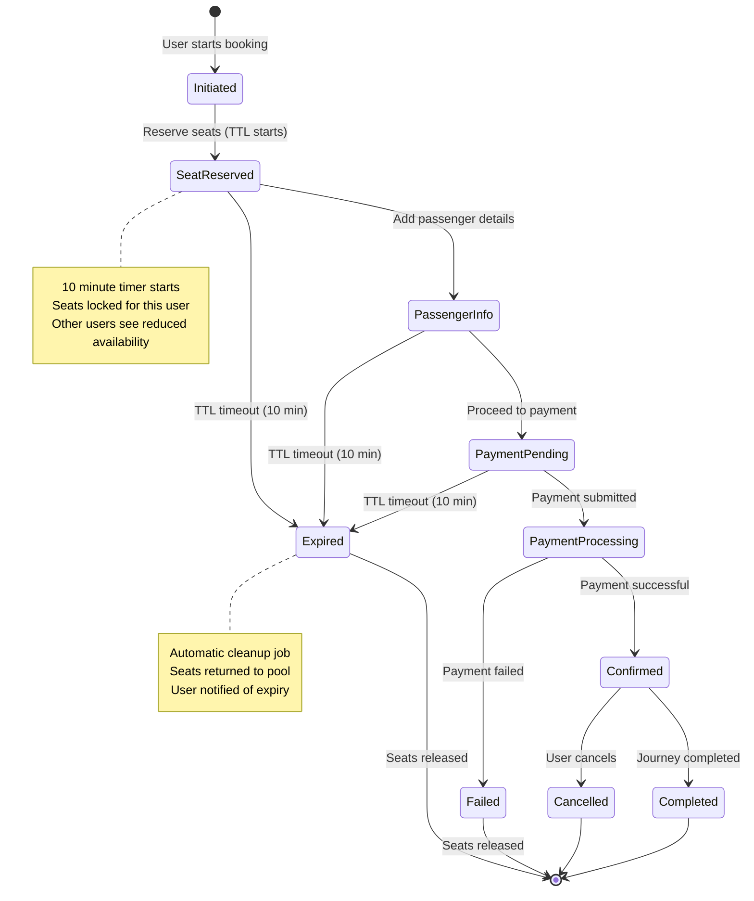
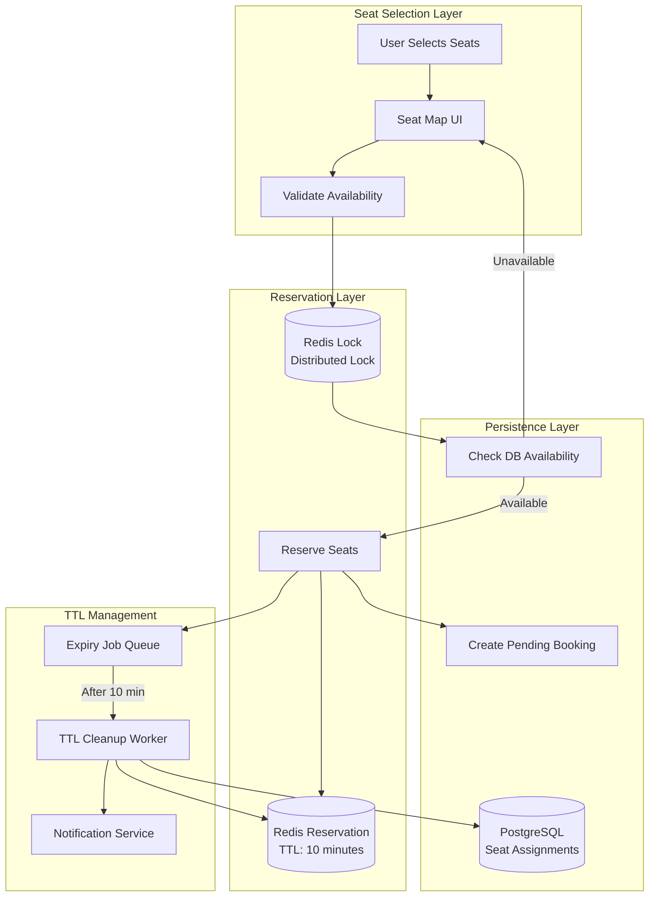
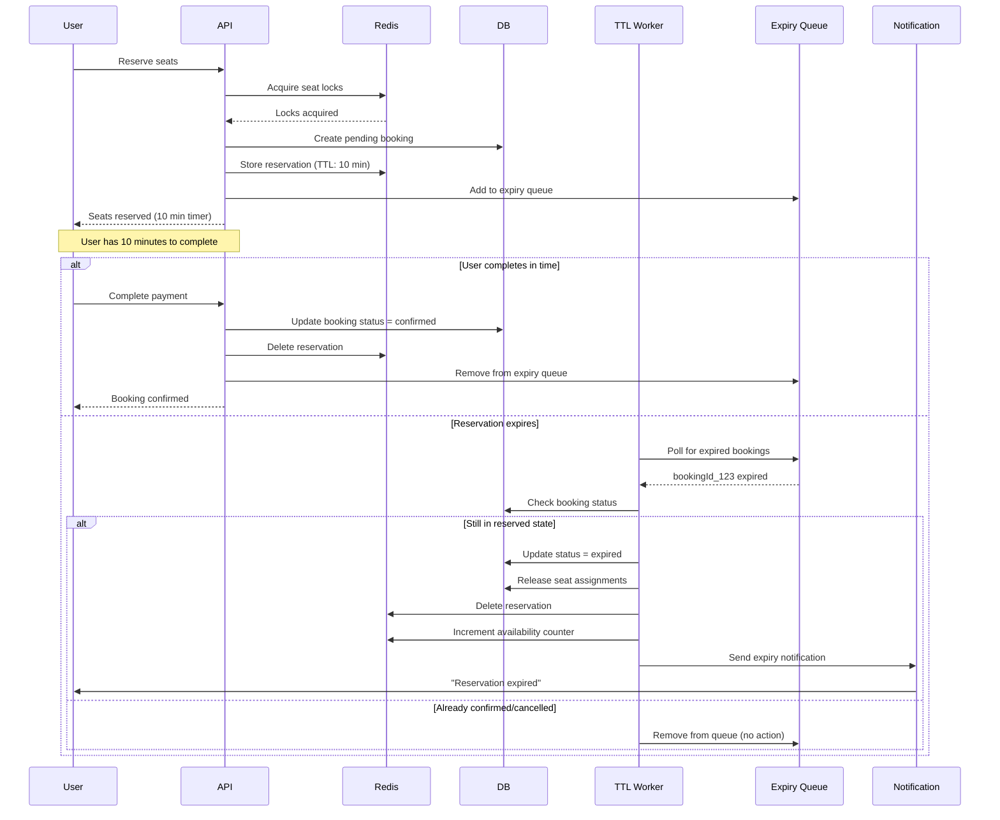
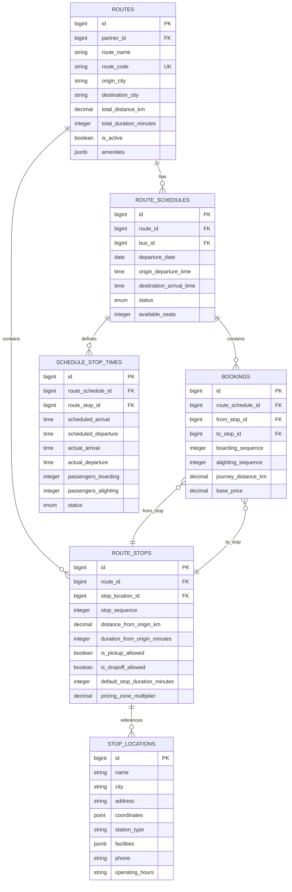
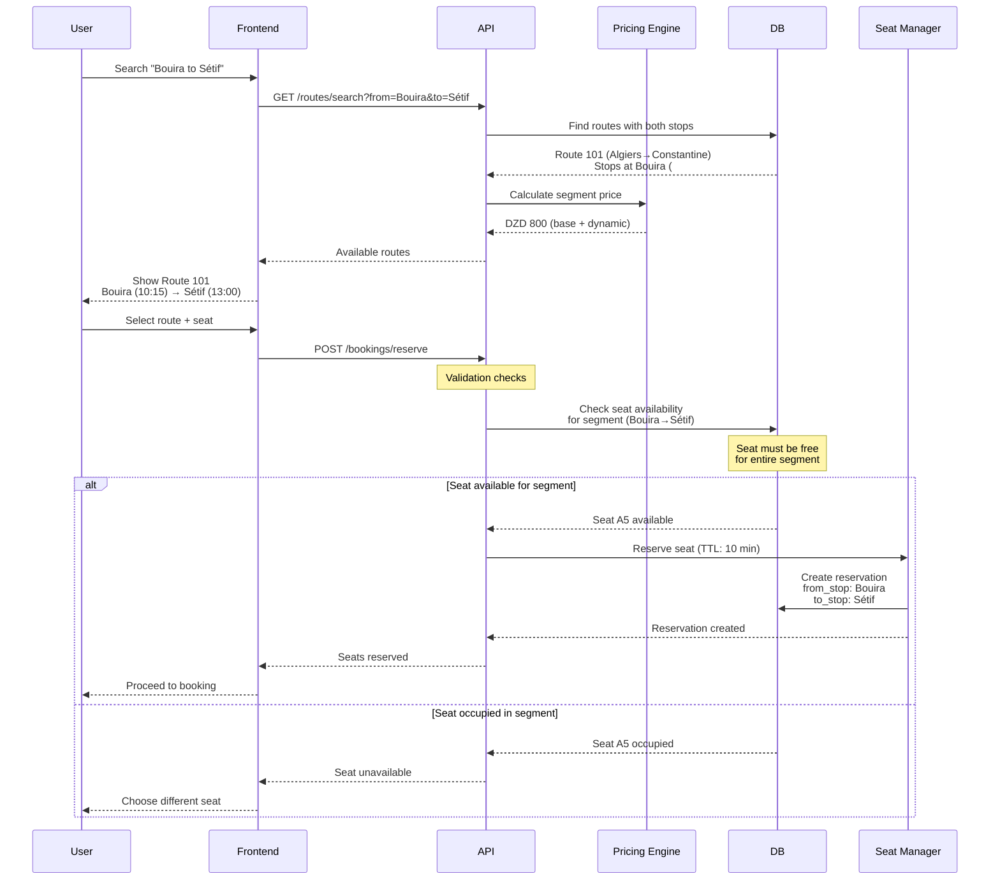
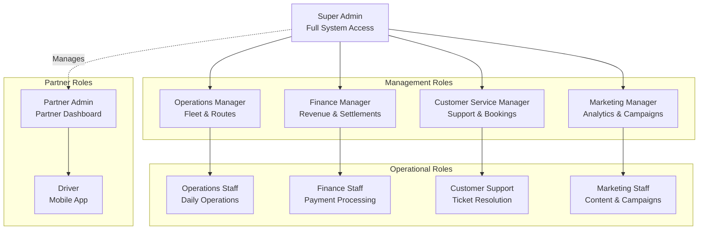
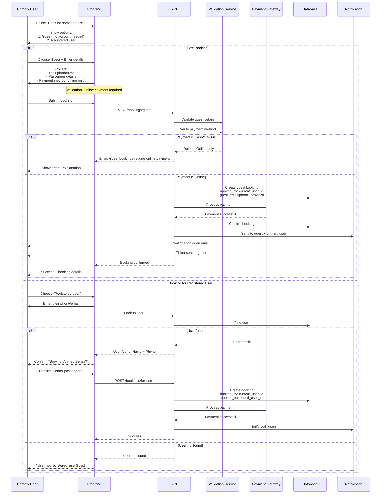
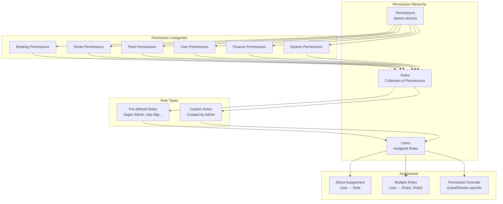
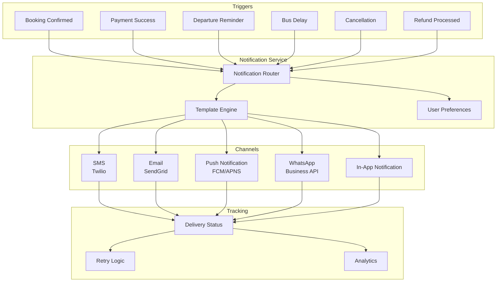

# Essential Features Architecture - Complete Implementation

## Table of Contents

1. Booking TTL & Seat Reservation System
2. Route Stops & Multi-Stop Journey Architecture
3. Comprehensive Admin Panel Features
4. Guest Booking for Others
5. Granular RBAC & Permission Management
6. Additional Critical Features

---

## 1. Booking TTL & Seat Reservation System

### 1.1 Booking Lifecycle State Machine



### 1.2 Seat Reservation Architecture



### 1.3 Database Schema for TTL

**Extended Booking Tables:**

```
Table: bookings
- id: bigint PK
- booking_ref: string UNIQUE
- user_id: bigint FK
- route_schedule_id: bigint FK
- status: enum [initiated, reserved, payment_pending,
               payment_processing, confirmed, failed,
               expired, cancelled, completed]
- reserved_at: timestamp (when seats reserved)
- expires_at: timestamp (reserved_at + 10 minutes)
- confirmed_at: timestamp NULL
- expired_at: timestamp NULL
- ...

Table: seat_reservations
- id: bigint PK
- booking_id: bigint FK
- route_schedule_id: bigint FK
- seat_number: string
- status: enum [reserved, confirmed, expired, released]
- reserved_at: timestamp
- expires_at: timestamp (reserved_at + 10 minutes)
- reserved_by_user: bigint FK (can be NULL for admin bookings)
- created_at: timestamp
- updated_at: timestamp

Indexes:
- (route_schedule_id, seat_number, status) - Availability check
- (expires_at, status) WHERE status='reserved' - TTL cleanup
- (booking_id) - Booking seat lookup

Table: booking_state_transitions
- id: bigint PK
- booking_id: bigint FK
- from_state: string
- to_state: string
- reason: string
- metadata: jsonb
- transitioned_at: timestamp
- transitioned_by: bigint FK (user_id or system)

Purpose: Audit trail of all state changes
```

### 1.4 Redis Reservation Cache

**Cache Strategy:**

```
Reservation Keys:

1. Seat Lock (Distributed Lock):
   Key: lock:seat:{scheduleId}:{seatNumber}
   Value: {userId}:{timestamp}
   TTL: 30 seconds
   Purpose: Prevent race conditions during reservation

   Lock acquisition flow:
   - User attempts to reserve seat
   - Acquire lock with SETNX (SET if Not eXists)
   - Check database availability
   - Create reservation
   - Release lock
   - If lock not acquired, seat is being reserved by another user

2. User Reservation:
   Key: reservation:{bookingId}
   Value: {
     "userId": "user_12345",
     "scheduleId": "schedule_789",
     "seats": ["A1", "A2"],
     "reservedAt": 1705320600000,
     "expiresAt": 1705321200000,
     "status": "reserved"
   }
   TTL: 600 seconds (10 minutes + 10 second buffer)
   Purpose: Fast reservation lookup and expiry

3. Schedule Availability Counter:
   Key: availability:{scheduleId}
   Value: 45 (number of available seats)
   TTL: 60 seconds (refreshed frequently)
   Purpose: Quick availability check without DB query

   Update operations:
   - DECR on reservation
   - INCR on release/expiry
   - Periodic sync with DB

4. User Active Reservation:
   Key: user:active_reservation:{userId}
   Value: {bookingId}
   TTL: 610 seconds (sync with reservation TTL)
   Purpose: Prevent user from creating multiple reservations

   Business rule: One active reservation per user

5. Expiry Queue:
   Key: expiry_queue
   Type: Sorted Set
   Score: expiresAt timestamp
   Member: bookingId
   Purpose: Efficient TTL cleanup

   Worker polls for expired bookings:
   ZRANGEBYSCORE expiry_queue 0 {currentTimestamp}
```

### 1.5 TTL Cleanup Architecture



### 1.6 TTL Worker Implementation Details

**Worker Configuration:**

```
TTL Cleanup Worker:

Polling Strategy:
- Interval: Every 30 seconds
- Batch size: 100 bookings per poll
- Query: SELECT bookings WHERE status IN ('reserved', 'payment_pending')
         AND expires_at < NOW()

Processing Logic:
1. Fetch expired bookings from Redis sorted set
2. For each booking:
   a. Acquire distributed lock (prevent concurrent processing)
   b. Check current status in database
   c. If still reserved/pending:
      - Update status to 'expired'
      - Release all seat assignments
      - Increment availability counter
      - Log state transition
      - Queue notification
   d. Release lock
   e. Remove from expiry queue

Idempotency:
- Use distributed lock (lock:booking_expiry:{bookingId})
- Check status before update (double-check pattern)
- Log all operations for audit

Error Handling:
- Retry failed operations (3 attempts)
- Alert on persistent failures
- Dead letter queue for unprocessable bookings
- Manual intervention queue for edge cases

Monitoring:
- Expired bookings per hour
- Processing latency
- Failed expirations
- Average time between expiry and cleanup
- Revenue lost to expiry (business metric)

Optimization:
- Index on (expires_at, status) for fast queries
- Partition expiry queue by hour for efficiency
- Cache recent expirations to avoid reprocessing
```

### 1.7 User Experience Flow

**Frontend Timer Implementation:**

```
Client-Side Countdown:

Display Timer:
- Prominent countdown display on every booking step
- Format: "9:45 remaining" (MM:SS)
- Color coding:
  - Green: 10-5 minutes remaining
  - Yellow: 5-2 minutes remaining
  - Red: <2 minutes remaining + pulse animation

Timer Updates:
- Client-side countdown (JavaScript/React Native timer)
- Server time sync every 60 seconds (prevent client clock drift)
- WebSocket event on expiry (server-side trigger)

Warning Prompts:
- At 5 minutes: Toast notification
- At 2 minutes: Modal warning with "Continue" button
- At 30 seconds: Prominent modal + sound alert (optional)

Extension Mechanism (Optional):
- One-time 5-minute extension button
- Only available if seats still available
- Requires re-validation of seat availability
- New TTL = current_time + 5 minutes
- Log extension for analytics

Post-Expiry UX:
- Clear, apologetic message
- Explain what happened
- One-click "Start Over" button
- Auto-redirect to search if no action (30 seconds)
- Offer alternative dates/routes if available

Progress Indicators:
Step 1: Select Seats (2-3 minutes expected)
Step 2: Passenger Details (3-4 minutes expected)
Step 3: Payment (3-4 minutes expected)

Each step shows:
- Step progress bar
- Time remaining
- "Save and continue later" (if implemented)
```

---

## 2. Route Stops & Multi-Stop Journey Architecture

### 2.1 Route Structure with Stops



### 2.2 Route Stop Data Model Details

**Route Configuration Example:**

```
Route: Algiers → Constantine (431 km, 5h 30min)

route_stops:
{
  "id": 1,
  "route_id": 101,
  "stop_location_id": 201,
  "stop_sequence": 1,
  "distance_from_origin_km": 0,
  "duration_from_origin_minutes": 0,
  "city": "Algiers",
  "stop_name": "Algiers Central Bus Station",
  "is_pickup_allowed": true,
  "is_dropoff_allowed": false,
  "default_stop_duration_minutes": 0,
  "pricing_zone_multiplier": 1.0
}

{
  "id": 2,
  "route_id": 101,
  "stop_location_id": 202,
  "stop_sequence": 2,
  "distance_from_origin_km": 92,
  "duration_from_origin_minutes": 75,
  "city": "Bouira",
  "stop_name": "Bouira Bus Terminal",
  "is_pickup_allowed": true,
  "is_dropoff_allowed": true,
  "default_stop_duration_minutes": 10,
  "pricing_zone_multiplier": 0.8
}

{
  "id": 3,
  "route_id": 101,
  "stop_location_id": 203,
  "stop_sequence": 3,
  "distance_from_origin_km": 238,
  "duration_from_origin_minutes": 180,
  "city": "Sétif",
  "stop_name": "Sétif Main Station",
  "is_pickup_allowed": true,
  "is_dropoff_allowed": true,
  "default_stop_duration_minutes": 15,
  "pricing_zone_multiplier": 0.9
}

{
  "id": 4,
  "route_id": 101,
  "stop_location_id": 204,
  "stop_sequence": 4,
  "distance_from_origin_km": 431,
  "duration_from_origin_minutes": 330,
  "city": "Constantine",
  "stop_name": "Constantine Bus Terminal",
  "is_pickup_allowed": false,
  "is_dropoff_allowed": true,
  "default_stop_duration_minutes": 0,
  "pricing_zone_multiplier": 1.0
}

Segment Pricing:
- Algiers → Bouira (92 km): DZD 500 (base)
- Bouira → Sétif (146 km): DZD 800
- Sétif → Constantine (193 km): DZD 1000
- Algiers → Sétif (238 km): DZD 1200 (not 1300 = sum)
- Algiers → Constantine (431 km): DZD 2000 (full route)

Pricing Logic:
- Base price per km: DZD 4.5-5.0
- Distance-based discounts for longer journeys
- Zone multipliers for popular segments
- Dynamic pricing applies on top
```

### 2.3 Multi-Stop Booking Flow



### 2.4 Segment-Based Seat Availability

**Complex Availability Logic:**

````
Example Scenario:
Route: Algiers (A) → Bouira (B) → Sétif (S) → Constantine (C)
Bus has 40 seats

Existing Bookings:
- Booking 1: Seat 1, A→B (Passenger boards in Algiers, alights in Bouira)
- Booking 2: Seat 1, S→C (Passenger boards in Sétif, alights in Constantine)
- Booking 3: Seat 2, A→S (Passenger boards in Algiers, alights in Sétif)
- Booking 4: Seat 3, A→C (Full journey)

Availability Check:

Query: Check if Seat 1 available for B→S (Bouira to Sétif)
Answer: YES ✓
Reason:
- Booking 1 ends at Bouira (passenger alights)
- Booking 2 starts at Sétif (passenger boards)
- Gap between B and S allows new booking

Query: Check if Seat 2 available for B→S (Bouira to Sétif)
Answer: NO ✗
Reason:
- Booking 3 occupies A→S (includes B→S segment)
- No gap for new booking

Query: Check if Seat 3 available for B→S (Bouira to Sétif)
Answer: NO ✗
Reason:
- Booking 4 occupies full route
- No gaps anywhere

Visual Representation:
Seat 1: [A---B]      [S---C]  ← Gap allows B→S booking
Seat 2: [A--------S]          ← No gap, occupied
Seat 3: [A-----------C]       ← Full route, occupied

SQL Query for Availability:
```sql
-- Check if seat N available for boarding_stop to alighting_stop
SELECT NOT EXISTS (
  SELECT 1 FROM bookings b
  JOIN route_stops rs_boarding ON b.from_stop_id = rs_boarding.id
  JOIN route_stops rs_alighting ON b.to_stop_id = rs_alighting.id
  WHERE b.route_schedule_id = :schedule_id
    AND b.status IN ('reserved', 'confirmed')
    AND :seat_number = ANY(b.seat_numbers)
    AND (
      -- Existing booking overlaps with requested segment
      (rs_boarding.stop_sequence < :alighting_sequence
       AND rs_alighting.stop_sequence > :boarding_sequence)
    )
) AS is_available;
````

**Seat Map Display Logic:**

```
Seat Availability States:

1. Available (Green):
   - Seat is free for entire journey segment
   - User can select

2. Partially Available (Yellow/Warning):
   - Seat becomes available mid-journey
   - Show details: "Available from Sétif"
   - Allow booking if user adjusts boarding point

3. Occupied (Grey):
   - Seat occupied for requested segment
   - Not selectable

4. Your Reservation (Blue):
   - Currently reserved by this user
   - Can deselect

5. Reserved by Another (Red):
   - Temporarily locked by another user
   - May become available if their reservation expires

UI Display:
- Tooltip on hover shows segment availability
- Legend explains color coding
- Filter seats by availability type
```

### 2.5 Stop-Level Features

**Station Information:**

```
stop_locations table includes:

Facilities:
{
  "waiting_area": true,
  "restrooms": true,
  "food": ["cafe", "vending_machines"],
  "accessibility": {
    "wheelchair_accessible": true,
    "elevator": false,
    "ramp": true
  },
  "amenities": ["wifi", "charging_stations", "luggage_storage"],
  "parking": {
    "available": true,
    "capacity": 50,
    "paid": true,
    "rate": "DZD 100/day"
  },
  "nearby": {
    "atm": true,
    "pharmacy": true,
    "hotels": ["Hotel X", "Hotel Y"]
  }
}

Operating Hours:
- 24/7 for major stations
- Limited hours for smaller stops
- Holiday schedule variations

Contact Information:
- Phone: +213 XXX XXX XXX
- Emergency contact
- Station manager

Real-Time Updates:
- Bus arrival times
- Delay notifications
- Platform/gate information
- Crowd levels (if available)
```

**Stop-Level Analytics:**

```
Metrics per Stop:
- Passenger boardings per day/week/month
- Passenger alightings per day/week/month
- Average dwell time (actual vs scheduled)
- Missed connections due to delays
- Revenue generated per stop
- Popular destination pairs from this stop
- Peak hours for boarding
- Seat utilization from this stop

Business Intelligence:
- Identify underserved stops
- Optimize stop duration
- Schedule adjustments based on demand
- Marketing opportunities per location
- Partnership opportunities (e.g., station cafes)
```

---

## 3. Comprehensive Admin Panel Features

### 3.1 Admin Role Hierarchy



### 3.2 Admin Dashboard Feature Matrix

**Feature Access by Role:**

```
┌─────────────────────────────────────────────────────────────────────────────┐
│                          ADMIN PANEL FEATURES                                │
├──────────────────────┬────────┬────────┬────────┬────────┬────────┬─────────┤
│ Feature              │ Super  │  Ops   │  Fin   │  Cust  │  Mkt   │ Partner │
│                      │ Admin  │  Mgr   │  Mgr   │  Mgr   │  Mgr   │  Admin  │
├──────────────────────┼────────┼────────┼────────┼────────┼────────┼─────────┤
│ DASHBOARD & OVERVIEW │        │        │        │        │        │         │
├──────────────────────┼────────┼────────┼────────┼────────┼────────┼─────────┤
│ System Dashboard     │   ✓    │   ✓    │   ✓    │   ✓    │   ✓    │    ✗    │
│ Real-time Metrics    │   ✓    │   ✓    │   ✓    │   ✓    │   ✓    │    ✓    │
│ Revenue Overview     │   ✓    │   ✗    │   ✓    │   ✗    │   ✓    │    ✓*   │
│ Fleet Status Map     │   ✓    │   ✓    │   ✗    │   ✗    │   ✗    │    ✓*   │
│ Alert Center         │   ✓    │   ✓    │   ✓    │   ✓    │   ✓    │    ✓    │
├──────────────────────┼────────┼────────┼────────┼────────┼────────┼─────────┤
│ BOOKING MANAGEMENT   │        │        │        │        │        │         │
├──────────────────────┼────────┼────────┼────────┼────────┼────────┼─────────┤
│ View All Bookings    │   ✓    │   ✓    │   ✓    │   ✓    │   R    │    ✓*   │
│ Create Booking       │   ✓    │   ✓    │   ✗    │   ✓    │   ✗    │    ✓    │
│ Modify Booking       │   ✓    │   ✓    │   ✗    │   ✓    │   ✗    │    ✓*   │
│ Cancel Booking       │   ✓    │   ✓    │   A    │   ✓    │   ✗    │    ✓*   │
│ Process Refund       │   ✓    │   ✗    │   ✓    │   ✓    │   ✗    │    ✗    │
│ Override Price       │   ✓    │   ✗    │   A    │   ✗    │   ✗    │    ✗    │
│ Booking Reports      │   ✓    │   ✓    │   ✓    │   ✓    │   ✓    │    ✓*   │
├──────────────────────┼────────┼────────┼────────┼────────┼────────┼─────────┤
│ ROUTE MANAGEMENT     │        │        │        │        │        │         │
├──────────────────────┼────────┼────────┼────────┼────────┼────────┼─────────┤
│ View Routes          │   ✓    │   ✓    │   R    │   R    │   R    │    ✓*   │
│ Create Route         │   ✓    │   ✓    │   ✗    │   ✗    │   ✗    │    A    │
│ Edit Route           │   ✓    │   ✓    │   ✗    │   ✗    │   ✗    │    A    │
│ Delete Route         │   ✓    │   A    │   ✗    │   ✗    │   ✗    │    ✗    │
│ Manage Stops         │   ✓    │   ✓    │   ✗    │   ✗    │   ✗    │    A    │
│ Schedule Routes      │   ✓    │   ✓    │   ✗    │   ✗    │   ✗    │    ✓*   │
│ Pricing Management   │   ✓    │   ✓    │   A    │   ✗    │   ✗    │    ✗    │
├──────────────────────┼────────┼────────┼────────┼────────┼────────┼─────────┤
│ FLEET MANAGEMENT     │        │        │        │        │        │         │
├──────────────────────┼────────┼────────┼────────┼────────┼────────┼─────────┤
│ View Fleet           │   ✓    │   ✓    │   R    │   R    │   ✗    │    ✓*   │
│ Add/Edit Bus         │   ✓    │   ✓    │   ✗    │   ✗    │   ✗    │    ✓    │
│ Bus Tracking         │   ✓    │   ✓    │   ✗    │   R    │   ✗    │    ✓*   │
│ Maintenance Records  │   ✓    │   ✓    │   ✗    │   ✗    │   ✗    │    ✓    │
│ Assign Bus to Route  │   ✓    │   ✓    │   ✗    │   ✗    │   ✗    │    ✓*   │
│ Driver Management    │   ✓    │   ✓    │   ✗    │   ✗    │   ✗    │    ✓    │
├──────────────────────┼────────┼────────┼────────┼────────┼────────┼─────────┤
│ PARTNER MANAGEMENT   │        │        │        │        │        │         │
├──────────────────────┼────────┼────────┼────────┼────────┼────────┼─────────┤
│ View Partners        │   ✓    │   ✓    │   ✓    │   R    │   R    │    ✗    │
│ Add Partner          │   ✓    │   A    │   ✗    │   ✗    │   ✗    │    ✗    │
│ Edit Partner         │   ✓    │   ✓    │   A    │   ✗    │   ✗    │    ✗    │
│ Partner Performance  │   ✓    │   ✓    │   ✓    │   ✗    │   ✗    │    ✗    │
│ Commission Settings  │   ✓    │   ✗    │   ✓    │   ✗    │   ✗    │    ✗    │
│ Settlement Reports   │   ✓    │   ✗    │   ✓    │   ✗    │   ✗    │    ✓    │
│ Contract Management  │   ✓    │   A    │   A    │   ✗    │   ✗    │    R    │
├──────────────────────┼────────┼────────┼────────┼────────┼────────┼─────────┤
│ CUSTOMER MANAGEMENT  │        │        │        │        │        │         │
├──────────────────────┼────────┼────────┼────────┼────────┼────────┼─────────┤
│ View Customers       │   ✓    │   R    │   R    │   ✓    │   ✓    │    ✗    │
│ Customer Details     │   ✓    │   R    │   R    │   ✓    │   ✓    │    ✗    │
│ Booking History      │   ✓    │   ✓    │   ✓    │   ✓    │   R    │    ✗    │
│ Support Tickets      │   ✓    │   R    │   R    │   ✓    │   ✗    │    ✗    │
│ Refund Requests      │   ✓    │   ✗    │   ✓    │   ✓    │   ✗    │    ✗    │
│ Loyalty Program      │   ✓    │   ✗    │   ✗    │   ✓    │   ✓    │    ✗    │
│ Customer Segments    │   ✓    │   ✗    │   ✗    │   R    │   ✓    │    ✗    │
├──────────────────────┼────────┼────────┼────────┼────────┼────────┼─────────┤
│ FINANCIAL            │        │        │        │        │        │         │
├──────────────────────┼────────┼────────┼────────┼────────┼────────┼─────────┤
│ Revenue Dashboard    │   ✓    │   R    │   ✓    │   ✗    │   ✓    │    ✓*   │
│ Payment Transactions │   ✓    │   ✗    │   ✓    │   R    │   ✗    │    ✓*   │
│ Refund Management    │   ✓    │   ✗    │   ✓    │   A    │   ✗    │    ✗    │
│ Partner Settlements  │   ✓    │   ✗    │   ✓    │   ✗    │   ✗    │    ✓    │
│ Financial Reports    │   ✓    │   ✗    │   ✓    │   ✗    │   R    │    ✓*   │
│ Invoice Generation   │   ✓    │   ✗    │   ✓    │   ✗    │   ✗    │    ✓    │
│ Tax Reports          │   ✓    │   ✗    │   ✓    │   ✗    │   ✗    │    ✗    │
├──────────────────────┼────────┼────────┼────────┼────────┼────────┼─────────┤
│ ANALYTICS            │        │        │        │        │        │         │
├──────────────────────┼────────┼────────┼────────┼────────┼────────┼─────────┤
│ System Analytics     │   ✓    │   ✓    │   ✓    │   ✓    │   ✓    │    ✗    │
│ Route Performance    │   ✓    │   ✓    │   ✓    │   R    │   ✓    │    ✓*   │
│ Customer Insights    │   ✓    │   R    │   R    │   ✓    │   ✓    │    ✗    │
│ Revenue Analytics    │   ✓    │   ✗    │   ✓    │   ✗    │   ✓    │    ✓*   │
│ Custom Reports       │   ✓    │   ✓    │   ✓    │   ✓    │   ✓    │    ✓    │
│ Export Data          │   ✓    │   A    │   A    │   A    │   A    │    A    │
│ BI Dashboard         │   ✓    │   ✓    │   ✓    │   ✗    │   ✓    │    ✗    │
├──────────────────────┼────────┼────────┼────────┼────────┼────────┼─────────┤
│ SYSTEM ADMIN         │        │        │        │        │        │         │
├──────────────────────┼────────┼────────┼────────┼────────┼────────┼─────────┤
│ User Management      │   ✓    │   ✗    │   ✗    │   ✗    │   ✗    │    ✗    │
│ Role Management      │   ✓    │   ✗    │   ✗    │   ✗    │   ✗    │    ✗    │
│ Permission Management│   ✓    │   ✗    │   ✗    │   ✗    │   ✗    │    ✗    │
│ System Settings      │   ✓    │   ✗    │   ✗    │   ✗    │   ✗    │    ✗    │
│ Audit Logs           │   ✓    │   R    │   R    │   R    │   R    │    R    │
│ System Health        │   ✓    │   ✓    │   ✗    │   ✗    │   ✗    │    ✗    │
│ API Keys             │   ✓    │   ✗    │   ✗    │   ✗    │   ✗    │    A    │
└──────────────────────┴────────┴────────┴────────┴────────┴────────┴─────────┘

Legend:
✓ = Full Access
R = Read Only
A = Approval Required (request + super admin approval)
* = Own Data Only (partner sees only their data)
✗ = No Access
```

### 3.3 Admin Dashboard Pages

**1. System Dashboard:**

```
Real-Time Overview:

Metrics Cards:
┌─────────────────────────────────────────────────────────────┐
│ Today's Bookings          │ Active Buses        │ Revenue   │
│ ▲ 342 (+12%)              │ 🚌 28/45            │ 245K DZD  │
│ vs yesterday              │ In service          │ (+8%)     │
├───────────────────────────┼─────────────────────┼───────────┤
│ Pending Payments          │ Support Tickets     │ New Users │
│ ⏳ 23                     │ 🎫 15 open          │ +47       │
│ Oldest: 8m ago            │ Avg response: 12m   │ This week │
└───────────────────────────┴─────────────────────┴───────────┘

Charts & Visualizations:
- Revenue trend (Last 30 days) - Line chart
- Bookings by hour (Today) - Bar chart
- Top routes (This week) - Horizontal bar
- Payment methods distribution - Pie chart
- Occupancy rate by route - Heat map

Recent Activity Feed:
- New booking: User_123 booked Algiers→Oran (2 min ago)
- Payment completed: Booking_456 (3 min ago)
- Bus departed: Bus_789 from Algiers (5 min ago)
- Support ticket: Customer complaint (7 min ago)
- Seat expired: Booking_234 timeout (9 min ago)

Alerts & Warnings:
🔴 Critical: Bus_456 not reporting location (15 min)
🟡 Warning: Route ALG-ORA low occupancy (28%)
🟢 Info: Daily settlement report ready

Quick Actions:
[Create Booking] [View Fleet Map] [Support Queue] [Reports]
```

**2. Booking Management:**

```
Features:

Search & Filter:
- Booking reference
- User phone/email
- Date range
- Route
- Status
- Payment status
- Amount range

Booking List View:
┌──────┬─────────────┬──────────┬─────────────┬────────┬────────┬─────────┐
│  ID  │  Reference  │   User   │    Route    │ Status │  Price │ Actions │
├──────┼─────────────┼──────────┼─────────────┼────────┼────────┼─────────┤
│ 1234 │ BK16F3A2B   │ 06XXXXXX │ ALG → ORA   │ Conf   │ 1200  │ [...] │
│ 1235 │ BK16F3A2C   │ 07XXXXXX │ ORA → TLM   │ Pend   │  800  │ [...] │
│ 1236 │ BK16F3A2D   │ 06XXXXXX │ ALG → CST   │ Exp    │ 2000  │ [...] │
└──────┴─────────────┴──────────┴─────────────┴────────┴────────┴─────────┘

Bulk Actions:
☑️ Select all | [Cancel Selected] [Export] [Send Notification]

Booking Detail Modal:
┌─────────────────────────────────────────────────────────────┐
│ Booking Details - BK16F3A2B                                 │
├─────────────────────────────────────────────────────────────┤
│ Status: Confirmed ✓            Created: 2025-01-15 10:30    │
│ Payment: Completed             Confirmed: 2025-01-15 10:35  │
│                                                              │
│ Journey Information:                                         │
│ Route: Algiers → Oran (432 km)                             │
│ Date: 2025-01-20                                            │
│ Departure: 08:00 | Arrival: 13:30                          │
│ Seats: A12, A13                                             │
│                                                              │
│ Passenger Information:                                       │
│ 1. Ahmed Benali (Adult, Seat A12)                          │
│ 2. Fatima Benali (Adult, Seat A13)                         │
│                                                              │
│ Pricing:                                                     │
│ Base Price: 2 × 550 DZD = 1100 DZD                         │
│ Seat Selection: 2 × 50 DZD = 100 DZD                       │
│ Total: 1200 DZD                                             │
│ Platform Commission (27%): 324 DZD                          │
│ Partner Revenue (73%): 876 DZD                              │
│                                                              │
│ Payment Details:                                             │
│ Method: CIB Card (****1234)                                │
│ Transaction ID: TRX_ABC123                                  │
│ Status: Completed                                            │
│ Timestamp: 2025-01-15 10:35:22                             │
│                                                              │
│ Actions:                                                     │
│ [Modify Booking] [Cancel & Refund] [Resend Ticket]         │
│ [View Timeline] [Contact Customer] [Download PDF]           │
└─────────────────────────────────────────────────────────────┘

Booking Timeline:
10:30 - Booking initiated
10:32 - Seats reserved (A12, A13)
10:34 - Passenger details entered
10:35 - Payment submitted
10:35 - Payment confirmed
10:35 - Booking confirmed
10:35 - SMS sent to customer
10:36 - Email with ticket sent
```

**3. Route Management:**

```
Route List:
┌───────┬──────────────┬─────────┬────────┬──────┬────────┬─────────┐
│  ID   │     Name     │  O → D  │ Stops  │ Dist │ Active │ Actions │
├───────┼──────────────┼─────────┼────────┼──────┼────────┼─────────┤
│  101  │ ALG-ORA-01   │ ALG→ORA │   3    │ 432km│   ✓    │ [...]  │
│  102  │ ALG-CST-01   │ ALG→CST │   4    │ 431km│   ✓    │ [...]  │
│  103  │ ORA-TLM-01   │ ORA→TLM │   2    │ 170km│   ✓    │ [...]  │
└───────┴──────────────┴─────────┴────────┴──────┴────────┴─────────┘

Create/Edit Route Form:
┌─────────────────────────────────────────────────────────────┐
│ Route Information                                            │
│ Route Name: [Algiers - Oran Express 01          ]          │
│ Route Code: [ALG-ORA-01        ]                            │
│ Partner: [Select Partner ▼                       ]          │
│ Bus Type: [Standard ▼] Total Seats: [40]                   │
│ Status: [✓] Active                                          │
│                                                              │
│ Route Stops (Drag to reorder):                             │
│ ═══════════════════════════════════════════════════════     │
│ Stop 1: 🏁 Origin                                           │
│ Location: [Algiers Central Bus Station ▼        ]          │
│ Distance: 0 km | Duration: 0 min                            │
│ ☑️ Pickup allowed  ☐ Dropoff allowed                        │
│ ─────────────────────────────────────────────────────        │
│ Stop 2: 🚏 Intermediate                                      │
│ Location: [Bouira Bus Terminal ▼                ]          │
│ Distance: [92] km | Duration: [75] min                      │
│ ☑️ Pickup allowed  ☑️ Dropoff allowed                        │
│ Stop duration: [10] minutes                                 │
│ Pricing zone multiplier: [0.8]                              │
│ [Remove Stop]                                                │
│ ─────────────────────────────────────────────────────        │
│ Stop 3: 🚏 Intermediate                                      │
│ Location: [Chlef Bus Station ▼                  ]          │
│ Distance: [230] km | Duration: [150] min                    │
│ ☑️ Pickup allowed  ☑️ Dropoff allowed                        │
│ Stop duration: [10] minutes                                 │
│ Pricing zone multiplier: [0.9]                              │
│ [Remove Stop]                                                │
│ ─────────────────────────────────────────────────────        │
│ Stop 4: 🏁 Destination                                       │
│ Location: [Oran Bus Terminal ▼                  ]          │
│ Distance: [432] km | Duration: [270] min                    │
│ ☐ Pickup allowed  ☑️ Dropoff allowed                        │
│ ═══════════════════════════════════════════════════════     │
│ [+ Add Stop]                                                 │
│                                                              │
│ Pricing:                                                     │
│ Base Price per km: [4.5] DZD                                │
│ Full route base price: [2000] DZD                           │
│ ☑️ Enable dynamic pricing                                   │
│                                                              │
│ Amenities:                                                   │
│ ☑️ WiFi  ☑️ AC  ☑️ Reclining Seats  ☑️ USB Charging         │
│ ☐ TV  ☐ Restroom  ☑️ Snacks                                │
│                                                              │
│ [Save Route] [Preview] [Cancel]                             │
└─────────────────────────────────────────────────────────────┘

Route Scheduling:
- Calendar view of scheduled departures
- Assign buses to schedules
- Set pricing for specific dates
- Bulk schedule creation
- Holiday schedule management
```

**4. Fleet Management:**

```
Fleet Map View:
┌─────────────────────────────────────────────────────────────┐
│ Live Fleet Tracking                          [Filters ▼]     │
│ ┌─────────────────────────────────────────────────────────┐ │
│ │                    🗺️ MAP AREA                          │ │
│ │                                                          │ │
│ │  🚌 Bus_101 (ALG→ORA) - On Time                        │ │
│ │        ↓ ETA Oran: 13:25                                │ │
│ │                                                          │ │
│ │          🚌 Bus_102 (ORA→TLM) - Delayed 15m            │ │
│ │                ↓ ETA Tlemcen: 16:45                     │ │
│ │                                                          │ │
│ │  🚌 Bus_103 (ALG→CST) - On Time                        │ │
│ │        ↓ ETA Constantine: 15:00                         │ │
│ └─────────────────────────────────────────────────────────┘ │
│                                                              │
│ Fleet Summary:                                               │
│ Active: 28/45 buses | On Time: 23 | Delayed: 4 | Idle: 1  │
│ ━━━━━━━━━━━━━━━━━━━━━━━━━━━━━━━━━━━━━━━━━━━━━━━━━━━━━━━  │
└─────────────────────────────────────────────────────────────┘

Bus List:
┌──────┬──────────────┬─────────┬────────┬─────────┬─────────────┐
│  Bus │  Partner     │  Type   │ Seats  │ Status  │   Location  │
├──────┼──────────────┼─────────┼────────┼─────────┼─────────────┤
│  101 │ Transport Co │ Standard│   40   │ Active  │ En route    │
│  102 │ Express Lines│ Premium │   35   │ Active  │ En route    │
│  103 │ Transport Co │ Standard│   40   │ Active  │ En route    │
│  104 │ Comfort Bus  │ Luxury  │   28   │ Idle    │ Algiers     │
│  105 │ Transport Co │ Standard│   40   │ Mainten │ Workshop    │
└──────┴──────────────┴─────────┴────────┴─────────┴─────────────┘

Bus Details Modal:
┌─────────────────────────────────────────────────────────────┐
│ Bus #101 - License Plate: 16-ALG-1234                      │
├─────────────────────────────────────────────────────────────┤
│ Partner: Transport Company Ltd                              │
│ Model: Mercedes Travego | Year: 2021                        │
│ Total Seats: 40 | Type: Standard                            │
│                                                              │
│ Current Status: Active - En Route                           │
│ Route: Algiers → Oran (ALG-ORA-01)                         │
│ Schedule: Departure 08:00, Arrival 13:30                    │
│ Current Location: 35.8° N, 0.6° W (near Chlef)            │
│ Last Update: 2 minutes ago                                   │
│ ETA Next Stop: Chlef - 10:15 (8 min)                       │
│                                                              │
│ Today's Journey:                                             │
│ ✓ Algiers (08:00) - Departed on time                       │
│ ✓ Bouira (09:15) - Arrived 09:17 (+2m)                     │
│ → Chlef (10:15) - En route                                 │
│ → Oran (13:30) - Scheduled                                  │
│                                                              │
│ Passenger Load: 32/40 (80% occupancy)                       │
│ Boardings: Algiers(28), Bouira(4)                          │
│ Expected: Chlef(2), Alightings in Oran(32)                 │
│                                                              │
│ Maintenance:                                                 │
│ Last Service: 2024-12-15 (31 days ago)                     │
│ Next Due: 2025-02-28 (44 days)                             │
│ Odometer: 145,230 km                                         │
│                                                              │
│ Driver: Mohammed Kaddour                                     │
│ License: #DRV-4567 | Phone: +213 XXX XXX                   │
│                                                              │
│ Documents:                                                   │
│ Insurance: Valid until 2025-12-31                           │
│ Inspection: Valid until 2025-03-15                          │
│ Registration: Current                                        │
│                                                              │
│ [Track Live] [Maintenance History] [Edit Bus] [Contact]    │
└─────────────────────────────────────────────────────────────┘
```

**5. Partner Management:**

```
Partner List:
┌──────┬──────────────────┬────────┬──────┬─────────┬──────────┐
│  ID  │   Company Name   │  Fleet │Routes│  Rating │  Status  │
├──────┼──────────────────┼────────┼──────┼─────────┼──────────┤
│  501 │ Transport Co Ltd │   15   │  8   │  4.7⭐  │  Active  │
│  502 │ Express Lines    │   8    │  5   │  4.5⭐  │  Active  │
│  503 │ Comfort Bus      │   12   │  6   │  4.8⭐  │  Active  │
│  504 │ Speed Transport  │   5    │  3   │  4.2⭐  │  Pending │
└──────┴──────────────────┴────────┴──────┴─────────┴──────────┘

Partner Dashboard (for specific partner):
┌─────────────────────────────────────────────────────────────┐
│ Transport Company Ltd - Partner Dashboard                    │
├─────────────────────────────────────────────────────────────┤
│ This Month Performance:                                       │
│ Revenue: 1,245,000 DZD (+12% vs last month)                 │
│ Your Share (73%): 908,850 DZD                                │
│ Platform Commission (27%): 336,150 DZD                       │
│ Total Bookings: 2,345 passengers                            │
│ Occupancy Rate: 76% (Target: 75%)                           │
│ On-Time Performance: 94% (Target: 95%)                       │
│ Customer Rating: 4.7/5.0 ⭐                                   │
│                                                              │
│ Active Routes (8):                                           │
│ - ALG-ORA-01: 145 bookings this week                        │
│ - ALG-CST-01: 98 bookings this week                         │
│ - ORA-TLM-01: 67 bookings this week                         │
│ [...view all]                                                │
│                                                              │
│ Fleet Status (15 buses):                                     │
│ 🚌 Active: 12 | 🔧 Maintenance: 2 | 💤 Idle: 1              │
│                                                              │
│ Recent Settlements:                                          │
│ Jan 1-7: 227,000 DZD - Paid ✓                              │
│ Jan 8-14: 245,000 DZD - Pending                             │
│ Jan 15-21: 436,850 DZD - Current period                     │
│                                                              │
│ Alerts:                                                      │
│ 🟡 Bus #105 maintenance overdue (5 days)                    │
│ 🟢 Route ALG-ORA-01 high demand - consider adding frequency │
│                                                              │
│ [View Detailed Reports] [Fleet Management] [Settlement]     │
└─────────────────────────────────────────────────────────────┘
```

---

## 4. Guest Booking for Others

### 4.1 Guest Booking Flow Architecture



### 4.2 Database Schema for Guest Bookings

**Extended Booking Schema:**

```
Table: bookings (enhanced)
- id: bigint PK
- booking_ref: string UNIQUE
- user_id: bigint FK (who travels - can be NULL for guest)
- booked_by_user_id: bigint FK (who made the booking)
- booking_type: enum ['self', 'guest', 'registered_user']
- guest_details: jsonb NULL (for guest bookings)
- ...

guest_details structure:
{
  "firstName": "Fatima",
  "lastName": "Benali",
  "email": "fatima@example.com",
  "phone": "+213 555 123 456",
  "idNumber": "ABC123456",  // optional
  "relationship": "family",  // friend, colleague, family, other
  "emergencyContact": "+213 555 654 321"
}

Table: booking_relationships
- id: bigint PK
- booking_id: bigint FK
- booker_user_id: bigint FK (who paid)
- traveler_user_id: bigint FK NULL (if registered)
- traveler_guest_email: string NULL
- traveler_guest_phone: string NULL
- relationship_type: enum ['self', 'family', 'friend', 'colleague', 'client']
- created_at: timestamp

Purpose: Track all bookings made on behalf of others

Indexes:
- (booker_user_id, created_at DESC) - "My bookings for others"
- (traveler_user_id) - "Bookings made for me"
- (traveler_guest_email) - "Guest booking lookup"
- (traveler_guest_phone) - "Guest booking lookup"
```

### 4.3 Guest Booking Business Rules

```
Restrictions & Validations:

1. Payment Method:
   ✓ Allowed: Online payments only
     - Credit/Debit card
     - Mobile money (if verified)
     - Bank transfer (with instant confirmation)
   ✗ Not Allowed:
     - Cash payment at station
     - Cash on bus
     - Pay on arrival

   Reason: Prevent no-show fraud and ensure accountability

2. Guest Information Required:
   - Full name (mandatory)
   - Email OR phone (at least one mandatory)
   - Preferred: Both email and phone

3. Verification:
   - Send OTP to guest phone/email (optional, recommended)
   - Guest confirms they authorized the booking
   - Prevents unauthorized bookings

4. Ticket Delivery:
   Primary User (Booker):
   - Booking confirmation
   - Payment receipt
   - Reference to share with traveler

   Guest/Traveler:
   - Digital ticket (email + SMS)
   - Booking reference
   - Can track journey in app (if they create account later)

5. Cancellation Rights:
   - Only booker (who paid) can cancel
   - Guest cannot cancel directly
   - Guest must contact booker or support
   - Refund goes to original payment method (booker)

6. Modifications:
   - Booker can modify (change date, seats)
   - Guest cannot modify
   - Date/time changes require availability check
   - Price difference handled via booker's payment method

7. Check-in Requirements:
   - Guest must present:
     a. Booking reference (SMS/email)
     b. Government ID matching passenger name
     c. Optional: QR code from ticket

8. Limits:
   - Maximum 5 guest bookings per user per day
   - Maximum 10 active guest bookings per user
   - Prevents abuse (scalping, fraud)

9. Fraud Prevention:
   - Track booking patterns
   - Flag suspicious activity:
     * Multiple guest bookings to same email/phone
     * Rapid succession bookings
     * High-value bookings for guests
   - Require additional verification if flagged

10. Account Linking:
    - Guest receives invitation to create account
    - If they register with same email/phone:
      * Past guest bookings auto-link to their account
      * Can view history
      * Can manage future bookings
```

### 4.4 Guest Booking UI/UX

**Booking Flow Screens:**

```
Screen 1: Booking Type Selection
┌─────────────────────────────────────────────────────────────┐
│ Who is this booking for?                                     │
│                                                              │
│ ┌─────────────────────────┐  ┌─────────────────────────┐   │
│ │  👤 Myself              │  │  👥 Someone Else        │   │
│ │                         │  │                         │   │
│ │  Book for your own      │  │  Book for a friend,     │   │
│ │  travel                 │  │  family, or colleague   │   │
│ │                         │  │                         │   │
│ │  [Continue]             │  │  [Continue]             │   │
│ └─────────────────────────┘  └─────────────────────────┘   │
└─────────────────────────────────────────────────────────────┘

Screen 2: Guest Details Entry
┌─────────────────────────────────────────────────────────────┐
│ ← Back          Book for Someone Else                        │
│                                                              │
│ Traveler Information:                                        │
│                                                              │
│ First Name *                                                 │
│ [                                     ]                      │
│                                                              │
│ Last Name *                                                  │
│ [                                     ]                      │
│                                                              │
│ Phone Number * (for ticket delivery)                         │
│ [+213]  [                             ]                      │
│                                                              │
│ Email Address * (for ticket delivery)                        │
│ [                                     ]                      │
│                                                              │
│ ID/Passport Number (optional)                                │
│ [                                     ]                      │
│                                                              │
│ Relationship to traveler:                                    │
│ ( ) Family  ( ) Friend  ( ) Colleague  ( ) Other            │
│                                                              │
│ ℹ️  The traveler will receive:                               │
│    • Ticket via SMS and email                                │
│    • Booking reference                                       │
│    • Journey details                                         │
│                                                              │
│ ⚠️  Important:                                               │
│    • You'll pay for this booking                             │
│    • Online payment required (no cash)                       │
│    • You can cancel/modify this booking                      │
│    • Refund will be to your payment method                   │
│                                                              │
│ ☑️  I confirm the traveler has authorized this booking       │
│                                                              │
│ [Continue to Payment]                                         │
└─────────────────────────────────────────────────────────────┘

Screen 3: Payment (Online Only)
┌─────────────────────────────────────────────────────────────┐
│ ← Back          Payment                                       │
│                                                              │
│ 💳 Select Payment Method:                                    │
│                                                              │
│ ● Credit/Debit Card                                          │
│   [Card Number                            ]                  │
│   [MM/YY]  [CVV]                                            │
│                                                              │
│ ○ Mobile Money (BaridiMob)                                   │
│                                                              │
│ ⚠️  Cash payment not available for guest bookings            │
│                                                              │
│ Booking Summary:                                             │
│ Route: Algiers → Oran                                        │
│ Traveler: Ahmed Benali                                       │
│ Booked by: You (Fatima Kaddour)                             │
│ Total: 1,200 DZD                                             │
│                                                              │
│ [Complete Payment]                                            │
└─────────────────────────────────────────────────────────────┘

Screen 4: Confirmation
┌─────────────────────────────────────────────────────────────┐
│           ✓ Booking Confirmed!                               │
│                                                              │
│ Booking Reference: BK16F3A2B                                 │
│                                                              │
│ Journey Details:                                             │
│ Algiers → Oran                                               │
│ January 20, 2025 at 08:00                                    │
│ Seat: A12                                                    │
│                                                              │
│ Traveler: Ahmed Benali                                       │
│ Phone: +213 555 123 456                                      │
│ Email: ahmed@example.com                                     │
│                                                              │
│ ✓ Ticket sent to traveler via SMS and email                 │
│ ✓ Payment receipt sent to you                                │
│                                                              │
│ What's Next?                                                 │
│ 1. Share booking reference with traveler                     │
│ 2. Traveler should check their phone/email                   │
│ 3. Traveler brings ticket + ID to bus station               │
│                                                              │
│ [View My Bookings] [Book Another] [Share Details]           │
└─────────────────────────────────────────────────────────────┘
```

### 4.5 My Bookings View Enhancement

```
Enhanced "My Bookings" Tab:

┌─────────────────────────────────────────────────────────────┐
│ My Bookings                                    [Filter ▼]    │
├─────────────────────────────────────────────────────────────┤
│ Tabs: [For Me] [For Others] [All]                           │
├─────────────────────────────────────────────────────────────┤
│                                                              │
│ For Me (3):                                                  │
│ ━━━━━━━━━━━━━━━━━━━━━━━━━━━━━━━━━━━━━━━━━━━━━━━━━━━━━━━━  │
│ ┌──────────────────────────────────────────────────────┐   │
│ │ BK16F3A2B - Algiers → Oran           👤 My Booking    │   │
│ │ Jan 20, 08:00 | Seat A12 | 1,200 DZD                 │   │
│ │ Booked by: Me                                         │   │
│ │ [View Details] [Modify] [Cancel]                      │   │
│ └──────────────────────────────────────────────────────┘   │
│                                                              │
│ For Others (2):                                              │
│ ━━━━━━━━━━━━━━━━━━━━━━━━━━━━━━━━━━━━━━━━━━━━━━━━━━━━━━━━  │
│ ┌──────────────────────────────────────────────────────┐   │
│ │ BK16F3A2C - Algiers → Constantine    👥 For Guest    │   │
│ │ Jan 22, 10:00 | Seat B5 | 2,000 DZD                  │   │
│ │ Traveler: Ahmed Benali (+213 555 XXX XXX)            │   │
│ │ [View Details] [Modify] [Cancel] [Contact Traveler]  │   │
│ └──────────────────────────────────────────────────────┘   │
│                                                              │
│ ┌──────────────────────────────────────────────────────┐   │
│ │ BK16F3A2D - Oran → Tlemcen          👥 For User      │   │
│ │ Jan 25, 14:00 | Seat C8 | 800 DZD                    │   │
│ │ Traveler: Karima Mansouri (registered user)          │   │
│ │ [View Details] [Modify] [Cancel]                      │   │
│ └──────────────────────────────────────────────────────┘   │
└─────────────────────────────────────────────────────────────┘

Booking Detail View for "For Others":
┌─────────────────────────────────────────────────────────────┐
│ ← My Bookings                                                │
│                                                              │
│ Booking for: Ahmed Benali (Guest)            [Edit] [Cancel]│
│ Booking Reference: BK16F3A2C                                 │
│                                                              │
│ Journey:                                                     │
│ Algiers → Constantine                                        │
│ January 22, 2025 at 10:00                                    │
│ Seat: B5                                                     │
│                                                              │
│ Traveler Information:                                        │
│ Name: Ahmed Benali                                           │
│ Phone: +213 555 123 456                                      │
│ Email: ahmed@example.com                                     │
│ Relationship: Friend                                         │
│                                                              │
│ Payment:                                                     │
│ Amount: 2,000 DZD (paid by you)                             │
│ Method: CIB Card ****1234                                    │
│ Date: Jan 15, 2025                                           │
│                                                              │
│ Ticket Status: ✓ Sent to traveler                           │
│ Last sent: Jan 15, 2025 10:35 AM                            │
│ [Resend Ticket]                                              │
│                                                              │
│ Actions:                                                     │
│ [Share Booking Details]                                      │
│ [Contact Traveler] (opens WhatsApp/SMS)                     │
│ [Modify Booking] (change date/seat)                         │
│ [Cancel & Refund] (refund to your account)                  │
└─────────────────────────────────────────────────────────────┘
```

---

## 5. Granular RBAC & Permission Management

### 5.1 Permission System Architecture



### 5.2 Database Schema for RBAC

```
Table: permissions
- id: bigint PK
- name: string UNIQUE (e.g., 'booking.view')
- display_name: string (e.g., 'View Bookings')
- category: string (e.g., 'booking', 'route', 'finance')
- description: text
- is_system: boolean (protected from deletion)
- created_at: timestamp
- updated_at: timestamp

Table: roles
- id: bigint PK
- name: string UNIQUE (e.g., 'operations_manager')
- display_name: string (e.g., 'Operations Manager')
- description: text
- is_system: boolean (protected from deletion/modification)
- is_active: boolean
- created_by: bigint FK (user_id)
- created_at: timestamp
- updated_at: timestamp

Table: role_permissions
- id: bigint PK
- role_id: bigint FK
- permission_id: bigint FK
- granted: boolean (true = granted, false = explicitly denied)
- created_at: timestamp
UNIQUE(role_id, permission_id)

Table: user_roles
- id: bigint PK
- user_id: bigint FK
- role_id: bigint FK
- assigned_by: bigint FK (user_id who assigned)
- assigned_at: timestamp
- expires_at: timestamp NULL (optional expiry)
UNIQUE(user_id, role_id)

Table: user_permissions (permission overrides)
- id: bigint PK
- user_id: bigint FK
- permission_id: bigint FK
- granted: boolean
- reason: text
- assigned_by: bigint FK
- assigned_at: timestamp
- expires_at: timestamp NULL
UNIQUE(user_id, permission_id)

Purpose: Override role permissions for specific users

Table: permission_audit_log
- id: bigint PK
- action: enum ['role_created', 'role_updated', 'role_deleted',
               'role_assigned', 'role_revoked',
               'permission_granted', 'permission_revoked']
- actor_user_id: bigint FK (who performed action)
- target_user_id: bigint FK NULL (if user-specific)
- role_id: bigint FK NULL
- permission_id: bigint FK NULL
- metadata: jsonb
- ip_address: inet
- user_agent: text
- timestamp: timestamp

Purpose: Complete audit trail of all permission changes
```

### 5.3 Permission Definitions

**Complete Permission List:**

```
BOOKING PERMISSIONS:
- booking.view.all        : View all bookings
- booking.view.own        : View own bookings only
- booking.create          : Create new booking
- booking.update.all      : Modify any booking
- booking.update.own      : Modify own bookings
- booking.cancel.all      : Cancel any booking
- booking.cancel.own      : Cancel own bookings
- booking.refund          : Process refunds
- booking.override_price  : Override dynamic pricing
- booking.view_pii        : View full customer PII (audited)
- booking.export          : Export booking data

ROUTE PERMISSIONS:
- route.view.all          : View all routes
- route.view.own          : View own partner routes only
- route.create            : Create new route
- route.update.all        : Modify any route
- route.update.own        : Modify own routes
- route.delete            : Delete routes
- route.schedule          : Manage schedules
- route.pricing           : Manage pricing
- route.stops.manage      : Add/remove/edit stops

FLEET PERMISSIONS:
- fleet.view.all          : View all buses
- fleet.view.own          : View own partner fleet
- fleet.create            : Add new bus
- fleet.update.all        : Modify any bus
- fleet.update.own        : Modify own buses
- fleet.delete            : Delete buses
- fleet.assign            : Assign buses to routes
- fleet.maintenance       : Manage maintenance
- fleet.tracking          : View live tracking
- fleet.drivers           : Manage drivers

PARTNER PERMISSIONS:
- partner.view.all        : View all partners
- partner.view.own        : View own partner details
- partner.create          : Add new partner
- partner.update          : Modify partner details
- partner.delete          : Delete partners
- partner.settlements     : Process settlements
- partner.performance     : View performance metrics
- partner.contracts       : Manage contracts

USER & CUSTOMER PERMISSIONS:
- user.view.all           : View all users
- user.view.customers     : View customers only
- user.create             : Create users
- user.update             : Update user details
- user.delete             : Delete users
- user.impersonate        : Impersonate users (audited)
- customer.support        : Handle support tickets
- customer.refunds        : Process customer refunds

FINANCIAL PERMISSIONS:
- finance.view.dashboard  : View revenue dashboard
- finance.view.detailed   : View detailed financials
- finance.payments        : Manage payments
- finance.refunds         : Process refunds
- finance.settlements     : Process partner settlements
- finance.reports         : Generate financial reports
- finance.taxes           : Manage tax reports
- finance.invoices        : Generate invoices

ANALYTICS PERMISSIONS:
- analytics.view.basic    : View basic analytics
- analytics.view.detailed : View detailed analytics
- analytics.export        : Export analytics data
- analytics.custom_reports: Create custom reports

SYSTEM PERMISSIONS:
- system.settings         : Modify system settings
- system.roles.view       : View roles
- system.roles.create     : Create roles
- system.roles.update     : Modify roles
- system.roles.delete     : Delete roles
- system.roles.assign     : Assign roles to users
- system.permissions.manage: Manage permissions
- system.audit_log        : View audit logs
- system.health           : View system health
- system.api_keys         : Manage API keys
- system.backups          : Manage backups

SUPPORT PERMISSIONS:
- support.view.tickets    : View support tickets
- support.create.ticket   : Create tickets (for users)
- support.update.ticket   : Update ticket status
- support.assign.ticket   : Assign tickets
- support.close.ticket    : Close tickets
- support.view.all        : View all tickets
- support.view.assigned   : View assigned tickets only

MARKETING PERMISSIONS:
- marketing.campaigns.view     : View campaigns
- marketing.campaigns.create   : Create campaigns
- marketing.campaigns.update   : Modify campaigns
- marketing.campaigns.delete   : Delete campaigns
- marketing.analytics          : View marketing analytics
- marketing.promotions         : Manage promotions
```

### 5.4 Pre-defined Roles

**System Roles Configuration:**

```
1. SUPER_ADMIN:
   Display Name: Super Administrator
   Description: Full system access, all permissions
   Permissions: ALL
   Protected: Yes (cannot be deleted)

2. OPERATIONS_MANAGER:
   Display Name: Operations Manager
   Description: Manage routes, fleet, schedules
   Permissions:
     ✓ booking.view.all
     ✓ booking.create
     ✓ booking.update.all
     ✓ booking.cancel.all
     ✓ route.* (all route permissions)
     ✓ fleet.* (all fleet permissions)
     ✓ partner.view.all
     ✓ partner.performance
     ✓ analytics.view.detailed
     ✗ finance.* (no financial access)
     ✗ system.* (no system admin)

3. FINANCE_MANAGER:
   Display Name: Finance Manager
   Description: Financial operations and reporting
   Permissions:
     ✓ booking.view.all
     ✓ booking.refund
     ✓ finance.* (all finance permissions)
     ✓ partner.settlements
     ✓ partner.performance
     ✓ analytics.view.detailed
     ✗ route.* (view only)
     ✗ fleet.* (view only)
     ✗ system.*

4. CUSTOMER_SERVICE_MANAGER:
   Display Name: Customer Service Manager
   Description: Customer support and booking management
   Permissions:
     ✓ booking.view.all
     ✓ booking.create
     ✓ booking.update.all
     ✓ booking.cancel.all
     ✓ booking.refund
     ✓ user.view.customers
     ✓ customer.* (all customer permissions)
     ✓ support.* (all support permissions)
     ✗ finance.view.detailed (basic only)
     ✗ partner.*
     ✗ system.*

5. CUSTOMER_SUPPORT:
   Display Name: Customer Support Agent
   Description: Front-line customer support
   Permissions:
     ✓ booking.view.all
     ✓ booking.update.own (limited)
     ✓ support.view.assigned
     ✓ support.update.ticket
     ✓ customer.support
     ✗ booking.refund (requires approval)
     ✗ booking.cancel.all (requires approval)
     ✗ finance.*

6. MARKETING_MANAGER:
   Display Name: Marketing Manager
   Description: Marketing campaigns and analytics
   Permissions:
     ✓ marketing.* (all marketing permissions)
     ✓ analytics.view.detailed
     ✓ user.view.customers
     ✓ booking.view.all (read-only)
     ✗ booking.create/update/cancel
     ✗ finance.* (view basic only)

7. PARTNER_ADMIN:
   Display Name: Partner Administrator
   Description: Partner company administrator
   Permissions:
     ✓ booking.view.own
     ✓ route.view.own
     ✓ route.update.own
     ✓ route.schedule
     ✓ fleet.* (own fleet only)
     ✓ partner.view.own
     ✓ partner.settlements (own)
     ✓ analytics.view.basic
     ✗ All other partners' data
     ✗ System operations

8. DRIVER:
   Display Name: Bus Driver
   Description: Mobile app for drivers
   Permissions:
     ✓ booking.view.own (assigned route)
     ✓ route.view.own
     ✓ fleet.update.own (bus status)
     ✓ fleet.tracking (report location)
     ✗ All administrative functions
```

### 5.5 Role Management UI

**Admin Panel - Role Management:**

```
Roles List Page:
┌─────────────────────────────────────────────────────────────┐
│ Roles & Permissions                    [+ Create New Role]   │
├─────────────────────────────────────────────────────────────┤
│ Search: [                    ] Filter: [All ▼] [System] [Custom]│
├─────────────────────────────────────────────────────────────┤
│                                                              │
│ System Roles (Protected):                                    │
│ ━━━━━━━━━━━━━━━━━━━━━━━━━━━━━━━━━━━━━━━━━━━━━━━━━━━━━━━━  │
│ ┌──────────────────────────────────────────────────────┐   │
│ │ 🔒 Super Administrator                  12 users      │   │
│ │ Full system access                                    │   │
│ │ All permissions (127)                                 │   │
│ │ [View Details]                                        │   │
│ └──────────────────────────────────────────────────────┘   │
│                                                              │
│ ┌──────────────────────────────────────────────────────┐   │
│ │ 🔧 Operations Manager                    5 users      │   │
│ │ Manage routes, fleet, daily operations               │   │
│ │ 45 permissions                                        │   │
│ │ [View Details] [Edit]                                 │   │
│ └──────────────────────────────────────────────────────┘   │
│                                                              │
│ Custom Roles:                                                │
│ ━━━━━━━━━━━━━━━━━━━━━━━━━━━━━━━━━━━━━━━━━━━━━━━━━━━━━━━━  │
│ ┌──────────────────────────────────────────────────────┐   │
│ │ 👔 Regional Manager (Oran)               2 users      │   │
│ │ Manage Oran region operations                        │   │
│ │ 32 permissions                                        │   │
│ │ [View Details] [Edit] [Duplicate] [Delete]           │   │
│ └──────────────────────────────────────────────────────┘   │
│                                                              │
│ ┌──────────────────────────────────────────────────────┐   │
│ │ 📊 Analytics Specialist                  3 users      │   │
│ │ View and export analytics data                       │   │
│ │ 12 permissions                                        │   │
│ │ [View Details] [Edit] [Duplicate] [Delete]           │   │
│ └──────────────────────────────────────────────────────┘   │
└─────────────────────────────────────────────────────────────┘

Create/Edit Role Form:
┌─────────────────────────────────────────────────────────────┐
│ ← Roles             Create New Role                          │
├─────────────────────────────────────────────────────────────┤
│ Role Information:                                            │
│                                                              │
│ Role Name *                                                  │
│ [regional_manager_west               ]                      │
│ (lowercase, underscores only)                                │
│                                                              │
│ Display Name *                                               │
│ [Regional Manager - West             ]                      │
│                                                              │
│ Description                                                  │
│ [Manages all operations in western    ]                      │
│ [Algeria (Oran, Tlemcen, etc.)        ]                      │
│                                                              │
│ ☑️  Active (users can be assigned this role)                 │
│                                                              │
│ ━━━━━━━━━━━━━━━━━━━━━━━━━━━━━━━━━━━━━━━━━━━━━━━━━━━━━━━━  │
│                                                              │
│ Permissions:                                [Select All] [None]│
│                                                              │
│ 📋 Booking Permissions           [Expand ▼]                 │
│ ━━━━━━━━━━━━━━━━━━━━━━━━━━━━━━━━━━━━━━━━━━━━━━━━━━━━━━━━  │
│ ☑️  booking.view.all         View all bookings              │
│ ☑️  booking.create           Create new booking             │
│ ☑️  booking.update.all       Modify any booking             │
│ ☐   booking.cancel.all       Cancel any booking             │
│ ☑️  booking.refund           Process refunds                │
│ ☐   booking.override_price   Override pricing               │
│                                                              │
│ 🚌 Route Permissions           [Expand ▼]                    │
│ ━━━━━━━━━━━━━━━━━━━━━━━━━━━━━━━━━━━━━━━━━━━━━━━━━━━━━━━━  │
│ ☑️  route.view.all           View all routes                │
│ ☑️  route.create             Create new route               │
│ ☑️  route.update.all         Modify any route               │
│ ☐   route.delete             Delete routes                  │
│ ☑️  route.schedule           Manage schedules               │
│ ☑️  route.pricing            Manage pricing                 │
│                                                              │
│ 🚍 Fleet Permissions           [Expand ▼]                    │
│ 🤝 Partner Permissions         [Expand ▼]                    │
│ 👥 User Permissions            [Expand ▼]                    │
│ 💰 Financial Permissions       [Expand ▼]                    │
│ 📊 Analytics Permissions       [Expand ▼]                    │
│ ⚙️  System Permissions          [Expand ▼]                    │
│                                                              │
│ Summary: 32 permissions selected                             │
│                                                              │
│ [Save Role] [Save & Assign Users] [Cancel]                  │
└─────────────────────────────────────────────────────────────┘

User Assignment Page:
┌─────────────────────────────────────────────────────────────┐
│ ← Role Details       Assign Role: Regional Manager - West    │
├─────────────────────────────────────────────────────────────┤
│ Search Users: [                              ] [Search]      │
│                                                              │
│ Currently Assigned (2):                                      │
│ ━━━━━━━━━━━━━━━━━━━━━━━━━━━━━━━━━━━━━━━━━━━━━━━━━━━━━━━━  │
│ ┌──────────────────────────────────────────────────────┐   │
│ │ Ahmed Benali (ahmed.b@company.dz)                     │   │
│ │ Assigned: Jan 10, 2025 by Super Admin                │   │
│ │ [View Profile] [Revoke Role]                          │   │
│ └──────────────────────────────────────────────────────┘   │
│                                                              │
│ ┌──────────────────────────────────────────────────────┐   │
│ │ Karima Mansouri (karima.m@company.dz)                 │   │
│ │ Assigned: Jan 12, 2025 by Super Admin                │   │
│ │ Expires: Feb 12, 2025 (30 days)                      │   │
│ │ [View Profile] [Extend] [Revoke Role]                │   │
│ └──────────────────────────────────────────────────────┘   │
│                                                              │
│ Add Users:                                                   │
│ ━━━━━━━━━━━━━━━━━━━━━━━━━━━━━━━━━━━━━━━━━━━━━━━━━━━━━━━━  │
│ Search Results:                                              │
│ ( ) Mohamed Kaddour - Operations Staff                       │
│ ( ) Fatima Benali - Customer Support                         │
│ ( ) Youcef Amrani - Finance Staff                            │
│                                                              │
│ Role Expires (optional):                                     │
│ ( ) Never                                                    │
│ ( ) After: [30] days                                         │
│ ( ) On: [Select Date ▼]                                     │
│                                                              │
│ [Assign Selected Users]                                      │
└─────────────────────────────────────────────────────────────┘

User Profile - Roles Tab:
┌─────────────────────────────────────────────────────────────┐
│ User Profile: Ahmed Benali         [Edit] [Deactivate]      │
├─────────────────────────────────────────────────────────────┤
│ Tabs: [Overview] [Roles & Permissions] [Activity] [Audit]   │
├─────────────────────────────────────────────────────────────┤
│                                                              │
│ Assigned Roles (2):                                          │
│ ━━━━━━━━━━━━━━━━━━━━━━━━━━━━━━━━━━━━━━━━━━━━━━━━━━━━━━━━  │
│ ┌──────────────────────────────────────────────────────┐   │
│ │ 🔧 Operations Manager                                 │   │
│ │ Assigned: Jan 1, 2025 by Super Admin                 │   │
│ │ Permissions: 45                                       │   │
│ │ [View Permissions] [Revoke]                           │   │
│ └──────────────────────────────────────────────────────┘   │
│                                                              │
│ ┌──────────────────────────────────────────────────────┐   │
│ │ 👔 Regional Manager - West                            │   │
│ │ Assigned: Jan 10, 2025 by Super Admin                │   │
│ │ Permissions: 32                                       │   │
│ │ [View Permissions] [Revoke]                           │   │
│ └──────────────────────────────────────────────────────┘   │
│                                                              │
│ Permission Overrides (1):                                    │
│ ━━━━━━━━━━━━━━━━━━━━━━━━━━━━━━━━━━━━━━━━━━━━━━━━━━━━━━━━  │
│ ┌──────────────────────────────────────────────────────┐   │
│ │ ✓ finance.view.detailed                               │   │
│ │ Granted specifically to this user                     │   │
│ │ Reason: Needs financial reports for region            │   │
│ │ By: Super Admin on Jan 15, 2025                       │   │
│ │ [Revoke]                                              │   │
│ └──────────────────────────────────────────────────────┘   │
│                                                              │
│ Effective Permissions: 78 total                              │
│ [View All Permissions] [Add Permission Override]            │
│ [+ Assign New Role]                                          │
└─────────────────────────────────────────────────────────────┘
```

### 5.6 Permission Check Implementation

**Authorization Middleware Logic:**

```
Permission Evaluation Flow:

1. Extract User ID from JWT
2. Load User Roles (from cache or DB)
3. Load Role Permissions (from cache or DB)
4. Load User Permission Overrides (from cache or DB)
5. Evaluate Required Permission:

   a. Check if user has explicit DENY override
      → If yes: Access Denied (override takes precedence)

   b. Check if user has explicit GRANT override
      → If yes: Access Granted (override takes precedence)

   c. Check role permissions:
      → Iterate through all user roles
      → If any role grants permission: Access Granted
      → If all roles lack permission: Access Denied

   d. Special handling for resource ownership:
      → booking.update.own: Check if booking.user_id = current_user_id
      → route.view.own: Check if route.partner_id = user.partner_id

6. Log access attempt (for auditing)
7. Return Allow/Deny

Caching Strategy:
- Cache user roles: 1 hour TTL
- Cache role permissions: 6 hours TTL
- Cache user permission overrides: 1 hour TTL
- Invalidate cache on role/permission changes
- Cache key: permissions:{userId}

Edge Cases:
- User with no roles: Deny all (except public endpoints)
- Expired role assignment: Automatically revoke
- Deleted role: Cascade revoke from all users
- Permission renamed: Update all references

Performance Optimization:
- Single DB query to get all permissions
- Bulk permission check (check multiple at once)
- Permission bitmap for fast checking (future optimization)
```

---

## 6. Additional Critical Features

### 6.1 Advanced Search & Filters

**Multi-criteria Search:**

```
Search Capabilities:

1. Basic Search:
   - Origin city
   - Destination city
   - Travel date
   - Passengers count

2. Advanced Filters:
   Route Filters:
   ☐ Direct routes only (no stops)
   ☐ Include routes with stops
   ☐ Maximum stops: [1, 2, 3, 4, 5+]

   Departure Time:
   ( ) Any time
   ( ) Morning (06:00 - 12:00)
   ( ) Afternoon (12:00 - 18:00)
   ( ) Evening (18:00 - 22:00)
   ( ) Night (22:00 - 06:00)

   Price Range:
   Min: [____] DZD  Max: [____] DZD

   Bus Type:
   ☐ Standard
   ☐ Premium
   ☐ Luxury

   Amenities:
   ☐ WiFi
   ☐ AC
   ☐ Reclining seats
   ☐ USB charging
   ☐ Restroom
   ☐ Entertainment

   Partner Preference:
   ☐ Preferred partners only
   ☐ Minimum rating: [4.0, 4.5, 4.8] stars

   Availability:
   ☐ Show only routes with available seats
   Minimum seats: [1, 2, 4, 6]

3. Flexible Date Search:
   "Show me cheapest dates within +/- 3 days"

   Calendar View:
   ┌──────────────────────────────────┐
   │  Jan 20: 1,200 DZD (cheapest)    │
   │  Jan 21: 1,400 DZD               │
   │  Jan 22: 1,800 DZD               │
   │  Jan 23: 1,200 DZD               │
   └──────────────────────────────────┘

4. Multi-City Search (Phase 2):
   Algiers → Oran → Tlemcen
   Find connections automatically

5. Return Journey Search:
   Outbound: Jan 20
   Return: Jan 27
   Show combinations

6. AI-Powered Smart Search:
   "I want to go from Algiers to Constantine
    next weekend, morning departure, comfortable seats"

   → Parse intent
   → Show matching results
```

### 6.2 Notifications System

**Multi-Channel Notification Architecture:**



**Notification Types:**

```
Booking Lifecycle:
1. Booking Confirmed
   - SMS: "Booking BK16F3A2B confirmed! Algiers→Oran, Jan 20, 08:00"
   - Email: Full ticket with QR code
   - Push: "Booking confirmed ✓"
   - WhatsApp: Ticket + Journey details

2. Payment Successful
   - SMS: "Payment of 1,200 DZD received"
   - Email: Receipt + Invoice
   - Push: "Payment successful"

3. Departure Reminders
   - T-24h: "Reminder: Your bus departs tomorrow at 08:00"
   - T-2h: "Your bus departs in 2 hours from Algiers Central"
   - T-30m: "Bus boarding now at Gate 5"

4. Journey Updates
   - "Bus delayed by 15 minutes"
   - "Bus departed on time"
   - "Next stop: Bouira in 10 minutes"
   - "Arrived at destination"

5. Cancellations
   - "Booking cancelled. Refund processed to your card"
   - "Route cancelled due to weather. Alternative offered"

Promotional:
6. Offers & Discounts
   - "50% off on Algiers→Oran routes this weekend!"
   - "Your favorite route now has new departures"

7. Loyalty Updates
   - "You earned 50 points! 450 more for free trip"
   - "Congratulations! You're now a Gold member"

System:
8. Security Alerts
   - "New device logged in to your account"
   - "Password changed successfully"

9. Support Updates
   - "Your support ticket has been updated"
   - "Support agent replied to your query"
```

### 6.3 Loyalty & Rewards Program

**Program Structure:**

```
Loyalty Tiers:

1. Bronze (Default)
   - 0-999 points
   - Benefits:
     * Earn 1 point per 100 DZD spent
     * Birthday bonus: 50 points

2. Silver
   - 1,000-4,999 points
   - Benefits:
     * Earn 1.5 points per 100 DZD spent
     * Priority customer support
     * 5% discount on selected routes
     * Early access to new routes

3. Gold
   - 5,000-14,999 points
   - Benefits:
     * Earn 2 points per 100 DZD spent
     * Free seat selection
     * One free date change per booking
     * 10% discount on selected routes
     * Priority boarding

4. Platinum
   - 15,000+ points
   - Benefits:
     * Earn 2.5 points per 100 DZD spent
     * Free upgrades (when available)
     * Unlimited free date changes
     * 15% discount on all routes
     * Dedicated support line
     * Lounge access (partner lounges)

Points Earning:
- Base: 1 point per 100 DZD
- Multipliers: Tier-based (1x, 1.5x, 2x, 2.5x)
- Bonuses:
  * Complete profile: 100 points (one-time)
  * First booking: 200 points
  * Referral: 500 points per successful referral
  * Review: 20 points per review
  * Streak: 50 bonus points for 3 consecutive monthly bookings

Points Redemption:
- 1000 points = 100 DZD discount
- 5000 points = Free route (up to 500 DZD)
- 10,000 points = Premium upgrade for 5 trips

Points Expiry:
- Points valid for 12 months from earning date
- Warning sent 30 days before expiry
```

### 6.4 Referral System

```
Referral Mechanics:

1. User generates unique referral code: "AHMED2025"

2. Share options:
   - WhatsApp (auto-message)
   - SMS
   - Social media
   - Email
   - Copy link

3. New user signs up with code:
   - Enters code during registration
   - Or clicks referral link (auto-applied)

4. Rewards after first booking:
   Referrer: 500 loyalty points + 50 DZD credit
   Referee: 100 DZD off first booking

5. Tracking:
   - Dashboard shows: referrals sent, successful, earned
   - Leaderboard (optional, gamification)

6. Limits:
   - Maximum 50 referrals per month per user
   - Prevents abuse/fraud
```

### 6.5 Reviews & Ratings System

```
Review Components:

1. Route Rating (1-5 stars):
   - Overall experience
   - Driver professionalism
   - Bus cleanliness
   - On-time performance
   - Comfort level

2. Written Review:
   - Minimum 20 characters
   - Maximum 500 characters
   - Moderation for inappropriate content

3. Photos (optional):
   - Upload up to 3 photos
   - Bus interior, seats, amenities

4. Verified Badge:
   - Only users who completed the journey
   - Badge shows: "Verified Passenger - Jan 2025"

5. Helpful Votes:
   - Other users vote helpful/not helpful
   - Sorts reviews by helpfulness

Display:
- Route page shows average rating
- Recent reviews displayed
- Filter: Most helpful, Most recent, Highest rated, Lowest rated
- Partner response to reviews

Incentives:
- 20 loyalty points per review
- Monthly "Review of the Month" bonus (100 points)
```

### 6.6 Dynamic Pricing Factors (Expanded)

```
Pricing Algorithm Inputs:

Base Factors:
1. Distance (km)
2. Duration (minutes)
3. Base price per km
4. Partner commission rate

Demand Factors:
5. Current occupancy rate
6. Historical demand for route
7. Day of week
8. Time of day
9. Season (summer, holidays)
10. Special events (concerts, sports, festivals)

Time Factors:
11. Booking lead time (days before departure)
12. Time until departure (hours)
13. Last-minute surge pricing

Supply Factors:
14. Available buses on route
15. Alternative route availability
16. Competitor pricing (if available)

User Factors:
17. Loyalty tier (discount)
18. Promotional codes
19. Group booking (volume discount)
20. Corporate contract rates

External Factors:
21. Weather conditions
22. Fuel prices
23. Holiday periods (Eid, Ramadan)
24. School breaks
25. Local events

Price Bounds:
- Minimum: Base price * 0.7 (30% max discount)
- Maximum: Base price * 1.5 (50% max surge)
- Exceptions: Emergency surges (weather, special events)

Dynamic Adjustment:
- Recalculate every 5 minutes
- Real-time availability impacts
- A/B testing different pricing strategies
```

### 6.7 Cancellation & Refund Policies

```
Cancellation Policy:

Time Before Departure | Refund Amount | Cancellation Fee
--------------------- | ------------- | ----------------
> 48 hours            | 100%          | 0%
24-48 hours           | 75%           | 25%
12-24 hours           | 50%           | 50%
6-12 hours            | 25%           | 75%
< 6 hours             | 0%            | 100%
No-show              | 0%            | 100%

Processing Time:
- Online payment: 5-7 business days
- Mobile money: 1-3 business days
- Refund to loyalty points: Instant

Special Cases:
- Route cancellation by company: 100% refund + 200 bonus points
- Medical emergency: 100% refund (with documentation)
- Force majeure (weather, disaster): 100% refund
- Partner no-show: 100% refund + 500 bonus points + free future trip

Refund Methods:
- Original payment method (default)
- Loyalty points (1.1x value - 10% bonus)
- Credit for future booking (1.15x value - 15% bonus)
```

---

## Summary & Implementation Priority

**Phase 1 (Months 1-3) - Must Have:**

1. ✅ Booking TTL (10-minute reservation)
2. ✅ Route stops architecture
3. ✅ Basic admin panel (Super Admin, Ops Manager, Customer Support)
4. ✅ Guest booking capability
5. ✅ Role-based access control (5 core roles)

**Phase 2 (Months 4-6) - Should Have:** 6. ✅ Advanced search & filters 7. ✅ Multi-channel notifications 8. ✅ Reviews & ratings 9. ✅ Dynamic pricing v2 (expanded factors) 10. ✅ Flexible cancellation

**Phase 3 (Months 7-12) - Nice to Have:** 11. ✅ Loyalty & rewards program 12. ✅ Referral system 13. ✅ Permission management UI 14. ✅ Custom role creation 15. ✅ Advanced analytics

**Implementation Notes:**

- All features designed for scalability
- Database schemas support future extensions
- API endpoints designed RESTfully
- Admin UI mockups guide frontend development
- Security and performance considered throughout

---

_This completes the essential features architecture. All systems are designed to work together seamlessly while maintaining modularity for future enhancements._
